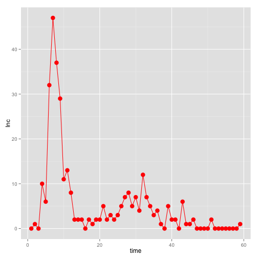

# Inference with ABC

The aim of this practical is to use Approximate Bayesian Computation (ABC) to circumvent the need for a tractable likelihood function when fitting your model.
To illustrate ABC, you are going to fit the [SEITL model](play_with_seitl.md) to the Tristan da Cunha epidemics. Although in this case we do have a tractable likelihood function, you may have noticed that it is computationally costly to evaluate with the particle filter for the stochastic SEITL model, so ABC could be an attractive alternative. 

There are two approximation steps at the core of ABC:

* it replaces observations with summary statistics. Unless these summary statistics are [sufficient](http://en.wikipedia.org/wiki/Sufficient_statistic), this leads to a possibly less informative posterior density.
* it's a simulation-based approximation of the posterior. Unless the acceptance tolerances are equal to 0, this leads to biased samples from the posterior.

On the other hand, we have seen in a previous session that MCMC provides unbiased samples from the true posterior at little cost for the deterministic SEITL model. You will end this session by fitting this deterministic model with ABC and assess the accuracy of your ABC posterior distribution by comparing it with the true posterior. 


```r
library(fitcourseR)

# create fitmodel
my_SEITL <- createSEITL(deterministic=FALSE, verbose=FALSE)

# print data
p <- ggplot(data=my_SEITL$data,aes(x=time,y=Inc))
p <- p + geom_line(colour="red")
p <- p + geom_point(colour="red",size=4)
print(p)
```

 

## Summary statistics

First of all, you need to define a set of summary statistics for the time series. Have a look at the figure above and propose at least three statistics to summarize the data. Finally, code three functions that take your time series as input and return the summary statistics.


```r
time.data <- my_SEITL$data$time
inc.data <- my_SEITL$data$Inc

# code
my_summaryStat1 <- function(time,inc){
	
}

# test
ss1.data <- my_summaryStat1(time=time.data,inc=inc.data)

# etc.
```

Can you check whether your summary statistics are [sufficient](http://en.wikipedia.org/wiki/Sufficient_statistic)?


## Distance between observed and simulated summary statistics

The second step is to compare your data with your simulation with distance functions between your observed and simulated summary statistics.
You can perform a simulation as follows:


```r
simu <- my_SEITL$simulate.model(theta=my_SEITL$theta, state.init=my_SEITL$initialise.state(my_SEITL$theta),times=c(0,my_SEITL$data$time))
head(simu)
```

```
##   time   S  E  I T  L Inc
## 1    0 254  0  2 0 28   0
## 2    1 251  3  1 1 28   0
## 3    2 246  4  5 1 28   4
## 4    3 231 15  8 2 28   8
## 5    4 201 35 14 6 28  18
## 6    5 167 55 25 9 28  34
```

Then generate an observation:


```r
simu.obs <- my_SEITL$generate.observation(model.traj=simu, theta=my_SEITL$theta)
head(simu.obs)
```

```
##   time   S  E  I T  L Inc observation
## 1    0 254  0  2 0 28   0           0
## 2    1 251  3  1 1 28   0           0
## 3    2 246  4  5 1 28   4           3
## 4    3 231 15  8 2 28   8           4
## 5    4 201 35 14 6 28  18           6
## 6    5 167 55 25 9 28  34          11
```

And compute the set of summary statistics:


```r
time.simu <- simu.obs$time[-1] # remove initial time
inc.simu <- simu.obs$observation[-1] # remove initial state

ss1.simu <- my_summaryStat1(time=time.simu,inc=inc.simu)

# write other summary statistics
```

Now, you can write three functions that will take as inputs: 

* observed summary statistics
* simulated summary statistics
* an acceptance tolerance


```r
my_distance1 <- function(data,simu,tol) {
	

}

# test
d1 <- my_distance1(data=ss1.data,simu=ss1.simu,tol=1)

# write other distance functions
```

## ABC acceptance function


```r
ABCacceptance <- function(theta,fitmodel) {

	# simulate model

	# generate observation

	# compute data and simulated summary statistics

	# compute distance between summary statistics

	# return 0/1

}
```

## Plug it into your posterior and run MCMC


## Comparison with likelihood approach


## Reference

[Review of ABC in practice](http://membres-timc.imag.fr/Michael.Blum/publications/CsilleryTREE10.pdf)


Previous: [Run SMC](smc.md)


