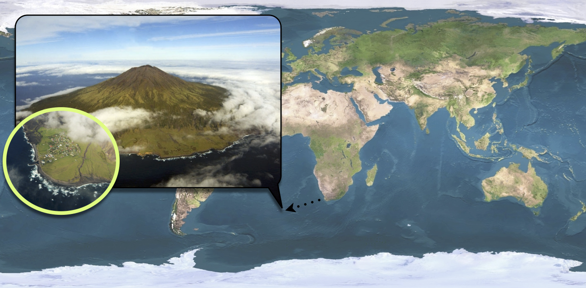

% Modelling interlude: Tristan da Cunha outbreak & the SEITL model.

```{r setup, echo=FALSE}
knitr::opts_chunk$set(cache=TRUE, fig.path='figure/play_with_SEITL/', cache.path='cache/play_with_SEITL/' , fig.cap='', fig.align="center", message=FALSE, tidy=TRUE, warning=FALSE)
```

```{r load, include=FALSE, cache=FALSE}
library(fitR)
set.seed(1234)
```
[Lecture slides](slides/sto_2015.pdf)

# Objectives

This session will focus on modelling rather than fitting (don't worry, we will come back to fitting on the next session). __The aim of this session is to familiarise yourselves with a real data set: the Tristan da Cunha outbreak and a new model called SEITL.__ We felt this session was necessary as we will use this dataset and this model as a toy example to illustrate all the concepts and methods from now until the end of the course. 

As you will read below, the SEITL model has been proposed as a mechanistic explanation for a two-wave influenza A/H3N2 epidemic that occurred on the remote island of Tristan da Cunha in 1971. __Given the small population size of this island (284 inhabitants), random effects at the individual level may have had important consequences at the population level.__ For instance, even if the distribution of the infectious period is the same for all islanders, some islanders will stay infectious longer than others just by chance and might therefore produce more secondary cases. This phenomenon is called *demographic stochasticity* and it could have played a significant role in the dynamics of the epidemic on Tristan da Cunha. 

Unsurprisingly, to account for demographic stochasticity we need a stochastic model. However, as you will see in this session and the following, __simulating and fitting a stochastic model is much more computationally costly than doing so for a deterministic model__. This is why it is important to understand when and why you need to use stochastic or deterministic models. In fact, we hope that by the end of the day you'll be convinced that both approaches are complementary.

Finally, because this session is devoted to modelling rather than fitting, we thought it was useful to show you __how you can make your model biologically more realistic by using distributions for the time spent in each compartment that are more realistic than the exponential distribution__. 

In brief, in this session you will:

1. Familiarise yourselves with the structure of the SEITL model and try to guess its parameter values from the literature.
2. Compare deterministic and stochastic simulations in order to explore the role of demographic stochasticity in the dynamics of the SEITL model.
3. Use a more realistic distribution for the time spent in one of the compartment and assess its effect on the shape of the epidemic.

But first of all, let's have a look at the data.

# Tristan da Cunha outbreak



[Tristan da Cunha](http://en.wikipedia.org/wiki/Tristan_da_Cunha) is a volcanic island in the South Atlantic Ocean. It has been inhabited since the $19^{th}$ century and in 1971, the 284 islanders were living in the single village of the island: Edinburgh of the Seven Seas. Whereas the internal contacts were typical of close-knit village communities, contacts with the outside world were infrequent and mostly due to fishing vessels that occasionally took passengers to or from the island. __These ships were often the cause of introduction of new diseases into the population.__ As for influenza, no outbreak had been reported since an epidemic of A/H1N1 in 1954. In this context of a small population with limited immunity against influenza, an unusual epidemic occurred in 1971, 3 years after the global emergence of the new subtype A/H3N2.

On August 13, a ship returning from Cape Town landed five islanders on Tristan da Cunha. __Three of them had developed acute respiratory disease during the 8-day voyage and the other two presented similar symptoms immediately after landing.__ Various family gatherings welcomed their disembarkation and in the ensuing days an epidemic started to spread rapidly throughout the whole island population. __After three weeks of propagation, while the epidemic was declining, some islanders developed second episodes of illness and a second peak of cases was recorded.__ The epidemic faded out after this second wave and lasted a total of 59 days. Despite the lack of virological data, serological evidence indicates that all episodes of illness were due to influenza A/H3N2.

Among the 284 islanders, 273 (96%) experienced at least one episode of illness and 92 (32%) experienced two, which is remarkable for influenza. Unfortunately, __only 312 of the 365 attacks (85%) are known to within a single day of accuracy__ and constitute the dataset reported by [Mantle \& Tyrrell in 1973](http://www.ncbi.nlm.nih.gov/pmc/articles/PMC2130434/). 

The dataset of daily incidence can be loaded and plotted as follows:

```{r data, collapse=TRUE}
data(FluTdC1971)
head(FluTdC1971)

# plot daily observed incidence
plotTraj(data=FluTdC1971)
```

# SEITL model

One possible explanation for the rapid influenza reinfections reported during this two-wave outbreak is that following recovery from a first infection, __some islanders did not develop long-term protective immunity and remained fully susceptible to reinfection by the same influenza strain__ that was still circulating. This can be modelled as follows:

![The SEITL model extends the classical SIR model to account for the dynamics and host heterogeneity of the immune response among the islanders. Following recovery, hosts remain temporarily protected against reinfection thanks to the cellular immune response (T-cells). Accordingly, they enter the T stage (temporary protection). Then, following down-regulation of the cellular response, the humoral immune response (antibodies) has a probability $\alpha$ to reach a level sufficient to protect against reinfection. In this case, recovered hosts enter the L stage (long-term protection), but otherwise they remain unprotected and re-enter the susceptible pool (S).
](external_fig/import/SEITL.jpg)

The SEITL model can be described with five states (S, E, I, T and L) and five parameters:

1. basic reproductive number ($R_0$)
2. latent period ($D_\mathrm{lat}$)
3. infectious period ($D_\mathrm{inf}$)
4. temporary-immune period ($D_\mathrm{imm}$)
5. probability of developing a long-term protection ($\alpha$).

and the following deterministic equations:

$$
\begin{cases}
\begin{aligned}
\frac{dS}{dt} &= - \beta S \frac{I}{N} + (1-\alpha) \tau T\\
\frac{dE}{dt} &= \beta S \frac{I}{N} - \epsilon E\\
\frac{dI}{dt} &= \epsilon E - \nu I\\
\frac{dT}{dt} &= \nu I - \tau T\\
\frac{dL}{dt} &= \alpha \tau T\\
\end{aligned}
\end{cases}
$$

where $\beta=R_0/D_\mathrm{inf}$, $\epsilon=1/D_\mathrm{lat}$, $\nu = 1/D_\mathrm{inf}$, $\tau=1/D_\mathrm{imm}$ and $N = S + E + I + L + T$ is constant. 

As you saw in the lecture, __there is an analogy between the deterministic equations and the algorithm that performs stochastic simulations of the model__. In that sense, the deterministic equations are a description of the stochastic model, too.

In order to fit the SEITL model to the Tristan da Cunha dataset we need to add one state variable and one parameter to the model:

* __The dataset represents daily incidence counts:__ we need to create a $6^\mathrm{th}$ state variable - called $\mathrm{Inc}$ - to track the daily number of new cases. Assuming that new cases are reported when they become symptomatic and infectious, we have the following equation for the new state variable:
$$
\frac{d\mathrm{Inc}}{dt} = \epsilon E
$$
* __The dataset is incomplete:__ only 85% of the cases were reported. In addition, we need to account for potential under-reporting of asymptomatic cases. We assume that the data were reported according to a Poisson process with reporting rate $\rho$. Since this reporting rate is unknown (we can only presume that it should be below 85% due to reporting errors) we will include it as an additional parameter.

The deterministic and stochastic SEITL models are already implemented as two `fitmodel` objects called `SEITL_deter` and `SEITL_stoch` respectively. These can be loaded into your **R** session by typing:

```{r load_models,results="hide"}
data(SEITL_deter)
data(SEITL_stoch)
```

A brief technical note: You might be confused that we use a function called `data` to load a `fitmodel`. However, this was the only way to provide you with models that preserved comments in the code of the function. Type `SEITL_deter$simulate`, for instance.

__Take 10 minutes to look at the different elements of both models.__ In particular, you might be interested in how the daily incidence is computed in the function `SEITL_deter$simulate` and how the likelihood function `SEITL_deter$dPointObs` accounts for under-reporting. 

You should also notice that `SEITL_stoch` mainly differs from `SEITL_deter` through the `simulate` function, which replaces the deterministic equations solver by a stochastic simulation algorithm. More precisely, this algorithm needs a list of transitions (`SEITL_transitions`) and a function to compute the transition rate (`SEITL_rateFunc`). Make sure you understand all the transitions and rates and see the analogy with the deterministic equations.

If you are curious about how the stochastic model is simulated, you can have a look at the code of the function `simulateModelStochastic`. You will note that it calls the function `ssa.adaptivetau` of the **R** package `adaptivetau`, and then processes the returned data frame in order to extract the state of the model at the desired observation times given by `times`.

However, before doing any simulation, we need some parameter values and an initial state for the model.

## Parameter values and initial state

Based on the description of the outbreak above and the information below found in the literature, can you think of one or more set(s) of values for the parameters (`theta`) and initial state (`init.state`) of the model? 

1. The $R_0$ of influenza is commonly estimated to be around 2. However, it can be significantly larger in close-knit communities with exceptional contact configurations.
2. Both the average latent and infectious periods for influenza have been estimated around 2 days each.
3. The down-regulation of the cellular response is completed on average 15 days after symptom onset.
4. Serological surveys have shown that the seroconversion rate to influenza (probability of developing antibodies) is around 80%. However, it is likely that __not__ all seroconverted individuals acquire a long-term protective against reinfection.
5. Between 20 and 30% of the infections with influenza are asymptomatic.
6. There is very limited cross-immunity between influenza viruses A/H1N1 and A/H3N2.

# Deterministic vs Stochastic simulations

Now, try to assess whether the SEITL model can reproduce the two-wave outbreak of Tristan da Cunha with your guess values for the initial state and the parameters. This will give you the opportunity to compare the deterministic and stochastic model. We suggest to start with the deterministic model and then move on to the stochastic model but feel free to proceed in a different way. Of course, if you don't like to guess parameter values, you can still use [ours](play_with_seitl_example.html#parameter-values-and-initial-state).

## Deterministic simulations

You can use the `plotFit` function you encountered in the [first practical](introduction.html#assess-the-model-fit) to generate an observation trajectory and display it against the data:

```{r oneTraj, results="hide"}
theta.bad.guess <- c("R0"=2, "D_lat"=2 , "D_inf"=2, "alpha"=0.9, "D_imm"=13, "rho"=0.85)
init.state.bad.guess <- c("S"=250,"E"=0,"I"=4,"T"=0,"L"=30,"Inc"=0)
plotFit(SEITL_deter,theta.bad.guess,init.state.bad.guess,data=FluTdC1971)
```

You can display all states variables (not only the sampled observations) by passing `all.vars=TRUE` to the `plotFit` function:

```{r allVars, fig.height=6,fig.width=10, results="hide"}
plotFit(SEITL_deter,theta.bad.guess,init.state.bad.guess,data=FluTdC1971,all.vars=TRUE)
```

Note that although the simulation of the trajectory is deterministic, the observation process is stochastic, hence the noisy `obs` time-series.
You can appreciate the variability of the observation process by plotting several replicates (use the argument `n.replicates`):

```{r manyObs, results="hide"}
plotFit(SEITL_deter,theta.bad.guess,init.state.bad.guess,data=FluTdC1971, n.replicates=100)
```

By default, this function plots the mean and the median as well as the $95^\mathrm{th}$ and $50^\mathrm{th}$ percentiles of the replicated simulations. Alternatively, you can visualise all the simulated trajectories by passing `summary=FALSE` to the `plotFit` function:

```{r allTraj, results="hide"}
plotFit(SEITL_deter,theta.bad.guess,init.state.bad.guess,data=FluTdC1971, n.replicates=100, summary=FALSE)
```

__Now, take 10 minutes to explore the dynamics of the model for different parameter and initial state values.__ In particular, try different values for $R_0\in[2-15]$ and $\alpha\in[0.3-1]$. For which values of $R_0$ and $\alpha$ do you get a decent fit?

If you didn't manage to get the two waves, you can have look at [our example](play_with_seitl_example.html#deterministic-simulations).

You should find that it is hard to capture all the data-point with the deterministic model. We will now test if this can be better reproduced with a stochastic model which explicitly accounts for the discrete nature of individuals.

## Stochastic simulations

__Take about 10 minutes to explore the dynamics of the stochastic SEITL model with the function `plotFit`.__ 

Note that `SEITL_stoch` has the same `theta.names` and `state.names` as `SEITL_deter`, which means that you can use the same parameters and initial state vectors as in the previous section. 

In addition, you might find useful to plot the time-series of the extinction probability (i.e. the proportion of faded out simulations) by specifying the infectious states to `plotFit` as the epidemic will persist as long as there is at least one individual in one of these states. You can do so by using the `non.extinct` argument of `plotFit` (see the documentation for more details).

__What differences do you notice between stochastic and deterministic simulations? Can you make any conclusions on the role of demographic stochasticity on the dynamics of the SEITL model?__ Otherwise you can have a look at [our example](play_with_seitl_example.html#stochastic-simulations).

Now, let's try to make this model a bit more realistic.

# Exponential vs Erlang distributions

So far, we have assumed that the time spent in each compartment follows an [exponential distribution](http://en.wikipedia.org/wiki/Exponential_distribution), because by assuming transitions happen at constant rates we have implied that the process is [memoryless](http://en.wikipedia.org/wiki/Memorylessness). __Although mathematically convenient, this property is not realistic for many biological processes such as the contraction of the cellular response.__

In order to include a memory effect, it is common practice to replace the exponential distribution by an [Erlang distribution](http://en.wikipedia.org/wiki/Agner_Krarup_Erlang#mediaviewer/File:Erlang.jpg). This distribution is parametrised by its mean $m$ and shape $k$ and can be modelled by $k$ consecutive sub-stages, each being exponentially distributed with mean $m/k$.

As illustrated below the flexibility of the Erlang distribution ranges from the exponential ($k=1$) to Gaussian-like ($k>>1$) distributions.

```{r erlang, echo=FALSE, fig.width=10, fig.height=5}

library(ggplot2)
library(plyr)

m <- 2
x <- seq(0,4*m,0.01)
all_k <- c(1,2,5,20)
names(all_k) <- all_k

df_dist <- ldply(all_k,function(k){
	return(data.frame(x=x,"dens"=dgamma(x,shape=k,scale=m/k),"cum"=pgamma(x,shape=k,scale=m/k)))
}, .id="k")

lab <- paste("k==",all_k,sep="")

df_plot <- melt(df_dist,measure.vars=c("dens","cum"))

df_plot <- mutate(df_plot,variable=factor(variable,levels=c("dens","cum"),labels=c("probability density","cumulative distribution")))

p <- ggplot(data=df_plot,aes(x=x,y=value,group=k)) + facet_wrap(~variable,scale="free_y")
p <- p + geom_line(aes(colour=k, linetype=k),position="identity",alpha=1)
p <- p + scale_colour_brewer("Shape",palette="Dark2")
p <- p + scale_linetype("Shape")
p <- p + scale_x_continuous("time spent in the compartment")
p <- p + theme_bw() + theme(legend.position="top")
print(p)

```

We propose to extend the SEITL as follows:


The deterministic and stochastic SEIT4L models are already implemented as `fitmodel` objects, which can be loaded into your **R** session by typing:

```{r load_data, results="hide"}
data(SEIT4L_deter)
data(SEIT4L_stoch)
```
__Take 5 minutes to have a look at the function `simulate` of these SEIT4L models and make sure you understand how the Erlang distribution for the $T$ compartment is coded.__

Now, compare the dynamics of the SEITL and SEIT4L model using `plotFit`. Use your best guess from the previous section as well as stochastic and deterministic simulations. Note that although SEITL and SEIT4L share the same parameters, their state variables differ so you need to modify the `init.state` of SEIT4L accordingly.

__Can you notice any differences? If so, which model seems to provide the best fit? Do you understand why the shape of the epidemic changes when you use the Erlang distribution of the $T$ compartment?__

Again, feel free to can have a look at [our example](play_with_seitl_example.html#exponential-vs-erlang-distributions).

In the next session, you will verify your intuition by using a statistical criterion to find which model fits the best the Tristan da Cunha outbreak.

# Going further

* Curious about why we use the Poisson likelihood for count data? Have a look at the bottom of page 3 of this [reference](external_ref/poisson_obs.pdf).
* You might wonder why we only modified the distribution of the $T$ compartment. Indeed, wouldn't it be more realistic to use Erlang distributions for all the other compartments? And why did we use a shape equal to 4 and not 2 or 100? Think about another variant of the SEITL model and implement it by modifying the original version in a similar way as we did for the SEIT4L model. Does it fit the data better?

<div>
# Navigate
Top: [Index](index.html) Previous: [MCMC diagnostics](mcmc_diagnostics.html) Next: [MCMC and model comparison](mcmc_and_model_comparison.html)
</div>
