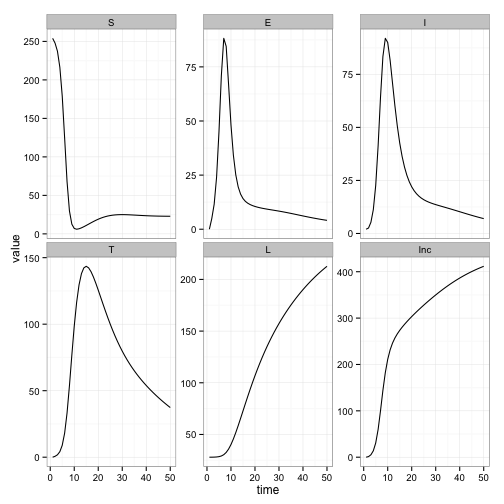
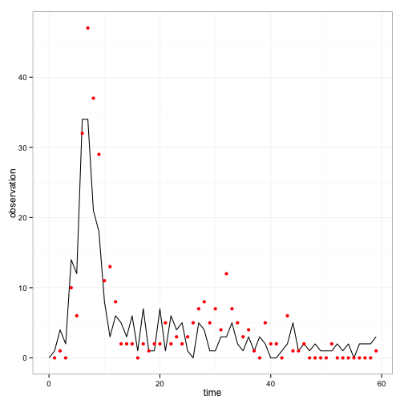
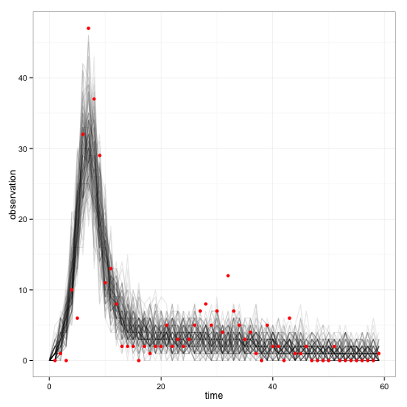
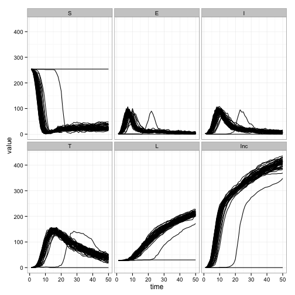
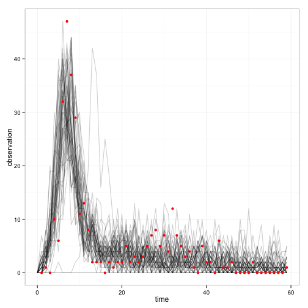

# Tristan da Cunha outbreak

## Create a function that will build and return the fitmodel

Copy and past the following R function into your R script file:


```r
createSEITL <- function(deterministic=TRUE, verbose=TRUE) {

	#########################################################################################
	# First we define all model parameters (theta) using fitparam objects.
	#########################################################################################

	# This is the basic reproduction number, its high value reflect the high contact rate among islanders.
	R0 <- fitparam(name="R0",value=10,support=c(0,Inf),sd.proposal=1,prior=list(distribution="dunif",parameters=c(min=1,max=100))) 

	# The latent period
	LatentPeriod <- fitparam(name="LP",value=2,support=c(0,Inf),sd.proposal=0.5,prior=list(distribution="dunif",parameters=c(min=0,max=7))) 

	# The infectious period
	InfectiousPeriod <- fitparam(name="IP",value=3,support=c(0,Inf),sd.proposal=0.5,prior=list(distribution="dunif",parameters=c(min=0,max=30))) 

	# The duration of the temporary protection against reinfection
	TemporaryImmunePeriod  <- fitparam(name="TIP",value=10,support=c(0,Inf),sd.proposal=2,prior=list(distribution="dunif",parameters=c(min=0,max=50))) 

	# The probability to acquire a long-term protection following completion of the temporary immunity
	ProbLongTermImmunity <- fitparam(name="alpha",value=0.5,support=c(0,1),sd.proposal=0.1,prior=list(distribution="dunif",parameters=c(min=0,max=1))) 

	# The intensity of the case reporting
	ReportingRate <- fitparam(name="rho",value=0.7,support=c(0,2),sd.proposal=0.1,prior=list(distribution="dunif",parameters=c(min=0,max=2))) 

	# The initial proportion of infectious individuals
	proportionI0 <- fitparam(name="pI0",value=2/284,support=c(0,1),sd.proposal=1/284,prior=list(distribution="dunif",parameters=c(min=1/284,max=5/284))) 
	
	# The initial proportion of fully protected individuals
	proportionL0 <- fitparam(name="pL0",value=0.1,support=c(0,1),sd.proposal=0.01,prior=list(distribution="dunif",parameters=c(min=0.0,max=0.5))) 
	
	# The population size (note that this parameter has less arguments since it is fixed)	
	PopSize <- fitparam(name="N",value=284) 

	#########################################################################################
	# We define the vector of state variable names
	#########################################################################################

	state.variables <- c("S","E","I","T","L","Inc")

	#########################################################################################
	# We load and rename the data to have column names: "time" and "Inc"
	#########################################################################################

	data("FluTdC1971",envir = environment())
	data <- rename(FluTdC1971,c("day"="time","incidence"="Inc"))[c("time","Inc")]

	#########################################################################################
	# Then we choose a simulator (deterministic or stochastic)
	#########################################################################################

	if(deterministic){
		simulate.model <- SEITL_simulateDeterministic
	}else{
		simulate.model <- SEITL_simulateStochastic
	}

	#########################################################################################
	# And finally we create a fitmodel 
	# Note that all the functions with names starting by SEITL_ are already coded in the 
	# package and can be considered as blackboxes. 
	# Of course, feel free to have a look at their code and documentation.
	#########################################################################################

	SEITL <- fitmodel(
		verbose=verbose,
		name="SEITL",
		state.variables=state.variables,
		list.fitparam=list(R0,LatentPeriod,InfectiousPeriod,TemporaryImmunePeriod,ProbLongTermImmunity,ReportingRate,proportionI0,proportionL0,PopSize), 
		initialise.state=SEITL_initialiseState,
		log.prior.fitparam=SEITL_logPrior,
		simulate.model=simulate.model, 
		generate.observation=SEITL_generateObservation, 
		data=data, 
		log.likelihood=SEITL_logLikelihood,
		distance.ABC=SEITL_distanceOscillation
		) 


	# Return the fitmodel object
	return(SEITL)
}
```

## Deterministic SEITL model

You can now call this function to create your SEITL `fitmodel`, let's start with the deterministic version:


```r
my_seitlDeter <- createSEITL(deterministic=TRUE)
```


This object has many elements, most of them you should already be familiar with:


```r
names(my_seitlDeter)
```

```
##  [1] "name"                 "state.variables"      "theta"               
##  [4] "initialise.state"     "simulate.model"       "generate.observation"
##  [7] "log.prior"            "data"                 "log.likelihood"      
## [10] "distance.ABC"         "gaussian.proposal"
```

For instance, `my_seitlDeter$theta` is the default vector of parameter values:

```r
my_seitlDeter$theta
```

```
##        R0        LP        IP       TIP     alpha       rho       pI0 
## 1.000e+01 2.000e+00 3.000e+00 1.000e+01 5.000e-01 7.000e-01 7.042e-03 
##       pL0         N 
## 1.000e-01 2.840e+02
```

You can pass this vector to the function `my_seitlDeter$initialise.state` and it will return a vector of initial conditions:

```r
my_seitlDeter$initialise.state(my_seitlDeter$theta)
```

```
##   S   E   I   T   L Inc 
## 254   0   2   0  28   0
```

Finally, you can pass these two vectors to the function `my_seitlDeter$simulate.model`, together with a `times` vector. For instance let's simulate the first 50 days of the outbreak:


```r
my_traj <- my_seitlDeter$simulate.model(theta=my_seitlDeter$theta, state.init=my_seitlDeter$initialise.state(my_seitlDeter$theta), times=1:50)
head(my_traj)
```

```
##   time     S      E      I       T     L    Inc
## 1    1 254.0  0.000  2.000  0.0000 28.00  0.000
## 2    2 247.8  4.915  2.564  0.6671 28.02  1.264
## 3    3 237.3 11.556  5.278  1.7914 28.07  5.218
## 4    4 216.4 23.993 11.217  4.1409 28.22 13.788
## 5    5 178.9 44.973 22.638  8.9690 28.53 30.666
## 6    6 124.4 71.114 41.221 18.1083 29.18 59.698
```

You can use the function `plotModelTraj` to plot your simulation:


```r
plotModelTraj(my_seitlDeter,my_traj)
```

 

Finally, the function `plotThetaFit` to plot one or more simulated observation:


```r
plotThetaFit(theta=my_seitlDeter$theta, fitmodel=my_seitlDeter, n.replicate=1)
```

 

Note that although the model is simulated deterministically, the observation process is stochastic (here it's a Poisson process, see bottom of page 3 of this [reference](http://data.princeton.edu/wws509/notes/c4.pdf) for more details). As such, you can check the variability of the observation by increasing the number of replicates:


```r
plotThetaFit(theta=my_seitlDeter$theta, fitmodel=my_seitlDeter, n.replicate=100)
```

 

## Stochastic SEITL model

You can now repeat the same steps but with the stochastic SEITL model:


```r
my_seitlSto <- createSEITL(deterministic=FALSE)
```


To simulate many replicates of the model use the function `simulateModelReplicates`:


```r
my_traj_replicates <- simulateModelReplicates(my_seitlSto, times=1:50, n=50)
```

```r
head(my_traj_replicates)
```

```
##   replicate time   S  E  I  T  L Inc
## 1         1    1 254  0  2  0 28   0
## 2         1    2 245  7  3  1 28   2
## 3         1    3 227 19  8  2 28   8
## 4         1    4 192 41 18  5 28  21
## 5         1    5 142 65 35 14 28  47
## 6         1    6  77 92 64 22 29  86
```

You can use the same `plotModelTraj` to plot your results:


```r
plotModelTraj(my_seitlSto,my_traj_replicates)
```

 

Similarly, you can plot some fits using `plotThetaFit`:


```r
plotThetaFit(theta=my_seitlSto$theta, fitmodel=my_seitlSto, n.replicate=50)
```

 

## To go further

* You can change the parameter value of your `fitmodel`, either directly from your `createSEITL` function (in this case you need recreate a `fitmodel` object), or by changing the vector of parameter directly from the object: `my_seitlSto$theta`.
* There is another model, the SEIT2L, available in the package. It differs from the SEITL model as it assumes an Erlang distribution for the duration of the temporary protection (hence the 2 after T in it's name) instead of the exponential distribution. It can be created in a similar way as the SEITL model, and has exactly the same parameters:


```r
my_seit2lSto <- SEIT2L_createModelTdC(deterministic=FALSE)
```

Compare the fit of both models for the same `theta` (for instance the default values above). Do you think that having an Erlang ditribution improves the fit?

Previous: [Run MCMC](mcmc.md) Next: [Run a SMC](smc.md)


