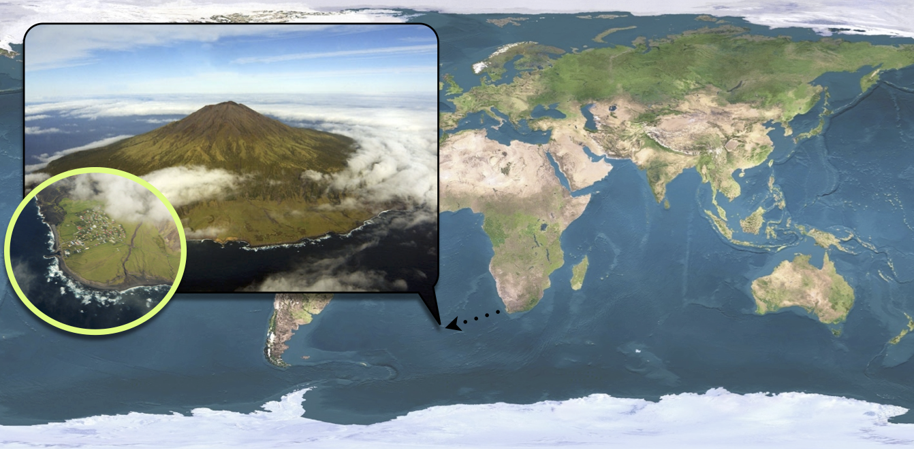

```{julia}
#| echo: false
#| include: false

using Pkg
# Activate the project root (one level up from sessions/)
project_root = joinpath(@__DIR__, "..")
Pkg.activate(project_root)
```

# Objectives

This session will focus on modelling rather than fitting (don't worry, we will come back to fitting on the next session). __The aim of this session is to familiarise yourselves with a real data set: the Tristan da Cunha outbreak and a new model called SEITL.__ We felt this session was necessary as we will use this dataset and this model as a toy example to illustrate all the concepts and methods from now until the end of the course.

As you will read below, the SEITL model has been proposed as a mechanistic explanation for a two-wave influenza A/H3N2 epidemic that occurred on the remote island of Tristan da Cunha in 1971.
__Given the small population size of this island (284 inhabitants), random effects at the individual level may have had important consequences at the population level.__
For instance, even if the distribution of the infectious period is the same for all islanders, some islanders will stay infectious longer than others just by chance and might therefore produce more secondary cases.
This phenomenon is called *demographic stochasticity* and it could have played a significant role in the dynamics of the epidemic on Tristan da Cunha.

Unsurprisingly, to account for demographic stochasticity we need a stochastic model.
However, as you will see in this session and the following, __simulating and fitting a stochastic model is much more computationally costly than doing so for a deterministic model___.
This is why it is important to understand when and why you need to use stochastic or deterministic models.
In fact, we hope that by the end of the day you'll be convinced that both approaches are complementary.

Finally, because this session is devoted to modelling rather than fitting, we thought it was useful to show you __how you can make your model biologically more realistic by using distributions for the time spent in each compartment that are more realistic than the exponential distribution___.

In brief, in this session you will:

1. Familiarise yourselves with the structure of the SEITL model and try to guess its parameter values from the literature.
2. Compare deterministic and stochastic simulations in order to explore the role of demographic stochasticity in the dynamics of the SEITL model.
3. Use a more realistic distribution for the time spent in one of the compartment and assess its effect on the shape of the epidemic.

::: {.callout-note collapse="true"}

# Setup

## Load libraries

```{julia}
using Random ## for random numbers
using Distributions ## for probability distributions
using DifferentialEquations ## for differential equations
using JumpProcesses ## for stochastic simulation (Gillespie algorithm)
using DataFrames ## for data frames
using Plots ## for plots
using StatsPlots ## for statistical plots
using Turing ## for probabilistic programming and MCMC
using CSV ## for CSV file reading
```

## Initialisation

We set a random seed for reproducibility.

```{julia}
Random.seed!(1234)
```

:::

But first of all, let's have a look at the data.

# Tristan da Cunha outbreak



[Tristan da Cunha](http://en.wikipedia.org/wiki/Tristan_da_Cunha) is a volcanic island in the South Atlantic Ocean.
It has been inhabited since the $19^{th}$ century and in 1971, the 284 islanders were living in the single village of the island: Edinburgh of the Seven Seas.
Whereas the internal contacts were typical of close-knit village communities, contacts with the outside world were infrequent and mostly due to fishing vessels that occasionally took passengers to or from the island.
__These ships were often the cause of introduction of new diseases into the population__.
As for influenza, no outbreak had been reported since an epidemic of A/H1N1 in 1954.
In this context of a small population with limited immunity against influenza, an unusual epidemic occurred in 1971, 3 years after the global emergence of the new subtype A/H3N2.

On August 13, a ship returning from Cape Town landed five islanders on Tristan da Cunha.
__Three of them had developed acute respiratory disease during the 8-day voyage and the other two presented similar symptoms immediately after landing__.
Various family gatherings welcomed their disembarkation and in the ensuing days an epidemic started to spread rapidly throughout the whole island population.
After three weeks of propagation, while the epidemic was declining, some islanders developed second episodes of illness and a second peak of cases was recorded.
The epidemic faded out after this second wave and lasted a total of 59 days.
Despite the lack of virological data, serological evidence indicates that all episodes of illness were due to influenza A/H3N2.

Among the 284 islanders, 273 (96%) experienced at least one episode of illness and 92 (32%) experienced two, which is remarkable for influenza.
Unfortunately, __only 312 of the 365 attacks (85%) are known to within a single day of accuracy__ and constitute the dataset reported by [Mantle & Tyrrell in 1973](http://www.ncbi.nlm.nih.gov/pmc/articles/PMC2130434/).

The dataset of daily incidence can be loaded and plotted as follows:

```{julia}
# Load Tristan da Cunha data from CSV
flu_tdc = CSV.read("../data/flu_tdc_1971.csv", DataFrame)

# Display first few rows
first(flu_tdc, 6)
```

```{julia}
# Plot daily observed incidence
scatter(
    flu_tdc.time, flu_tdc.obs,
    xlabel = "Time (days)", ylabel = "Daily incidence",
    label = "Observed cases", markersize = 4, color = :red,
    title = "Tristan da Cunha 1971 Influenza Outbreak"
)
```

# SEITL model

One possible explanation for the rapid influenza reinfections reported during this two-wave outbreak is that following recovery from a first infection, __some islanders did not develop long-term protective immunity and remained fully susceptible to reinfection by the same influenza strain__ that was still circulating.
This can be modelled as follows:

![The SEITL model extends the classical SIR model to account for the dynamics and host heterogeneity of the immune response among the islanders. Following recovery, hosts remain temporarily protected against reinfection thanks to the cellular immune response (T-cells). Accordingly, they enter the T stage (temporary protection). Then, following down-regulation of the cellular response, the humoral immune response (antibodies) has a probability $\alpha$ to reach a level sufficient to protect against reinfection. In this case, recovered hosts enter the L stage (long-term protection), but otherwise they remain unprotected and re-enter the susceptible pool (S).
](../Rmd/external_fig/import/SEITL.jpg)

The SEITL model can be described with five states (S, E, I, T and L) and five parameters:

1. basic reproductive number ($R_0$)
2. latent period ($D_\mathrm{lat}$)
3. infectious period ($D_\mathrm{inf}$)
4. temporary-immune period ($D_\mathrm{imm}$)
5. probability of developing a long-term protection ($\alpha$).

and the following deterministic equations:

$$
\begin{cases}
\begin{aligned}
\frac{\mathrm{d}S}{\mathrm{d}t} &= - \beta S \frac{I}{N} + (1-\alpha) \tau T\\
\frac{\mathrm{d}E}{\mathrm{d}t} &= \beta S \frac{I}{N} - \epsilon E\\
\frac{\mathrm{d}I}{\mathrm{d}t} &= \epsilon E - \nu I\\
\frac{\mathrm{d}T}{\mathrm{d}t} &= \nu I - \tau T\\
\frac{\mathrm{d}L}{\mathrm{d}t} &= \alpha \tau T\\
\end{aligned}
\end{cases}
$$

where $\beta=R_0/D_\mathrm{inf}$, $\epsilon=1/D_\mathrm{lat}$, $\nu = 1/D_\mathrm{inf}$, $\tau=1/D_\mathrm{imm}$ and $N = S + E + I + L + T$ is constant.

It can be shown that __there is an analogy between the deterministic equations and the algorithm that performs stochastic simulations of the model__.
In that sense, the deterministic equations are a description of the stochastic model, too.

In order to fit the SEITL model to the Tristan da Cunha dataset we need to add one state variable and one parameter to the model:

* __The dataset represents daily incidence counts__: we need to create a $6^\mathrm{th}$ state variable - called $\mathrm{Inc}$ - to track the daily number of new cases. Assuming that new cases are reported when they become symptomatic and infectious, we have the following equation for the new state variable:
$$
\frac{d\mathrm{Inc}}{dt} = \epsilon E
$$
* __The dataset is incomplete__: only 85% of the cases were reported. In addition, we need to account for potential under-reporting of asymptomatic cases. We assume that the data were reported according to a Poisson process with reporting rate $\rho$. Since this reporting rate is unknown (we can only presume that it should be below 85% due to reporting errors) we will include it as an additional parameter.

## Parameter values and initial state

Based on the description of the outbreak above and the information below found in the literature, can you think of one or more set(s) of values for the parameters and initial state of the model?

1. The $R_0$ of influenza is commonly estimated to be around 2. However, it can be significantly larger in close-knit communities with exceptional contact configurations.
2. Both the average latent and infectious periods for influenza have been estimated around 2 days each.
3. The down-regulation of the cellular response is completed on average 15 days after symptom onset.
4. Serological surveys have shown that the seroconversion rate to influenza (probability of developing antibodies) is around 80%. However, it is likely that not all seroconverted individuals acquire a long-term protective against reinfection.
5. Between 20 and 30% of the infections with influenza are asymptomatic.
6. There is very limited cross-immunity between influenza viruses A/H1N1 and A/H3N2.

# Deterministic vs Stochastic simulations

Now, try to assess whether the SEITL model can reproduce the two-wave outbreak of Tristan da Cunha with your guess values for the initial state and the parameters.
This will give you the opportunity to compare the deterministic and stochastic model.
We suggest to start with the deterministic model and then move on to the stochastic model but feel free to proceed in a different way.

## Deterministic simulations

Let's define the SEITL model for deterministic simulation:

```{julia}
"""
SEITL model ODE function for deterministic simulation.

States: S (susceptible), E (exposed), I (infectious),
        T (temporary immunity), L (long-term immunity), Inc (daily incidence)
Parameters: R_0, D_lat, D_inf, α, D_imm, ρ
"""
function seitl_ode!(du, u, p, t)
    # Unpack parameters
    R_0, D_lat, D_inf, α, D_imm = p

    # Convert to rates
    β = R_0 / D_inf
    ϵ = 1.0 / D_lat
    ν = 1.0 / D_inf
    τ = 1.0 / D_imm

    # Unpack states
    S, E, I, T, L, Inc = u

    # Total population
    N = S + E + I + T + L

    # ODEs
    du[1] = -β * S * I / N + (1 - α) * τ * T  # dS/dt
    du[2] = β * S * I / N - ϵ * E              # dE/dt
    du[3] = ϵ * E - ν * I                      # dI/dt
    du[4] = ν * I - τ * T                      # dT/dt
    du[5] = α * τ * T                          # dL/dt
    du[6] = ϵ * E                              # dInc/dt (cumulative incidence)
end

"""
Simulate the deterministic SEITL model.
"""
function simulate_seitl_deterministic(θ, init_state, times)
    # Parameters (without ρ which is only for observation process)
    params = [θ[:R_0], θ[:D_lat], θ[:D_inf], θ[:α], θ[:D_imm]]

    # Initial state with Inc = 0
    u0 = [init_state[:S], init_state[:E], init_state[:I],
          init_state[:T], init_state[:L], 0.0]

    # Solve ODE
    prob = ODEProblem(seitl_ode!, u0, (times[1], times[end]), params)
    sol = solve(prob, Tsit5(), saveat=times)

    # Convert to DataFrame manually
    n_times = length(sol.t)
    df = DataFrame(
        S = [sol[i][1] for i in 1:n_times],
        E = [sol[i][2] for i in 1:n_times],
        I = [sol[i][3] for i in 1:n_times],
        T = [sol[i][4] for i in 1:n_times],
        L = [sol[i][5] for i in 1:n_times],
        Inc_cumulative = [sol[i][6] for i in 1:n_times],
        time = sol.t
    )

    # Convert cumulative incidence to daily incidence
    df[!, :Inc] = [0.0; diff(df.Inc_cumulative)]

    return df
end

"""
Turing model for SEITL - enables both simulation and inference.
When obs=missing, use for prior predictive simulation.
When obs=data, use for inference (in later sessions).
"""
@model function seitl_model(times, init_state, obs=missing)
    # Priors
    R_0 ~ Uniform(1.0, 50.0)
    D_lat ~ Uniform(0.1, 10.0)
    D_inf ~ Uniform(0.1, 15.0)
    α ~ Uniform(0.0, 1.0)
    D_imm ~ Uniform(1.0, 50.0)
    ρ ~ Uniform(0.0, 1.0)

    # Create parameter dictionary
    θ = Dict(:R_0 => R_0, :D_lat => D_lat, :D_inf => D_inf,
             :α => α, :D_imm => D_imm, :ρ => ρ)

    # Simulate trajectory
    traj = simulate_seitl_deterministic(θ, init_state, times)

    # Likelihood (if observations provided)
    if !ismissing(obs)
        for i in 1:length(obs)
            λ = max(ρ * traj.Inc[i], 1e-10)
            obs[i] ~ Poisson(λ)
        end
    end

    return traj
end
```

Now let's try some parameter values based on the literature:

```{julia}
# First guess based on the literature
θ_guess = Dict(
    :R_0 => 2.0,
    :D_lat => 2.0,
    :D_inf => 2.0,
    :α => 0.9,
    :D_imm => 13.0,
    :ρ => 0.85
)

# Initial state
# 5 initial infected from the ship, assume some partial immunity from 1954 outbreak
init_state_guess = Dict(
    :S => 250.0,
    :E => 0.0,
    :I => 4.0,
    :T => 0.0,
    :L => 30.0
)

# Simulate
times = collect(0.0:1.0:60.0)
traj = simulate_seitl_deterministic(θ_guess, init_state_guess, times)

# Show first few rows
first(traj, 10)
```

```{julia}
# Plot the simulated incidence against the data
p = plot(title = "SEITL Model: Deterministic Simulation",
         xlabel = "Time (days)", ylabel = "Cases")

# Plot simulated incidence
plot!(p, traj.time, traj.Inc, label = "Simulated", linewidth = 2, color = :blue)

# Overlay real data
scatter!(p, flu_tdc.time, flu_tdc.obs,
         label = "Observed data", markersize = 4, color = :red)

plot!(p)
```

You can visualize all state variables by plotting them:

```{julia}
# Plot all state variables
plot(
    plot(traj.time, traj.S, label = "S", title = "Susceptible", ylabel = "Count"),
    plot(traj.time, traj.E, label = "E", title = "Exposed", ylabel = "Count"),
    plot(traj.time, traj.I, label = "I", title = "Infectious", ylabel = "Count"),
    plot(traj.time, traj.T, label = "T", title = "Temporary immunity", ylabel = "Count"),
    plot(traj.time, traj.L, label = "L", title = "Long-term immunity", ylabel = "Count"),
    plot(traj.time, traj.Inc, label = "Inc", title = "Daily incidence", ylabel = "Count"),
    layout = (3, 2), size = (800, 600), legend = false
)
```

Note that although the simulation of the trajectory is deterministic, the observation process is stochastic (Poisson with reporting rate $\rho$).
You can generate multiple observation replicates:

```{julia}
"""
Generate observed incidence using Poisson observation process.
"""
function generate_observations(traj, ρ)
    obs = [rand(Poisson(ρ * inc)) for inc in traj.Inc]
    return obs
end

# Generate 100 replicates of observations
p = plot(title = "Observation Process Variability",
         xlabel = "Time (days)", ylabel = "Cases")

for i in 1:100
    obs = generate_observations(traj, θ_guess[:ρ])
    plot!(p, traj.time, obs, alpha = 0.2, color = :lightblue, label = "")
end

# Overlay real data
scatter!(p, flu_tdc.time, flu_tdc.obs,
         label = "Observed data", markersize = 4, color = :red)

plot!(p)
```

### Using Turing for simulation

You've just seen how to simulate the model by directly calling the simulation function with specific parameter values.
However, since we've defined a Turing `@model`, we can also sample from the prior predictive distribution.
This is useful when we want to explore the range of behaviors the model can produce before seeing any data.

```{julia}
# Sample from the prior predictive distribution
# This samples parameter values from the priors and simulates trajectories

# Generate 5 trajectories by sampling parameters from priors
p = plot(title = "Prior Predictive Simulations",
         xlabel = "Time (days)", ylabel = "Cases")

for i in 1:5
    # Sample parameters from priors
    R_0 = rand(Uniform(1.0, 50.0))
    D_lat = rand(Uniform(0.1, 10.0))
    D_inf = rand(Uniform(0.1, 15.0))
    α = rand(Uniform(0.0, 1.0))
    D_imm = rand(Uniform(1.0, 50.0))
    ρ = rand(Uniform(0.0, 1.0))

    θ_prior = Dict(:R_0 => R_0, :D_lat => D_lat, :D_inf => D_inf,
                   :α => α, :D_imm => D_imm, :ρ => ρ)

    # Simulate trajectory with sampled parameters
    traj = simulate_seitl_deterministic(θ_prior, init_state_guess, times)

    plot!(p, traj.time, traj.Inc, alpha = 0.5, label = "")
end

scatter!(p, flu_tdc.time, flu_tdc.obs,
         label = "Observed data", markersize = 4, color = :red)

plot!(p)
```

Notice how the same `@model` definition can be used for both simulation (here) and inference (in the next session on pMCMC).
This unified approach means you only need to write the model once.

__Now, take 10 minutes to explore the dynamics of the model for different parameter and initial state values.__ In particular, try different values for $R_0\in[2-15]$ and $\alpha\in[0.3-1]$.
For which values of $R_0$ and $\alpha$ do you get a decent fit?

You should find that it is hard to capture all the data-points with the deterministic model.
We will now test if this can be better reproduced with a stochastic model which explicitly accounts for the discrete nature of individuals.

## Stochastic simulations

For stochastic simulation, we need to implement the model using the Gillespie algorithm (stochastic simulation algorithm).
The model has the following transitions:

| Transition | Rate | Effect |
|------------|------|--------|
| S → E | $\beta S I / N$ | S-1, E+1 |
| E → I | $\epsilon E$ | E-1, I+1, Inc+1 |
| I → T | $\nu I$ | I-1, T+1 |
| T → S | $(1-\alpha) \tau T$ | T-1, S+1 |
| T → L | $\alpha \tau T$ | T-1, L+1 |

```{julia}
"""
SEITL stochastic model using Gillespie algorithm.
"""
function simulate_seitl_stochastic(θ, init_state, times)
    # Parameters
    R_0, D_lat, D_inf, α, D_imm = θ[:R_0], θ[:D_lat], θ[:D_inf], θ[:α], θ[:D_imm]
    β = R_0 / D_inf
    ϵ = 1.0 / D_lat
    ν = 1.0 / D_inf
    τ = 1.0 / D_imm

    # Initial state
    u0 = [init_state[:S], init_state[:E], init_state[:I],
          init_state[:T], init_state[:L], 0.0]

    # Rate function: returns vector of rates for each transition
    function rate_func(u, p, t)
        S, E, I, T, L, Inc = u
        N = S + E + I + T + L

        return [
            β * S * I / N,           # S → E (infection)
            ϵ * E,                   # E → I (becoming infectious)
            ν * I,                   # I → T (recovery to temporary immunity)
            (1 - α) * τ * T,         # T → S (loss of immunity)
            α * τ * T                # T → L (gain long-term immunity)
        ]
    end

    # Stoichiometry matrix: columns are states, rows are transitions
    # Each row shows how a transition changes the state
    stoich = [
        -1  1  0  0  0  0;  # S → E
         0 -1  1  0  0  1;  # E → I (also increments Inc)
         0  0 -1  1  0  0;  # I → T
         1  0  0 -1  0  0;  # T → S
         0  0  0 -1  1  0   # T → L
    ]

    # Define jump problem
    prob = DiscreteProblem(u0, (times[1], times[end]))

    # Create jump processes
    jumps = []
    for i in 1:size(stoich, 1)
        affect! = function(integrator)
            for j in 1:length(integrator.u)
                integrator.u[j] += stoich[i, j]
            end
        end
        rate(u, p, t) = rate_func(u, p, t)[i]
        push!(jumps, ConstantRateJump(rate, affect!))
    end

    jump_prob = JumpProblem(prob, Direct(), jumps...)
    sol = solve(jump_prob, SSAStepper(), saveat=times)

    # Convert to DataFrame manually
    n_times = length(sol.t)
    df = DataFrame(
        S = [sol[i][1] for i in 1:n_times],
        E = [sol[i][2] for i in 1:n_times],
        I = [sol[i][3] for i in 1:n_times],
        T = [sol[i][4] for i in 1:n_times],
        L = [sol[i][5] for i in 1:n_times],
        Inc_cumulative = [sol[i][6] for i in 1:n_times],
        time = sol.t
    )

    # Convert cumulative incidence to daily incidence
    df[!, :Inc] = [0.0; diff(df.Inc_cumulative)]

    return df
end

"""
Turing model for stochastic SEITL - enables both simulation and inference.
This version uses the Gillespie algorithm for demographic stochasticity.
"""
@model function seitl_stochastic_model(times, init_state, obs=missing)
    # Priors
    R_0 ~ Uniform(1.0, 50.0)
    D_lat ~ Uniform(0.1, 10.0)
    D_inf ~ Uniform(0.1, 15.0)
    α ~ Uniform(0.0, 1.0)
    D_imm ~ Uniform(1.0, 50.0)
    ρ ~ Uniform(0.0, 1.0)

    # Create parameter dictionary
    θ = Dict(:R_0 => R_0, :D_lat => D_lat, :D_inf => D_inf,
             :α => α, :D_imm => D_imm, :ρ => ρ)

    # Simulate stochastic trajectory
    traj = simulate_seitl_stochastic(θ, init_state, times)

    # Likelihood (if observations provided)
    if !ismissing(obs)
        for i in 1:length(obs)
            λ = max(ρ * traj.Inc[i], 1e-10)
            obs[i] ~ Poisson(λ)
        end
    end

    return traj
end
```

Now let's run stochastic simulations with the same parameters:

```{julia}
# Run a single stochastic simulation
traj_stoch = simulate_seitl_stochastic(θ_guess, init_state_guess, times)

# Plot
p = plot(title = "SEITL Model: Stochastic Simulation",
         xlabel = "Time (days)", ylabel = "Cases")

plot!(p, traj_stoch.time, traj_stoch.Inc, label = "Simulated (stochastic)",
      linewidth = 2, color = :blue)

scatter!(p, flu_tdc.time, flu_tdc.obs,
         label = "Observed data", markersize = 4, color = :red)

plot!(p)
```

Run multiple stochastic replicates to see variability:

```{julia}
# Generate multiple stochastic trajectories
p = plot(title = "SEITL Model: 50 Stochastic Replicates",
         xlabel = "Time (days)", ylabel = "Cases")

for i in 1:50
    traj_rep = simulate_seitl_stochastic(θ_guess, init_state_guess, times)
    plot!(p, traj_rep.time, traj_rep.Inc, alpha = 0.3,
          color = :lightblue, label = "")
end

scatter!(p, flu_tdc.time, flu_tdc.obs,
         label = "Observed data", markersize = 4, color = :red)

plot!(p)
```

::: {.callout-tip}
## Using Turing for stochastic simulation

Just like with the deterministic model, you can use the Turing `@model` definition for stochastic simulation:

```julia
# Sample from the stochastic model
stoch_model = seitl_stochastic_model(times, init_state_guess, missing)
stoch_sample = rand(stoch_model)
stoch_traj = stoch_sample.traj

# Plot
plot(stoch_traj.time, stoch_traj.Inc, label = "Stochastic simulation", linewidth = 2)
scatter!(flu_tdc.time, flu_tdc.obs, label = "Observed data", color = :red)
```

The same model definition will be used for particle MCMC inference in the next session!
:::

__Take about 10 minutes to explore the dynamics of the stochastic SEITL model.__

__What differences do you notice between stochastic and deterministic simulations? Can you make any conclusions on the role of demographic stochasticity on the dynamics of the SEITL model?__

Now, let's try to make this model a bit more realistic.

# Exponential vs Erlang distributions

So far, we have assumed that the time spent in each compartment follows an [exponential distribution](http://en.wikipedia.org/wiki/Exponential_distribution), because by assuming transitions happen at constant rates we have implied that the process is [memoryless](http://en.wikipedia.org/wiki/Memorylessness).
Although mathematically convenient, this property is not realistic for many biological processes such as the contraction of the cellular response.

In order to include a memory effect, it is common practice to replace the exponential distribution by an [Erlang distribution](http://en.wikipedia.org/wiki/Erlang_distribution).
This distribution is parametrised by its mean $m$ and shape $k$ and can be modelled by $k$ consecutive sub-stages, each being exponentially distributed with mean $m/k$.

As illustrated below the flexibility of the Erlang distribution ranges from the exponential ($k=1$) to Gaussian-like ($k>>1$) distributions.

```{julia}
#| echo: false
# Illustrate Erlang distributions
m = 2.0
x = 0:0.01:4*m
all_k = [1, 2, 5, 20]

p = plot(title = "Erlang Distribution: Flexibility", size = (800, 400))

for k in all_k
    erlang_dist = Gamma(k, m/k)  # Erlang is special case of Gamma
    plot!(p, x, pdf.(erlang_dist, x), label = "k = $k", linewidth = 2)
end

xlabel!("Time spent in compartment")
ylabel!("Probability density")
plot!(p)
```

We propose to extend the SEITL as follows:


## SEIT4L model implementation

```{julia}
"""
SEIT4L model: SEITL with T compartment split into 4 stages (Erlang-4 distribution).
"""
function seit4l_ode!(du, u, p, t)
    # Unpack parameters
    R_0, D_lat, D_inf, α, D_imm = p

    # Convert to rates
    β = R_0 / D_inf
    ϵ = 1.0 / D_lat
    ν = 1.0 / D_inf
    τ = 4.0 / D_imm  # Rate through each T sub-stage (4 stages total)

    # Unpack states: S, E, I, T1, T2, T3, T4, L, Inc
    S, E, I, T1, T2, T3, T4, L, Inc = u

    # Total population
    N = S + E + I + T1 + T2 + T3 + T4 + L

    # ODEs
    du[1] = -β * S * I / N + (1 - α) * τ * T4  # dS/dt
    du[2] = β * S * I / N - ϵ * E              # dE/dt
    du[3] = ϵ * E - ν * I                      # dI/dt
    du[4] = ν * I - τ * T1                     # dT1/dt
    du[5] = τ * T1 - τ * T2                    # dT2/dt
    du[6] = τ * T2 - τ * T3                    # dT3/dt
    du[7] = τ * T3 - τ * T4                    # dT4/dt
    du[8] = α * τ * T4                         # dL/dt
    du[9] = ϵ * E                              # dInc/dt
end

"""
Simulate the deterministic SEIT4L model.
"""
function simulate_seit4l_deterministic(θ, init_state, times)
    params = [θ[:R_0], θ[:D_lat], θ[:D_inf], θ[:α], θ[:D_imm]]

    # Initial state with Inc = 0 and T split into 4 stages
    u0 = [init_state[:S], init_state[:E], init_state[:I],
          init_state[:T1], init_state[:T2], init_state[:T3], init_state[:T4],
          init_state[:L], 0.0]

    prob = ODEProblem(seit4l_ode!, u0, (times[1], times[end]), params)
    sol = solve(prob, Tsit5(), saveat=times)

    # Convert to DataFrame manually
    n_times = length(sol.t)
    df = DataFrame(
        S = [sol[i][1] for i in 1:n_times],
        E = [sol[i][2] for i in 1:n_times],
        I = [sol[i][3] for i in 1:n_times],
        T1 = [sol[i][4] for i in 1:n_times],
        T2 = [sol[i][5] for i in 1:n_times],
        T3 = [sol[i][6] for i in 1:n_times],
        T4 = [sol[i][7] for i in 1:n_times],
        L = [sol[i][8] for i in 1:n_times],
        Inc_cumulative = [sol[i][9] for i in 1:n_times],
        time = sol.t
    )

    df[!, :Inc] = [0.0; diff(df.Inc_cumulative)]

    return df
end

"""
Turing model for SEIT4L - enables both simulation and inference.
This version uses an Erlang-4 distribution for the T compartment.
"""
@model function seit4l_model(times, init_state, obs=missing)
    # Priors
    R_0 ~ Uniform(1.0, 50.0)
    D_lat ~ Uniform(0.1, 10.0)
    D_inf ~ Uniform(0.1, 15.0)
    α ~ Uniform(0.0, 1.0)
    D_imm ~ Uniform(1.0, 50.0)
    ρ ~ Uniform(0.0, 1.0)

    # Create parameter dictionary
    θ = Dict(:R_0 => R_0, :D_lat => D_lat, :D_inf => D_inf,
             :α => α, :D_imm => D_imm, :ρ => ρ)

    # Simulate trajectory
    traj = simulate_seit4l_deterministic(θ, init_state, times)

    # Likelihood (if observations provided)
    if !ismissing(obs)
        for i in 1:length(obs)
            λ = max(ρ * traj.Inc[i], 1e-10)
            obs[i] ~ Poisson(λ)
        end
    end

    return traj
end
```

__Take 5 minutes to have a look at the functions above and make sure you understand how the Erlang distribution for the $T$ compartment is coded.__

Now, compare the dynamics of the SEITL and SEIT4L model.
Use your best guess from the previous section for the parameters.
Note that although SEITL and SEIT4L share the same parameters, their state variables differ so you need to modify the initial state of SEIT4L accordingly.

```{julia}
# Initial state for SEIT4L (need to split T into 4 stages)
init_state_4l = Dict(
    :S => 250.0,
    :E => 0.0,
    :I => 4.0,
    :T1 => 0.0,
    :T2 => 0.0,
    :T3 => 0.0,
    :T4 => 0.0,
    :L => 30.0
)

# Try with better parameter values that produce two waves
θ_better = Dict(
    :R_0 => 10.0,
    :D_lat => 2.0,
    :D_inf => 2.0,
    :α => 0.5,
    :D_imm => 13.0,
    :ρ => 0.7
)

# Simulate both models
traj_seitl = simulate_seitl_deterministic(θ_better, init_state_guess, times)
traj_seit4l = simulate_seit4l_deterministic(θ_better, init_state_4l, times)

# Plot comparison
p = plot(title = "SEITL vs SEIT4L", xlabel = "Time (days)", ylabel = "Cases")

plot!(p, traj_seitl.time, traj_seitl.Inc,
      label = "SEITL (exponential T)", linewidth = 2, color = :blue)
plot!(p, traj_seit4l.time, traj_seit4l.Inc,
      label = "SEIT4L (Erlang-4 T)", linewidth = 2, color = :green)

scatter!(p, flu_tdc.time, flu_tdc.obs,
         label = "Observed data", markersize = 4, color = :red)

plot!(p)
```

__Can you notice any differences? If so, which model seems to provide the best fit? Do you understand why the shape of the epidemic changes when you use the Erlang distribution for the $T$ compartment?__

In the next session, you will verify your intuition by using a statistical criterion to find which model fits the best the Tristan da Cunha outbreak.

::: {.callout-note}
## From simulation to inference: the unified Turing approach

Throughout this session, you've defined models using the `@model` macro with the pattern:

```julia
@model function my_model(times, init_state, obs=missing)
    # 1. Define priors
    R_0 ~ Uniform(1.0, 50.0)
    # ... other parameters

    # 2. Simulate trajectory
    traj = simulate_function(θ, init_state, times)

    # 3. Likelihood (if data provided)
    if !ismissing(obs)
        for i in 1:length(obs)
            obs[i] ~ Poisson(λ[i])
        end
    end

    return traj
end
```

This unified structure enables both:
- **Simulation** (this session): Call `rand(my_model(times, init_state, missing))` to sample from the prior predictive distribution
- **Inference** (next session): Call `sample(my_model(times, init_state, data), PG(50), 1000)` to fit parameters to data using particle MCMC

You write the model once and use it for both purposes.
This is the power of probabilistic programming!
:::

# Going further

* Curious about why we use the Poisson likelihood for count data? Have a look at the bottom of page 3 of this [reference](../Rmd/external_ref/poisson_obs.pdf) from Germán Rodríguez' [lecture notes on generalized linear models](https://grodri.github.io/glms/notes/).
* You might wonder why we only modified the distribution of the $T$ compartment. Indeed, wouldn't it be more realistic to use Erlang distributions for all the other compartments? And why did we use a shape equal to 4 and not 2 or 100? Think about another variant of the SEITL model and implement it by modifying the original version in a similar way as we did for the SEIT4L model. Does it fit the data better?
