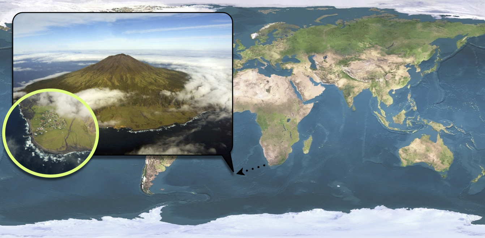

::: {.callout-note appearance="simple"}
**Estimated time**: 2-2.5 hours
:::

[Lecture slides](slides/seitl.qmd)

# Introduction

> **Entering the stochastic tier**: You've completed the core sessions with deterministic ODE models. This session introduces stochastic simulation and a new dataset (Tristan da Cunha) that we'll use for the rest of the course. Fitting resumes in Particle Filters.

This session focuses on modelling rather than fitting (fitting returns in the [Particle Filters](particle_filters.qmd) and [Particle MCMC](pmcmc.qmd) sessions). The aim is to familiarise you with a real dataset - the Tristan da Cunha outbreak - and a new model called SEITL. This dataset and model serve as the running example for all remaining sessions.

As you will read below, the SEITL model has been proposed as a mechanistic explanation for a two-wave influenza A/H3N2 epidemic that occurred on the remote island of Tristan da Cunha in 1971.
Given the small population size of this island (284 inhabitants), random effects at the individual level may have had important consequences at the population level.
For instance, even if the distribution of the infectious period is the same for all islanders, some islanders will stay infectious longer than others just by chance and might therefore produce more secondary cases.
This phenomenon is called *demographic stochasticity* and it could have played a significant role in the dynamics of the epidemic on Tristan da Cunha.

Unsurprisingly, to account for demographic stochasticity we need a stochastic model.
However, as you will see in this session and the following, simulating and fitting a stochastic model is much more computationally costly than doing so for a deterministic model.
This is why it is important to understand when and why you need to use stochastic or deterministic models.
In fact, we hope that by the end of the day you'll be convinced that both approaches are complementary.

Finally, because this session is devoted to modelling rather than fitting, we thought it was useful to show you how you can make your model biologically more realistic by using distributions for the time spent in each compartment that are more realistic than the exponential distribution.

# Objectives

In this session you will:

1. Familiarise yourselves with the structure of the SEITL model and try to guess its parameter values from the literature.
2. Compare deterministic and stochastic simulations in order to explore the role of demographic stochasticity in the dynamics of the SEITL model.
3. Use a more realistic distribution for the time spent in one of the compartment and assess its effect on the shape of the epidemic.

::: {.callout-important}
## Stochastic models produce different results each run

Unlike deterministic models, stochastic simulations give **different outputs every time you run them** - even with identical parameters. This is a feature, not a bug: it reflects the real randomness in small populations.

**What this means for you:**
- Your plots will look different from your neighbour's (and from any solutions we show)
- Running the same code twice gives different trajectories
- This is expected and correct behaviour

We set `Random.seed!(1234)` for reproducibility within a session, but the key insight is that stochastic variability *between* simulations is precisely what makes inference harder and more interesting.
:::

::: {.callout-note}
## Course roadmap
This session marks a transition in the course. We move from general inference methods (MCMC, diagnostics, model checking) to applying them to a specific scientific question: explaining the two-wave Tristan da Cunha outbreak.

The remaining sessions build on the SEITL/SEIT4L models introduced here:

- [Particle Filters](particle_filters.qmd): Estimating likelihoods for stochastic models
- [Particle MCMC](pmcmc.qmd): Full Bayesian inference using particle filters
- [Observation Models](observation_models.qmd): Comparing likelihood-based and likelihood-free inference
- [Variational Inference](variational_inference.qmd) (optional): Fast approximate inference for real-time applications
- [Universal Differential Equations](universal_differential_equations.qmd) (optional): Learning unknown mechanisms with neural networks
:::

# Setup

```{julia}
#| echo: false
#| include: false

ENV["GKSwstype"] = "100"  # Suppress plot windows during render
```

## Source file

The source file of this session is located at `sessions/seitl.qmd`.

## Load libraries

```{julia}
using Random ## for random numbers
using Distributions ## for probability distributions
using DifferentialEquations ## for differential equations
# JumpProcesses.jl is an alternative for stochastic simulation - we implement Gillespie manually here
using DataFrames ## for data frames
using Plots ## for plots
using StatsPlots ## for statistical plots
using Turing ## for probabilistic programming and MCMC
using CSV ## for CSV file reading
using DrWatson ## for datadir()
using MFIIDD ## the course package, which holds the SEITL implementations
```

## Initialisation

We set a random seed for reproducibility.

```{julia}
Random.seed!(1234)
```

But first of all, let's have a look at the data.

# Tristan da Cunha outbreak



[Tristan da Cunha](http://en.wikipedia.org/wiki/Tristan_da_Cunha) is a volcanic island in the South Atlantic Ocean.
It has been inhabited since the $19^{th}$ century and in 1971, the 284 islanders were living in the single village of the island: Edinburgh of the Seven Seas.
Whereas the internal contacts were typical of close-knit village communities, contacts with the outside world were infrequent and mostly due to fishing vessels that occasionally took passengers to or from the island.
These ships were often the cause of introduction of new diseases into the population.
As for influenza, no outbreak had been reported since an epidemic of A/H1N1 in 1954.
In this context of a small population with limited immunity against influenza, an unusual epidemic occurred in 1971, 3 years after the global emergence of the new subtype A/H3N2.

On August 13, a ship returning from Cape Town landed five islanders on Tristan da Cunha.
Three of them had developed acute respiratory disease during the 8-day voyage and the other two presented similar symptoms immediately after landing.
Various family gatherings welcomed their disembarkation and in the ensuing days an epidemic started to spread rapidly throughout the whole island population.
After three weeks of propagation, while the epidemic was declining, some islanders developed second episodes of illness and a second peak of cases was recorded.
The epidemic faded out after this second wave and lasted a total of 59 days.
Despite the lack of virological data, serological evidence indicates that all episodes of illness were due to influenza A/H3N2.

Among the 284 islanders, 273 (96%) experienced at least one episode of illness and 92 (32%) experienced two, which is remarkable for influenza.
Unfortunately, only 312 of the 365 attacks (85%) are known to within a single day of accuracy and constitute the dataset reported by [Mantle & Tyrrell in 1973](http://www.ncbi.nlm.nih.gov/pmc/articles/PMC2130434/).

The dataset of daily incidence can be loaded and plotted as follows:

```{julia}
# Load Tristan da Cunha data
# Alternatively, you can load directly from GitHub:
# flu_tdc_url = "https://raw.githubusercontent.com/mfiidd/mfiidd/main/data/flu_tdc_1971.csv"
# flu_tdc = CSV.read(download(flu_tdc_url), DataFrame)
flu_tdc = CSV.read(datadir("flu_tdc_1971.csv"), DataFrame)

# Display first few rows
first(flu_tdc, 6)
```

```{julia}
# Plot daily observed incidence
scatter(
    flu_tdc.time, flu_tdc.obs,
    xlabel = "Time (days)", ylabel = "Daily incidence",
    label = "Observed cases", markersize = 4, color = :red,
    title = "Tristan da Cunha 1971 Influenza Outbreak"
)
```

# SEITL model

One possible explanation for the rapid influenza reinfections reported during this two-wave outbreak is that following recovery from a first infection, some islanders did not develop long-term protective immunity and remained fully susceptible to reinfection by the same influenza strain that was still circulating.
This can be modelled as follows:

![The SEITL model extends the classical SIR model to account for the dynamics and host heterogeneity of the immune response among the islanders. Following recovery, hosts remain temporarily protected against reinfection thanks to the cellular immune response (T-cells). Accordingly, they enter the T stage (temporary protection). Then, following down-regulation of the cellular response, the humoral immune response (antibodies) has a probability $\alpha$ to reach a level sufficient to protect against reinfection. In this case, recovered hosts enter the L stage (long-term protection), but otherwise they remain unprotected and re-enter the susceptible pool (S).
](../figures/SEITL.jpg)

The SEITL model can be described with five states (S, E, I, T and L) and five parameters:

1. basic reproductive number ($R_0$)
2. latent period ($D_\mathrm{lat}$)
3. infectious period ($D_\mathrm{inf}$)
4. temporary-immune period ($D_\mathrm{imm}$)
5. probability of developing a long-term protection ($\alpha$).

and the following deterministic equations:

$$
\begin{cases}
\begin{aligned}
\frac{\mathrm{d}S}{\mathrm{d}t} &= - \beta S \frac{I}{N} + (1-\alpha) \tau T\\
\frac{\mathrm{d}E}{\mathrm{d}t} &= \beta S \frac{I}{N} - \epsilon E\\
\frac{\mathrm{d}I}{\mathrm{d}t} &= \epsilon E - \nu I\\
\frac{\mathrm{d}T}{\mathrm{d}t} &= \nu I - \tau T\\
\frac{\mathrm{d}L}{\mathrm{d}t} &= \alpha \tau T\\
\end{aligned}
\end{cases}
$$

where $\beta=R_0/D_\mathrm{inf}$, $\epsilon=1/D_\mathrm{lat}$, $\nu = 1/D_\mathrm{inf}$, $\tau=1/D_\mathrm{imm}$ and $N = S + E + I + L + T$ is constant.

It can be shown that there is an analogy between the deterministic equations and the algorithm that performs stochastic simulations of the model.
In that sense, the deterministic equations are a description of the stochastic model, too.

In order to fit the SEITL model to the Tristan da Cunha dataset we need to add one state variable and one parameter to the model:

* The dataset represents daily incidence counts: we need to create a $6^\mathrm{th}$ state variable - called $\mathrm{Inc}$ - to track the daily number of new cases. Assuming that new cases are reported when they become symptomatic and infectious, we have the following equation for the new state variable:
$$
\frac{d\mathrm{Inc}}{dt} = \epsilon E
$$
* The dataset is incomplete: only 85% of the cases were reported. In addition, we need to account for potential under-reporting of asymptomatic cases. We assume that the data were reported according to a Poisson process with reporting rate $\rho$. Since this reporting rate is unknown (we can only presume that it should be below 85% due to reporting errors) we will include it as an additional parameter.

## Parameter values and initial state

Based on the description of the outbreak above and the information below found in the literature, can you think of one or more set(s) of values for the parameters and initial state of the model?

1. The $R_0$ of influenza is commonly estimated to be around 2. However, it can be significantly larger in close-knit communities with exceptional contact configurations.
2. Both the average latent and infectious periods for influenza have been estimated around 2 days each.
3. The down-regulation of the cellular response is completed on average 15 days after symptom onset.
4. Serological surveys have shown that the seroconversion rate to influenza (probability of developing antibodies) is around 80%. However, it is likely that not all seroconverted individuals acquire a long-term protective against reinfection.
5. Between 20 and 30% of the infections with influenza are asymptomatic.
6. There is very limited cross-immunity between influenza viruses A/H1N1 and A/H3N2.

::: {.callout-tip collapse="true"}
## Hint: Reasonable parameter ranges

Based on the literature above, here are reasonable starting guesses:

| Parameter | Reasoning | Suggested range |
|-----------|-----------|-----------------|
| R_0 | Typically ~2 for influenza, but higher in close-knit communities | 4-10 |
| D_lat | Latent period ~2 days | 1-3 |
| D_inf | Infectious period ~2 days | 1-4 |
| D_imm | Cellular response ~15 days post-symptom | 10-20 |
| α | Seroconversion ~80%, but not all develop long-term immunity | 0.4-0.8 |
| ρ | <85% reporting, minus asymptomatic (20-30%) | 0.5-0.7 |

These are just starting points. The inference will refine them.
:::

# Deterministic vs Stochastic simulations

::: {.callout-note}
## Two independent modelling choices
This session explores two separate decisions that can be combined independently:

1. **Simulation method**: deterministic (ODEs) vs stochastic (Gillespie) — controls whether we model individual-level randomness
2. **Compartment durations**: exponential (SEITL) vs Erlang (SEIT4L) — controls how realistic the waiting times are

These are orthogonal: you can have a deterministic SEIT4L or a stochastic SEITL. We cover all four combinations below, but the key point is that each choice addresses a different biological question.
:::

Now, try to assess whether the SEITL model can reproduce the two-wave outbreak of Tristan da Cunha with your guess values for the initial state and the parameters.
This will give you the opportunity to compare the deterministic and stochastic model.
We suggest to start with the deterministic model and then move on to the stochastic model but feel free to proceed in a different way.

## Deterministic simulations

Let's look at the SEITL model for deterministic simulation.

These two functions live in [`src/seitl_model.jl`](https://github.com/mfiidd/mfiidd/blob/main/src/seitl_model.jl) and arrived with `using MFIIDD` above.
They are shown from that source rather than repeated here, so the page and the code the later sessions run cannot drift apart.

Both unpack their arguments positionally, so it is worth having the orderings to hand: the state vector `u` is `[S, E, I, T, L, Inc]`, where `Inc` accumulates cumulative incidence, and the parameter vector `p` is `[R_0, D_lat, D_inf, α, D_imm]`.
The reporting rate `ρ` is not among them, because it belongs to the observation process rather than to the dynamics.

```{julia}
#| echo: false
#| output: asis
println("```julia\n", source_for(seitl_ode!), "\n\n", source_for(simulate_seitl_deterministic), "\n```")
```

The Turing model wrapping them belongs to this session:

```{julia}
"""
Turing model for SEITL - enables both simulation and inference.
When unconditioned, use for prior predictive simulation.
When conditioned with | (; obs = data), use for inference (in later sessions).
"""
@model function seitl_model(times, init_state, n_obs)
    # `times` starts one day before the first observation, so `traj.Inc[i + 1]`
    # is the incidence over the day the i-th observation counts
    @assert length(times) == n_obs + 1 "times must have one more point than there are observations"

    # Deliberately wide priors — we want the data to drive inference
    # rather than our prior beliefs. These ranges are generous enough
    # to include all plausible parameter values for influenza.
    R_0 ~ Uniform(1.0, 50.0)
    D_lat ~ Uniform(0.1, 10.0)
    D_inf ~ Uniform(0.1, 15.0)
    α ~ Uniform(0.0, 1.0)
    D_imm ~ Uniform(1.0, 50.0)
    ρ ~ Uniform(0.0, 1.0)

    # Create parameter dictionary
    θ = Dict(:R_0 => R_0, :D_lat => D_lat, :D_inf => D_inf,
             :α => α, :D_imm => D_imm, :ρ => ρ)

    # Simulate trajectory
    traj = simulate_seitl_deterministic(θ, init_state, times)

    # Likelihood
    lambdas = [max(ρ * traj.Inc[i + 1], 1e-10) for i in 1:n_obs]
    obs ~ arraydist(Poisson.(lambdas))

    return traj
end
```

Now let's try some parameter values based on the literature:

```{julia}
# First guess based on the literature
θ_guess = Dict(
    :R_0 => 2.0,
    :D_lat => 2.0,
    :D_inf => 2.0,
    :α => 0.9,
    :D_imm => 13.0,
    :ρ => 0.85
)

# Initial state
## The island as the ship lands, at the start of day 1. Of the five islanders it
## brought back, three had fallen ill during the eight day voyage and are past
## their infectious period, so they start in T; the two who developed symptoms on
## landing start in I. The rest of the 284 islanders are susceptible
init_state_guess = Dict(
    :S => 279.0,
    :E => 0.0,
    :I => 2.0,
    :T => 3.0,
    :L => 0.0
)

# Simulate
times = collect(0.0:1.0:59.0)
traj = simulate_seitl_deterministic(θ_guess, init_state_guess, times)

# Show first few rows
first(traj, 10)
```

```{julia}
#| code-fold: true
#| code-summary: "Plotting code"
# Plot the simulated incidence against the data
p = plot(title = "SEITL Model: Deterministic Simulation",
         xlabel = "Time (days)", ylabel = "Cases")

# Plot simulated incidence
plot!(p, traj.time, traj.Inc, label = "Simulated", linewidth = 2, color = :blue)

# Overlay real data
scatter!(p, flu_tdc.time, flu_tdc.obs,
         label = "Observed data", markersize = 4, color = :red)

plot!(p)
```

You can visualise all state variables by plotting them:

```{julia}
#| code-fold: true
#| code-summary: "Plotting code"
# Plot all state variables
plot(
    plot(traj.time, traj.S, label = "S", title = "Susceptible", ylabel = "Count"),
    plot(traj.time, traj.E, label = "E", title = "Exposed", ylabel = "Count"),
    plot(traj.time, traj.I, label = "I", title = "Infectious", ylabel = "Count"),
    plot(traj.time, traj.T, label = "T", title = "Temporary immunity", ylabel = "Count"),
    plot(traj.time, traj.L, label = "L", title = "Long-term immunity", ylabel = "Count"),
    plot(traj.time, traj.Inc, label = "Inc", title = "Daily incidence", ylabel = "Count"),
    layout = (3, 2), size = (800, 600), legend = false
)
```

Note that although the simulation of the trajectory is deterministic, the observation process is stochastic (Poisson with reporting rate $\rho$).
You can generate multiple observation replicates, using `generate_observations`, which comes from the package too:

```{julia}
#| echo: false
#| output: asis
println("```julia\n", source_for(generate_observations), "\n```")
```

```{julia}
# Generate 100 replicates of observations
p = plot(title = "Observation Process Variability",
         xlabel = "Time (days)", ylabel = "Cases")

for i in 1:100
    obs = generate_observations(traj, θ_guess[:ρ])
    plot!(p, traj.time, obs, alpha = 0.2, color = :lightblue, label = "")
end

# Overlay real data
scatter!(p, flu_tdc.time, flu_tdc.obs,
         label = "Observed data", markersize = 4, color = :red)

plot!(p)
```

### Using Turing for simulation

You've just seen how to simulate the model by directly calling the simulation function with specific parameter values.
However, since we've defined a Turing `@model`, we can also sample from the prior predictive distribution.
This is useful when we want to explore the range of behaviours the model can produce before seeing any data.

```{julia}
# Sample from the prior predictive distribution
# This samples parameter values from the priors and simulates trajectories

# Generate 5 trajectories using the Turing model
# Without conditioning, the model samples parameters from priors and simulates
p = plot(title = "Prior Predictive Simulations",
         xlabel = "Time (days)", ylabel = "Cases")

for i in 1:5
    # Sample parameters from priors
    seitl_prior = seitl_model(times, init_state_guess, length(times) - 1)
    params = rand(seitl_prior).data

    # Create parameter dictionary and simulate
    θ = Dict(:R_0 => params.R_0, :D_lat => params.D_lat, :D_inf => params.D_inf,
             :α => params.α, :D_imm => params.D_imm, :ρ => params.ρ)
    traj = simulate_seitl_deterministic(θ, init_state_guess, times)

    plot!(p, traj.time, traj.Inc, alpha = 0.5, label = "")
end

scatter!(p, flu_tdc.time, flu_tdc.obs,
         label = "Observed data", markersize = 4, color = :red)

plot!(p)
```

Notice how the same `@model` definition can be used for both simulation (here) and inference (in the [Particle MCMC session](pmcmc.qmd)).
This unified approach means you only need to write the model once.

Now, take 5 minutes to explore the dynamics of the model for different parameter and initial state values. In particular, try different values for $R_0\in[2-15]$ and $\alpha\in[0.3-1]$.
For which values of $R_0$ and $\alpha$ do you get a decent fit?

You should find that it is hard to capture all the data-points with the deterministic model.
We will now test if this can be better reproduced with a stochastic model which explicitly accounts for the discrete nature of individuals.

## Stochastic simulations

The stochastic simulation uses the Gillespie algorithm, which simulates individual events (infections, recoveries) as random occurrences. Unlike ODEs which give smooth trajectories, this captures the inherent randomness in small populations. Each event is sampled from the possible transitions weighted by their rates, and waiting times between events follow exponential distributions.

The model has the following transitions:

| Transition | Rate | Effect |
|------------|------|--------|
| S → E | $\beta S I / N$ | S-1, E+1 |
| E → I | $\epsilon E$ | E-1, I+1 (count as new case) |
| I → T | $\nu I$ | I-1, T+1 |
| T → S | $(1-\alpha) \tau T$ | T-1, S+1 |
| T → L | $\alpha \tau T$ | T-1, L+1 |

::: {.callout-note collapse="true"}
## Implementation: Gillespie algorithm

```{julia}
#| echo: false
#| output: asis
println("```julia\n", source_for(simulate_seitl_stochastic), "\n```")
```

::: {.callout-tip collapse="true"}
## Code explainer

- **Stoichiometry matrix**: Each row defines how compartments change for one transition type (e.g., `[-1, 1, 0, 0, 0]` means S decreases by 1 and E increases by 1 for infection)
- **`rates(s)`**: Computes the current rate of each transition based on compartment sizes
- **`gillespie_step!`**: Simulates one day by repeatedly: (1) drawing an exponential waiting time, (2) selecting which event occurs proportional to rates, (3) applying the state change
- **`randexp() / total_rate`**: Waiting time to next event follows Exp(total_rate)
- **Event selection**: Cumulative sum trick to select event with probability proportional to its rate
- **`event == 2`**: E→I transitions are counted as new cases (daily incidence)
:::

:::

::: {.callout-note collapse="true"}
## Coming from R?
In R, the [`GillespieSSA2`](https://CRAN.R-project.org/package=GillespieSSA2) and [`adaptivetau`](https://CRAN.R-project.org/package=adaptivetau) packages provide Gillespie simulation. The [`odin`](https://mrc-ide.github.io/odin/) and [`dust`](https://mrc-ide.github.io/dust/) packages from the MRC Centre offer a more performant framework for stochastic compartmental models. Here we implement Gillespie manually to show the algorithm clearly, but Julia's [`JumpProcesses.jl`](https://docs.sciml.ai/JumpProcesses/stable/) package provides a production-quality implementation.
:::

```{julia}
"""
Turing model for stochastic SEITL - enables both simulation and inference.
This version uses the Gillespie algorithm for demographic stochasticity.
"""
@model function seitl_stochastic_model(times, init_state, n_obs)
    # `times` starts one day before the first observation, so `traj.Inc[i + 1]`
    # is the incidence over the day the i-th observation counts
    @assert length(times) == n_obs + 1 "times must have one more point than there are observations"

    # Priors
    R_0 ~ Uniform(1.0, 50.0)
    D_lat ~ Uniform(0.1, 10.0)
    D_inf ~ Uniform(0.1, 15.0)
    α ~ Uniform(0.0, 1.0)
    D_imm ~ Uniform(1.0, 50.0)
    ρ ~ Uniform(0.0, 1.0)

    # Create parameter dictionary
    θ = Dict(:R_0 => R_0, :D_lat => D_lat, :D_inf => D_inf,
             :α => α, :D_imm => D_imm, :ρ => ρ)

    # Simulate stochastic trajectory
    traj = simulate_seitl_stochastic(θ, init_state, times)

    # Likelihood
    lambdas = [max(ρ * traj.Inc[i + 1], 1e-10) for i in 1:n_obs]
    obs ~ arraydist(Poisson.(lambdas))

    return traj
end
```

Now let's run stochastic simulations with the same parameters:

```{julia}
# Run a single stochastic simulation
traj_stoch = simulate_seitl_stochastic(θ_guess, init_state_guess, times)

# Plot
p = plot(title = "SEITL Model: Stochastic Simulation",
         xlabel = "Time (days)", ylabel = "Cases")

plot!(p, traj_stoch.time, traj_stoch.Inc, label = "Simulated (stochastic)",
      linewidth = 2, color = :blue)

scatter!(p, flu_tdc.time, flu_tdc.obs,
         label = "Observed data", markersize = 4, color = :red)

plot!(p)
```

Run multiple stochastic replicates to see variability:

```{julia}
# Generate multiple stochastic trajectories with the same parameters
# This shows the variability from demographic stochasticity
p = plot(title = "SEITL Model: 50 Stochastic Replicates",
         xlabel = "Time (days)", ylabel = "Cases")

for i in 1:50
    traj_rep = simulate_seitl_stochastic(θ_guess, init_state_guess, times)
    plot!(p, traj_rep.time, traj_rep.Inc, alpha = 0.3,
          color = :lightblue, label = "")
end

scatter!(p, flu_tdc.time, flu_tdc.obs,
         label = "Observed data", markersize = 4, color = :red)

plot!(p)
```

::: {.callout-note}
Just like with the deterministic model, you can use the Turing `@model` for prior predictive checks by sampling parameters from priors (without conditioning on data). The same `@model` definitions will be used for inference in the [Particle Filters](particle_filters.qmd) and [Particle MCMC](pmcmc.qmd) sessions — condition with `| (; obs = data)` when fitting, leave unconditioned when simulating. See the [unified approach callout](#sec-unified-approach) at the end of this session for the full pattern.
:::

::: {.callout-tip title="Exercise: Explore stochastic SEITL dynamics"}
What differences do you notice between stochastic and deterministic simulations? Can you make any conclusions on the role of demographic stochasticity on the dynamics of the SEITL model?
:::

::: {.callout-tip title="What to look for" collapse="true"}
Three differences show up reliably. Individual stochastic runs are jagged where
the deterministic one is smooth, because transitions happen as discrete events
rather than continuous flows. Their peaks land at different times, sometimes days
apart, since early chance events shift the whole trajectory. And some runs fade
out entirely while others take off, which the deterministic model cannot do at
all.

The conclusion worth drawing is that the deterministic trajectory is not the
"average" stochastic one. Averaging over runs that peak at different times gives a
curve that is lower and broader than any individual run, so the deterministic
solution sits somewhere among the possibilities rather than at their centre.

This matters most in a population this size. Tristan da Cunha had 284 people, and
demographic noise scales roughly as $1/\sqrt{N}$, so chance is a first-order
effect rather than a correction. It is the reason the rest of the course needs
machinery that can handle a stochastic model rather than fitting the
deterministic one and hoping.
:::

Now we make this model a bit more realistic.

# Exponential vs Erlang distributions

So far, we have assumed that the time spent in each compartment follows an [exponential distribution](http://en.wikipedia.org/wiki/Exponential_distribution), because by assuming transitions happen at constant rates we have implied that the process is [memoryless](http://en.wikipedia.org/wiki/Memorylessness).
Although mathematically convenient, this property is not realistic for many biological processes such as the contraction of the cellular response.

In order to include a memory effect, it is common practice to replace the exponential distribution by an [Erlang distribution](http://en.wikipedia.org/wiki/Erlang_distribution).
This distribution is parametrised by its mean $m$ and shape $k$ and can be modelled by $k$ consecutive sub-stages, each being exponentially distributed with mean $m/k$.

As illustrated below the flexibility of the Erlang distribution ranges from the exponential ($k=1$) to Gaussian-like ($k>>1$) distributions.

```{julia}
#| echo: false
# Illustrate Erlang distributions
m = 2.0
x = 0:0.01:4*m
all_k = [1, 2, 5, 20]

p = plot(title = "Erlang Distribution: Flexibility", size = (800, 400))

for k in all_k
    erlang_dist = Gamma(k, m/k)  # Erlang is special case of Gamma
    plot!(p, x, pdf.(erlang_dist, x), label = "k = $k", linewidth = 2)
end

xlabel!("Time spent in compartment")
ylabel!("Probability density")
plot!(p)
```

We propose to extend the SEITL by replacing the single T compartment with 4 sub-stages (k=4). Why 4? This is a pragmatic choice from the original [Camacho et al. (2011)](https://doi.org/10.1098/rspb.2011.0300) paper: k=4 gives a bell-shaped distribution that is more realistic than the exponential (k=1), while keeping the model small enough to fit efficiently. The "Going further" section at the end invites you to explore other values of k.

The extended model looks as follows:


## SEIT4L model implementation

These two live in [`src/seitl_model.jl`](https://github.com/mfiidd/mfiidd/blob/main/src/seitl_model.jl) beside the SEITL pair, and arrived with `using MFIIDD` in the same way.
They are shown from that source for the same reason.

```{julia}
#| echo: false
#| output: asis
println("```julia\n", source_for(seit4l_ode!), "\n\n", source_for(simulate_seit4l_deterministic), "\n```")
```

The Turing model wrapping them belongs to this session:

```{julia}
"""
Turing model for SEIT4L - enables both simulation and inference.
This version uses an Erlang-4 distribution for the T compartment.
"""
@model function seit4l_model(times, init_state, n_obs)
    # `times` starts one day before the first observation, so `traj.Inc[i + 1]`
    # is the incidence over the day the i-th observation counts
    @assert length(times) == n_obs + 1 "times must have one more point than there are observations"

    # Priors
    R_0 ~ Uniform(1.0, 50.0)
    D_lat ~ Uniform(0.1, 10.0)
    D_inf ~ Uniform(0.1, 15.0)
    α ~ Uniform(0.0, 1.0)
    D_imm ~ Uniform(1.0, 50.0)
    ρ ~ Uniform(0.0, 1.0)

    # Create parameter dictionary
    θ = Dict(:R_0 => R_0, :D_lat => D_lat, :D_inf => D_inf,
             :α => α, :D_imm => D_imm, :ρ => ρ)

    # Simulate trajectory
    traj = simulate_seit4l_deterministic(θ, init_state, times)

    # Likelihood
    lambdas = [max(ρ * traj.Inc[i + 1], 1e-10) for i in 1:n_obs]
    obs ~ arraydist(Poisson.(lambdas))

    return traj
end
```

::: {.callout-tip title="Exercise: Understand the SEIT4L code"}
How does the code above implement the Erlang distribution for the $T$ compartment? What changes from the SEITL version?
:::

::: {.callout-tip title="Solution" collapse="true"}
The single $T$ compartment is replaced by four in series, $T_1$ to $T_4$, each
leaving at four times the rate. Time spent passing through all four is the sum of
four exponential waiting times, which is by definition Erlang-distributed with
shape 4, while the mean total duration is unchanged.

Everything else follows from that: four state variables instead of one, four
transitions instead of one, and the stoichiometry matrix gains the corresponding
rows and columns.

The point is the shape of the waiting-time distribution rather than its mean. A
single exponential compartment says the most likely thing is to leave immediately,
which is a strange claim about temporary immunity. Chaining four gives a
distribution with a peak away from zero, so most individuals stay immune for
something close to the average duration. This is the standard trick for putting a
realistic waiting time into a compartmental model, and the number of compartments
controls how realistic the waiting time is.
:::

Now compare the dynamics of the SEITL and SEIT4L models.
Use your best guess from the previous section for the parameters.
Note that although SEITL and SEIT4L share the same parameters, their state variables differ so you need to modify the initial state of SEIT4L accordingly.

```{julia}
# Initial state for SEIT4L (need to split T into 4 stages)
init_state_4l = Dict(
    :S => 279.0,
    :E => 0.0,
    :I => 2.0,
    :T1 => 3.0,
    :T2 => 0.0,
    :T3 => 0.0,
    :T4 => 0.0,
    :L => 0.0
)

# Try with better parameter values that produce two waves
θ_better = Dict(
    :R_0 => 10.0,
    :D_lat => 2.0,
    :D_inf => 2.0,
    :α => 0.5,
    :D_imm => 13.0,
    :ρ => 0.7
)

# Simulate both models
traj_seitl = simulate_seitl_deterministic(θ_better, init_state_guess, times)
traj_seit4l = simulate_seit4l_deterministic(θ_better, init_state_4l, times)

# Plot comparison
p = plot(title = "SEITL vs SEIT4L", xlabel = "Time (days)", ylabel = "Cases")

plot!(p, traj_seitl.time, traj_seitl.Inc,
      label = "SEITL (exponential T)", linewidth = 2, color = :blue)
plot!(p, traj_seit4l.time, traj_seit4l.Inc,
      label = "SEIT4L (Erlang-4 T)", linewidth = 2, color = :green)

scatter!(p, flu_tdc.time, flu_tdc.obs,
         label = "Observed data", markersize = 4, color = :red)

plot!(p)
```

Can you notice any differences? If so, which model seems to provide the best fit? Do you understand why the shape of the epidemic changes when you use the Erlang distribution for the $T$ compartment?

::: {.callout-note title="Model comparison: a preview"}
We now have multiple mechanistic models that could explain the two-wave pattern:

- **SEITL**: Exponential duration in T compartment (memoryless)
- **SEIT4L**: Erlang-4 duration in T compartment (more realistic timing)

Both encode the same biological hypothesis (temporary immunity followed by potential reinfection), but make different assumptions about the *distribution* of time spent in temporary immunity. The original [Camacho et al. (2011)](https://doi.org/10.1098/rspb.2011.0300) paper compared these and other variants using information criteria (DIC) and found that SEIT4L provided a better fit.

In the [Particle Filters](particle_filters.qmd) and [Particle MCMC](pmcmc.qmd) sessions, we'll fit both models to data and compare them.
:::

::: {.callout-note}
## From simulation to inference: the unified Turing approach {#sec-unified-approach}

Throughout this session, you've defined models using the `@model` macro with the pattern:

```julia
@model function my_model(times, init_state, n_obs)
    # 1. Define priors
    R_0 ~ Uniform(1.0, 50.0)
    # ... other parameters

    # 2. Simulate trajectory
    traj = simulate_function(θ, init_state, times)

    # 3. Likelihood
    obs ~ arraydist(Poisson.(λ))

    return traj
end
```

The `obs` variable is not a function argument — it is a random variable defined by the `~` statements. To supply observed data, use the `|` (condition) operator:

```julia
# `times` must start one day before the first observation, so that the trajectory
# has an incidence for every observed day: `length(times) == length(data) + 1`
model = my_model(times, init_state, length(data)) | (; obs = data)
```

That extra leading time point lets the model compare each observation with the incidence over the day it counts, rather than with the day before it.

This unified structure enables both:

- **Simulation** (this session): Call `rand(my_model(times, init_state, n_obs))` to sample from the prior predictive distribution (no conditioning — `obs` is sampled)
- **Inference** ([next session](pmcmc.qmd)): Call `sample(model, NUTS(), 1000)` where `model` is conditioned on data (the exact sampler choice depends on the model — see the MCMC and Particle MCMC sessions)
- **Posterior prediction**: Use `predict(decondition(model), chain)` to generate new observations from the fitted model

You write the model once and use it for all purposes.
This is the power of probabilistic programming!
:::

::: {.callout-tip title="Learning points"}

- **Deterministic models** are fast but ignore individual-level randomness
- **Stochastic models** capture demographic stochasticity, important for small populations
- **Erlang distributions** provide more realistic compartment durations than exponential
- **Same parameters, different dynamics**: stochastic models show variability even with fixed parameters
- **Unified Turing models** work for both simulation and inference

:::

::: {.callout-important}
## Why we need particle filters
Fitting stochastic models is fundamentally harder than fitting deterministic ones. With a deterministic model, the same parameters always produce the same trajectory, so the likelihood is straightforward. With a stochastic model, the same parameters can produce wildly different trajectories — there is no single "expected" output to compare against.

Particle filters solve this by running many stochastic simulations simultaneously and estimating the likelihood as an average. The [next session](particle_filters.qmd) introduces this technique.
:::

# References

- Camacho et al. (2011). [Explaining rapid reinfections in multiple-wave influenza outbreaks: Tristan da Cunha 1971 epidemic as a case study](https://doi.org/10.1098/rspb.2011.0300). *Proc. R. Soc. B* 278(1725), 3635-3643. (The original SEITL model paper - highly recommended!)
- Mantle & Tyrrell (1973). [An epidemic of influenza on Tristan da Cunha](https://pubmed.ncbi.nlm.nih.gov/4708546/). *Journal of Hygiene* 71(1), 89-95. (Original outbreak data)
- [JumpProcesses.jl](https://docs.sciml.ai/JumpProcesses/stable/) - Stochastic simulation in Julia (Gillespie algorithm and more)
- [Turing.jl documentation](https://turinglang.org/stable/) - Probabilistic programming in Julia

# Going further

* Curious about why we use the Poisson likelihood for count data? Have a look at the bottom of page 3 of this [reference](../references/poisson_obs.pdf) from Germán Rodríguez' [lecture notes on generalized linear models](https://grodri.github.io/glms/notes/).
* **Stochastic SEIT4L**: We implemented a stochastic version of SEITL but not SEIT4L. As an exercise, try implementing `simulate_seit4l_stochastic` by extending the Gillespie algorithm with additional transitions for the T1→T2→T3→T4 sub-stages. The stoichiometry matrix will need 7 transitions instead of 5.
* You might wonder why we only modified the distribution of the $T$ compartment. Indeed, wouldn't it be more realistic to use Erlang distributions for all the other compartments? And why did we use a shape equal to 4 and not 2 or 100? Think about another variant of the SEITL model and implement it by modifying the original version in a similar way as we did for the SEIT4L model. Does it fit the data better?
