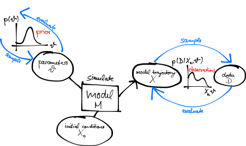
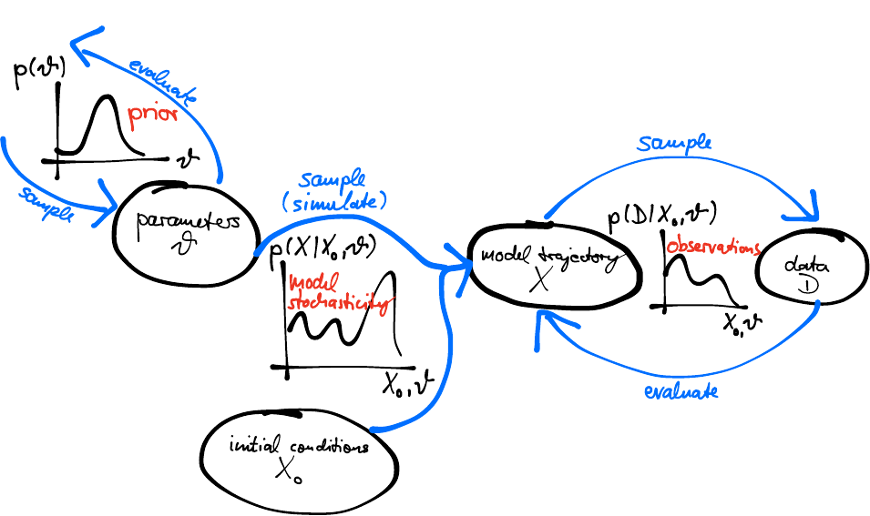
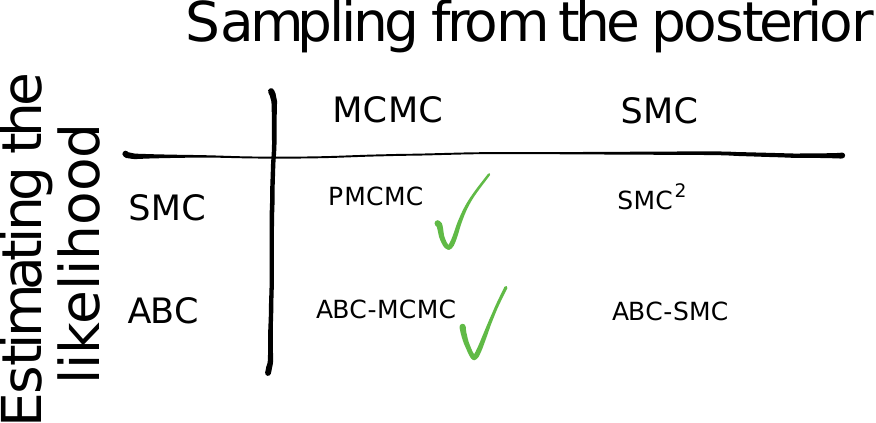

# The story so far

## Deterministic models

{.step}

$$p(\theta \mid \text{data}) \propto p(\text{data} \mid \theta)\, p(\theta)$$

Use MCMC to get **samples** from it: $\theta_1, \theta_2, \theta_3, \ldots$

## Stochastic models

{.step}

- What is $p(\text{data} \mid \theta)$?
- We need to **marginalise**:

  $$p(\text{data} \mid \theta) = \int_{X} p(\text{data} \mid X, \theta)\, p(X \mid \theta)$$

## The particle filter {.smaller}

Replaces the integral by a sum over Monte Carlo samples of trajectories.

::: {.fragment .current-visible fragment-index=1}
**propagate**
$$p(X_1 \mid \theta)$$
:::

::: {.fragment .current-visible fragment-index=2}
**resample**
$$p(\text{data}_1 \mid X_1, \theta)\, p(X_1 \mid \theta)$$
:::

::: {.fragment .current-visible fragment-index=3}
**propagate**
$$p(X_2 \mid X_1, \theta)\, p(\text{data}_1 \mid X_1, \theta)\, p(X_1 \mid \theta)$$
:::

::: {.fragment .current-visible fragment-index=4}
**resample**
$$p(\text{data}_2 \mid X_2, \theta)\, p(X_2 \mid X_1, \theta)\, p(\text{data}_1 \mid X_1, \theta)\, p(X_1 \mid \theta)$$
:::

::: {.fragment .current-visible fragment-index=5}
$$\ldots$$
:::

::: {.fragment .current-visible fragment-index=6}
**evaluate**
$$p(\text{data}_N \mid X_N, \theta)\, p(X_N \mid X_{1:N-1}, \theta) \ldots p(\text{data}_1 \mid X_1, \theta)\, p(X_1 \mid \theta)$$
:::

::: {.fragment .current-visible fragment-index=7}
**average**
$$\sum p(\text{data}_N \mid X_N, \theta) \ldots p(\text{data}_1 \mid X_1, \theta)\, p(X \mid \theta)$$
:::

::: {.fragment fragment-index=8}
**Result:**
$$\sum p(\text{data} \mid X)\, p(X \mid \theta)$$
:::

##  {.center}

##  Questions? {background-color="#447099" transition="fade-in"}

Anything from the first three days worth revisiting before the last session.

#

[Deterministic fitting](../introduction.qmd) &middot;
[Stochastic models](../seitl.qmd) &middot;
[Particle filters](../particle_filters.qmd) &middot;
[Particle MCMC](../pmcmc.qmd)
