```{julia}
#| echo: false
#| include: false

ENV["GKSwstype"] = "100"
using Distributions
```

# Introduction

## SIR-type models

:::: {.columns}
::: {.column width="38%"}
$$
\begin{aligned}
\frac{dS}{dt} &= -\beta I \frac{S}{N}\\
\frac{dI}{dt} &= \beta I \frac{S}{N} - \gamma I\\
\frac{dR}{dt} &= \gamma I
\end{aligned}
$$
:::
::: {.column width="62%"}
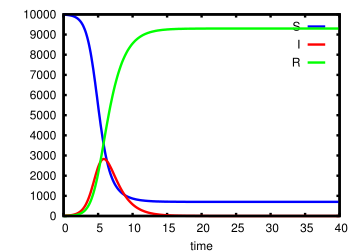
:::
::::

. . .

Mechanistic models: **description** vs **mechanism**.

## Model *fitting*: parameter estimation

Given a model, what are the parameter combinations that best **fit** the data?

. . .

### Why are we doing this?

- **Learn** something about the system
  - test a scientific hypothesis — e.g. why did the UK H1N1 epidemic wane in
    summer 2009?
  - estimate parameters — e.g. what fraction of cholera infections in
    Bangladesh are asymptomatic?
  - sometimes in real time
- **Validate** the model, especially for prediction
:::

## What do we mean by "best fit the data"?

::: {.r-stack}
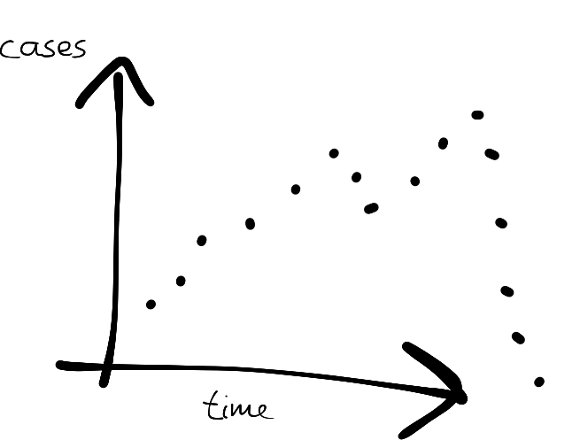{.step .fragment .fade-out fragment-index=1}
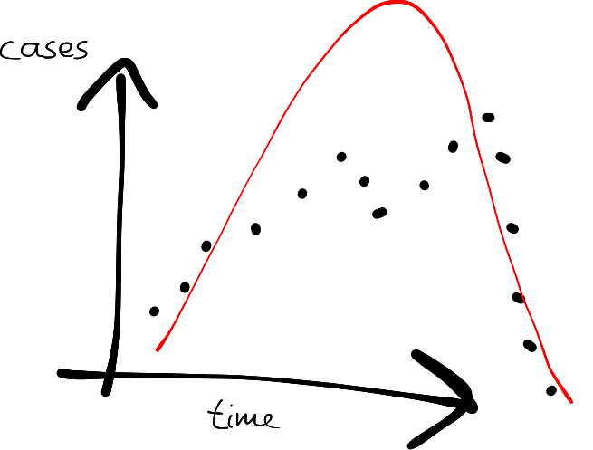{.step .fragment .current-visible fragment-index=1}
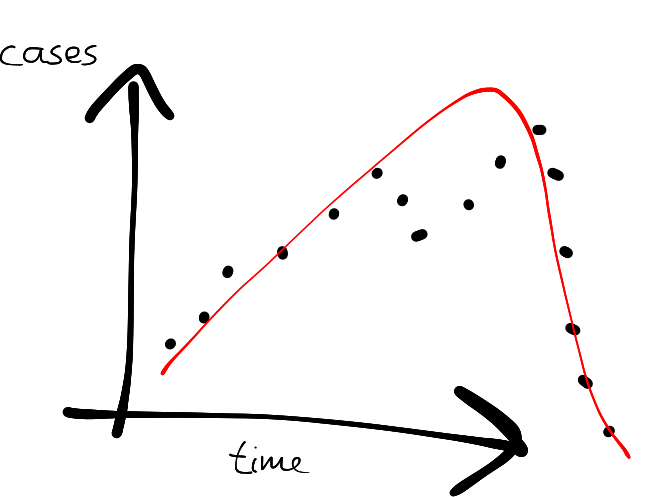{.step .fragment .current-visible fragment-index=2}
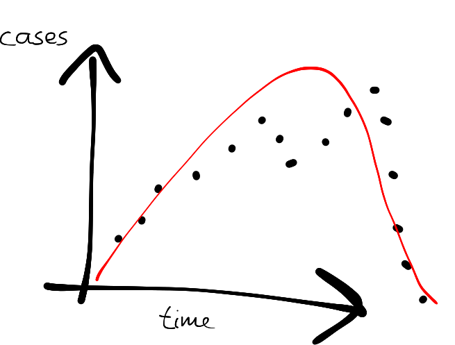{.step .fragment .current-visible fragment-index=3}
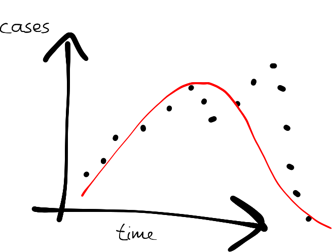{.step .fragment fragment-index=4}
:::

## Model *inference*: state estimation

Given what we observe, what is the **state** of the system?

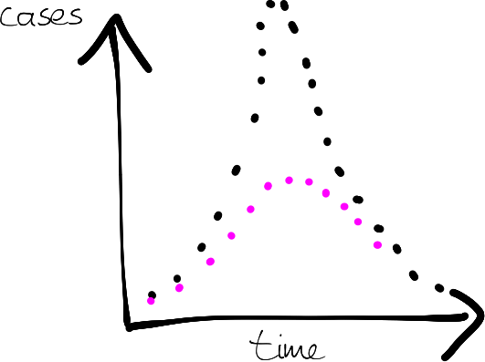

# Linking models to data

##  {.center}

::: {.r-stack}
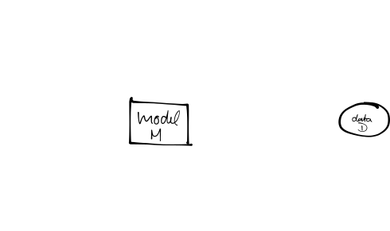{.step .fragment .fade-out fragment-index=1}
{.step .fragment .current-visible fragment-index=1}
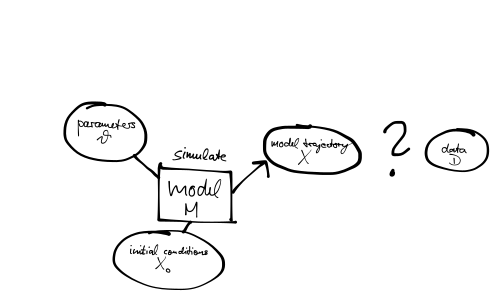{.step .fragment fragment-index=2}
:::

## Assessing the "closeness" of model output and data

::: {.r-stack}
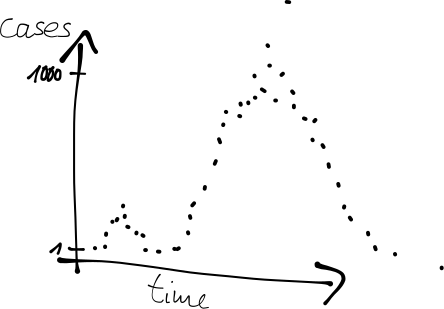{.step .fragment .fade-out fragment-index=1}
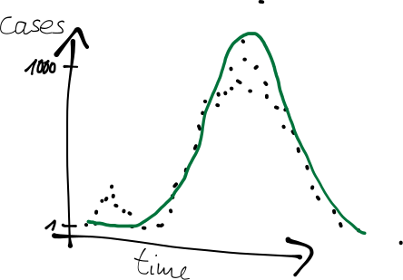{.step .fragment .current-visible fragment-index=1}
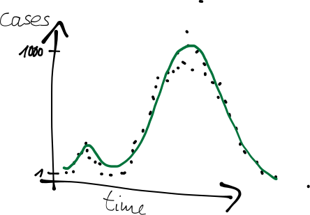{.step .fragment fragment-index=2}
:::

## Probabilistic formulation

- Often we know something about how the data were taken, so observations
  introduce uncertainty.

- We can express the uncertainty in observing the process as a probability

  $$p(\text{data} \mid \text{underlying process})$$

- Including this in our model gives

  $$p(\text{data} \mid \text{model output})$$

## Two things you can do with a distribution {.smaller}

:::: {.columns}
::: {.column width="50%"}
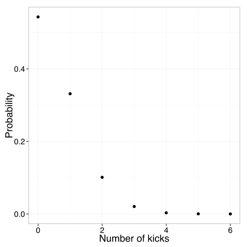{.mini}

Discrete, e.g. **Poisson**: how many die of horse kicks at 0.61 kicks per year?
:::
::: {.column width="50%"}
{.mini}

Continuous, e.g. **normal**: the temperature in London tomorrow.
:::
::::

::: {.fragment}
:::: {.columns}
::: {.column width="50%"}
[**Evaluate**]{.alert} the density of a value

```{julia}
#| echo: true
pdf(Poisson(0.61), 2)
```
:::
::: {.column width="50%"}
[**Sample**]{.alert} a value at random

```{julia}
#| echo: true
rand(Normal(23, 2))
```
:::
::::
:::

## Example: observation uncertainty {.smaller}

SIR model, assuming cases are detected with independent reporting probability
$\rho = 0.5$.

:::: {.columns}
::: {.column width="50%"}
::: {.r-stack}
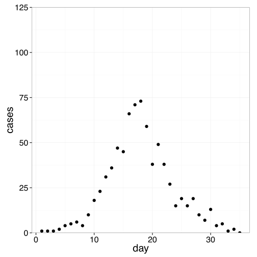{.step .fragment .fade-out fragment-index=1}
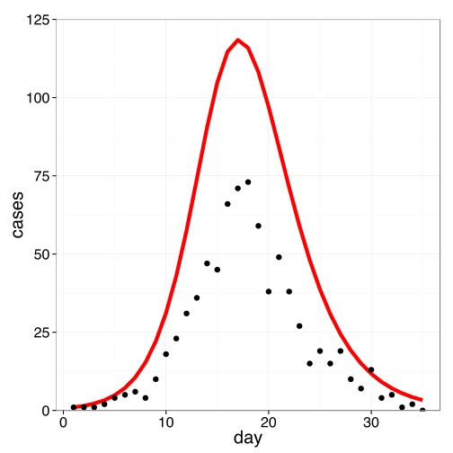{.step .fragment .current-visible fragment-index=1}
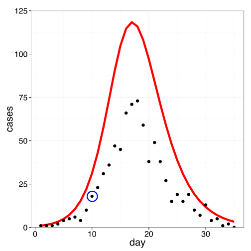{.step .fragment .current-visible fragment-index=2}
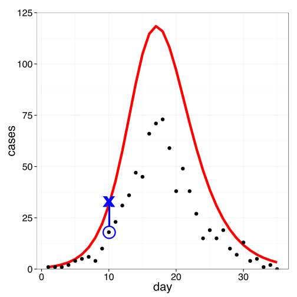{.step .fragment .current-visible fragment-index=3}
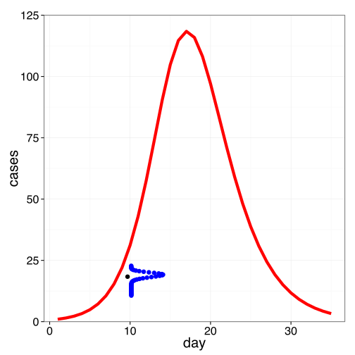{.step .fragment fragment-index=4}
:::
:::
::: {.column width="50%"}
::: {.fragment fragment-index=2}
At time 10, 18 cases observed.
:::

::: {.fragment fragment-index=3}
In the model, 31.1 cases.
:::

::: {.r-stack}
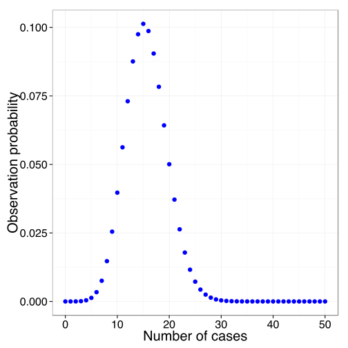{.step .fragment .current-visible fragment-index=4}
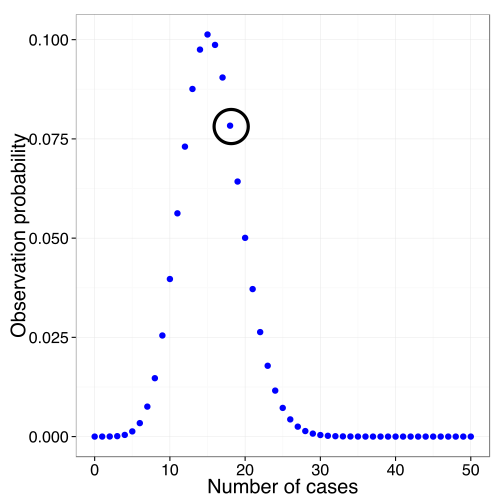{.step .fragment fragment-index=5}
:::

::: {.fragment fragment-index=5}
$p(\text{data point } 10 \mid \theta) = 0.078$
:::
:::
::::

## From one point to the whole trajectory

. . .

Multiply across the data to get the probability of the whole trajectory:

$$p(\text{data} \mid \theta) = \prod_{i} p(\text{data point } i \mid \theta)$$

. . .

Or sum on the log scale, which is numerically better behaved:

$$\log p(\text{data} \mid \theta) = \sum_{i} \log p(\text{data point } i \mid \theta)$$

##  {.center}

::: {.r-stack}
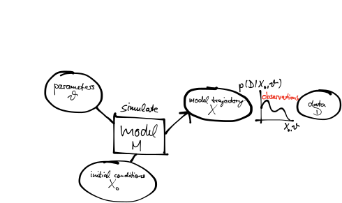{.step .fragment .fade-out fragment-index=1}
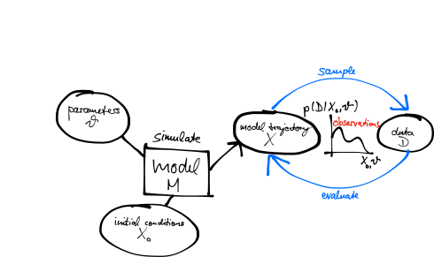{.step .fragment fragment-index=1}
:::

## The likelihood {.smaller}

- We compare models to data using **probabilities**:

  $$p(\text{data} \mid \text{model output})$$

- For a given model this depends on the parameters $\theta$:

  $$L(\theta) = p(\text{data} \mid \theta)$$

  is called the **likelihood** of parameters $\theta$. Here $\theta$ encompasses
  all parameters, e.g. $\theta = \{\beta, \gamma\}$.

- Likelihoods can span a wide range of orders of magnitude, which causes
  numerical problems. Taking the **logarithm** gives the **log-likelihood**.

# Bayesian inference

## Bayes' rule {.smaller}

In Bayesian inference we need $p(\theta \mid \text{data})$. Applying the rule of
conditional probabilities:

$$p(\theta \mid \text{data}) = \frac{p(\text{data} \mid \theta)\, p(\theta)}{p(\text{data})}$$

- $p(\theta \mid \text{data})$ is the *posterior*
- $p(\text{data} \mid \theta)$ is the *likelihood*
- $p(\theta)$ is the *prior*
- $p(\text{data})$ is a *normalisation constant*

In words,

$$\text{(posterior)} \propto \text{(normalised likelihood)} \times \text{(prior)}$$

## Prior probabilities

$p(\theta)$ quantifies our degree of **belief** via a probability distribution,
before confronting the model with data — from previous measurements, the
literature, experts and so on.

Example: $R_0$ of measles

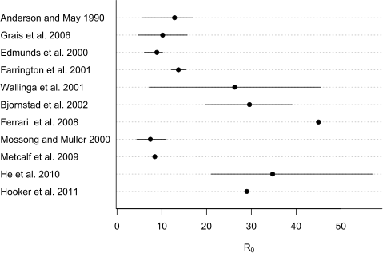{.step}

## Example: estimating $R_0$ of measles

::: {.r-stack}
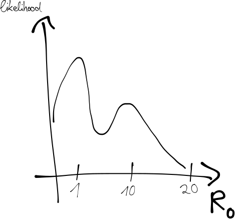{.step .fragment .fade-out fragment-index=1}
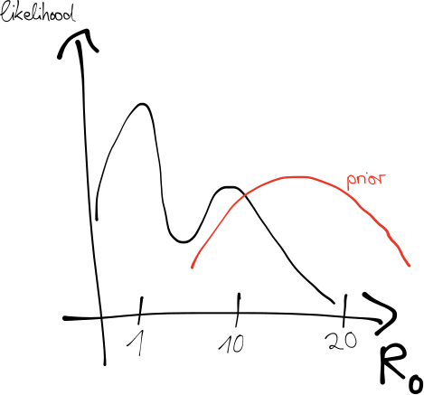{.step .fragment .current-visible fragment-index=1}
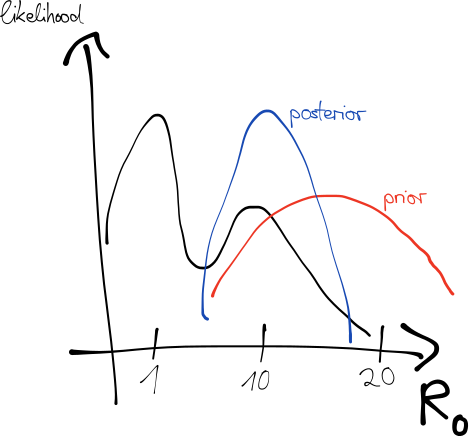{.step .fragment fragment-index=2}
:::

## Checking a prior by simulating from it {.smaller}

A prior on $R_0$ is hard to have intuition about. An epidemic curve is not.

. . .

So draw parameters from the prior, run the model, and look at what you get. This
is a **prior predictive simulation**, and it turns an abstract claim into a
picture you can judge.

. . .

If your prior produces epidemics that infect the whole population in four days,
you have learned something you could not have seen from the parameter range.

## Sampling from the posterior

Parameters $\theta$ are interpreted as a *random* variable, distributed
according to the posterior:

$$p(\theta \mid \text{data}) \propto p(\text{data} \mid \theta)\, p(\theta)$$

. . .

We want to generate **samples** of $\theta$ from this distribution.

##  {.center}


##  {.center}

::: {.r-stack}
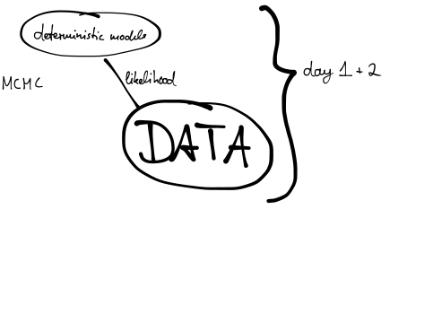{.step .fragment .fade-out fragment-index=1}
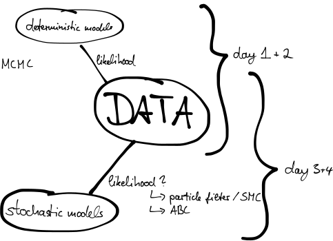{.step .fragment fragment-index=1}
:::

## Why we cannot just try sensible parameter combinations {.smaller}

You can explore a two-parameter posterior on a grid. Fifteen values each is 225
model runs, which is nothing.

. . .

| Parameters | Grid points at 15 each |
|---|---|
| 2 | 225 |
| 4 | 50,625 |
| 6 | 11,390,625 |
| 10 | 576,650,390,625 |

. . .

Real models have six parameters, or sixty. Grid search is a way of *seeing* a
posterior, never a way of fitting one — which is what the next session is about.

# Practical session

## The arrows as Julia functions

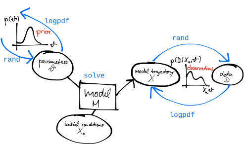

##  Your Turn {background-color="#447099" transition="fade-in"}

- Simulate an SIR model and explore what the priors imply
- Evaluate a Poisson likelihood against observed data
- Combine them into a posterior, and explore it by grid search

[mfiidd.github.io/mfiidd](https://mfiidd.github.io/mfiidd/)

#

[Return to the session](../introduction.qmd)
