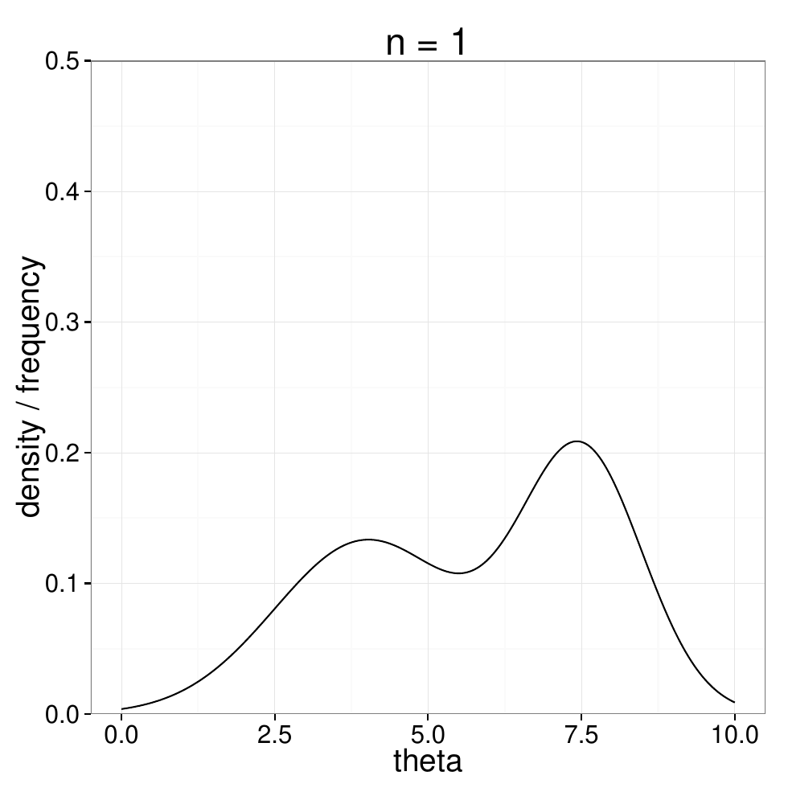
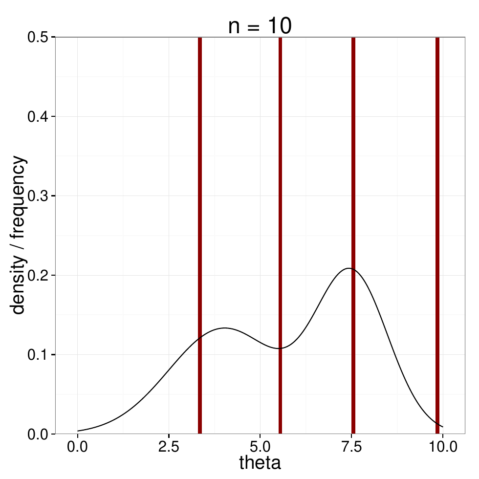
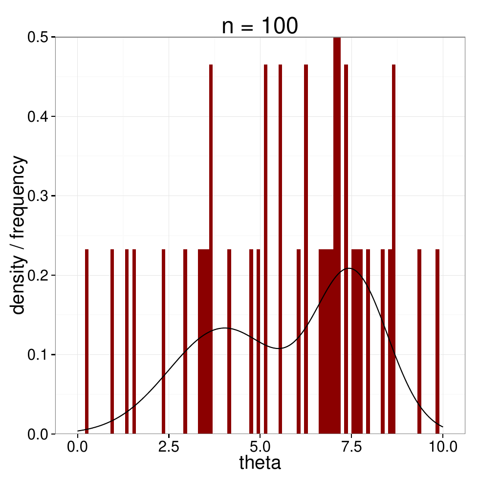
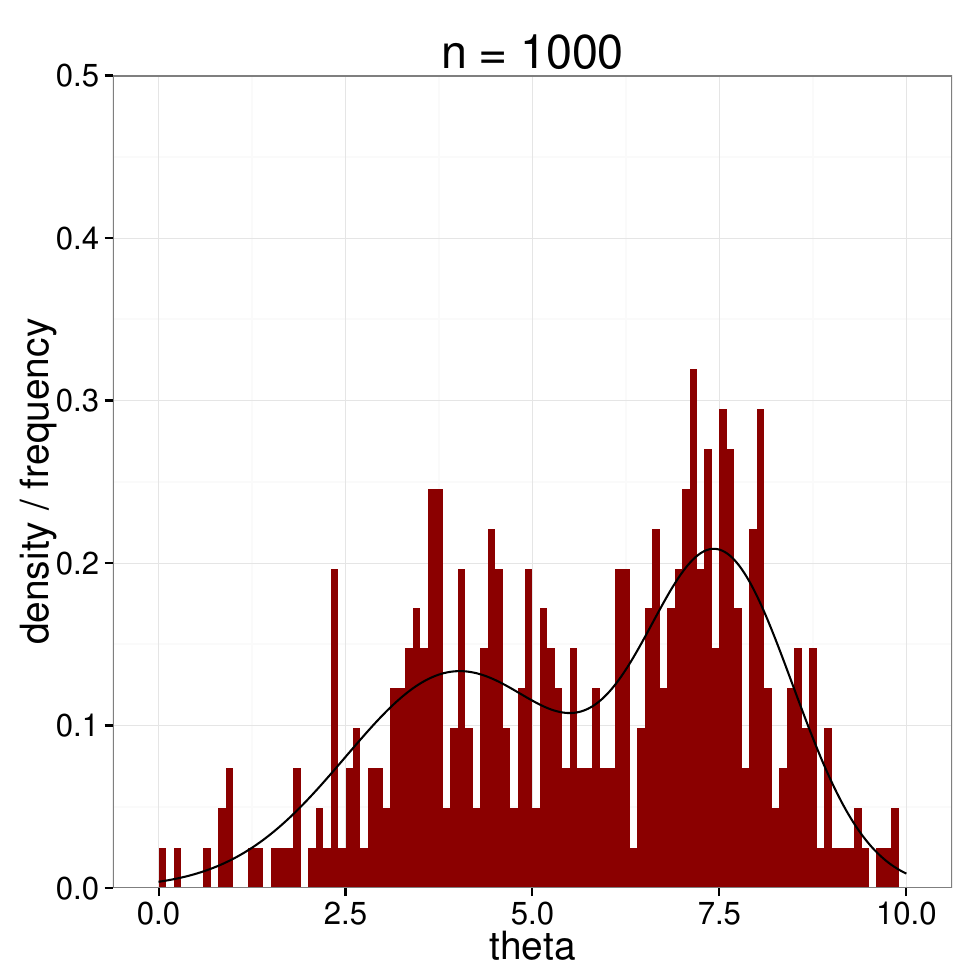
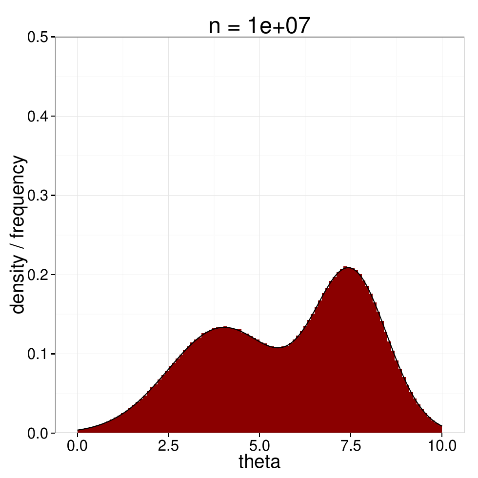
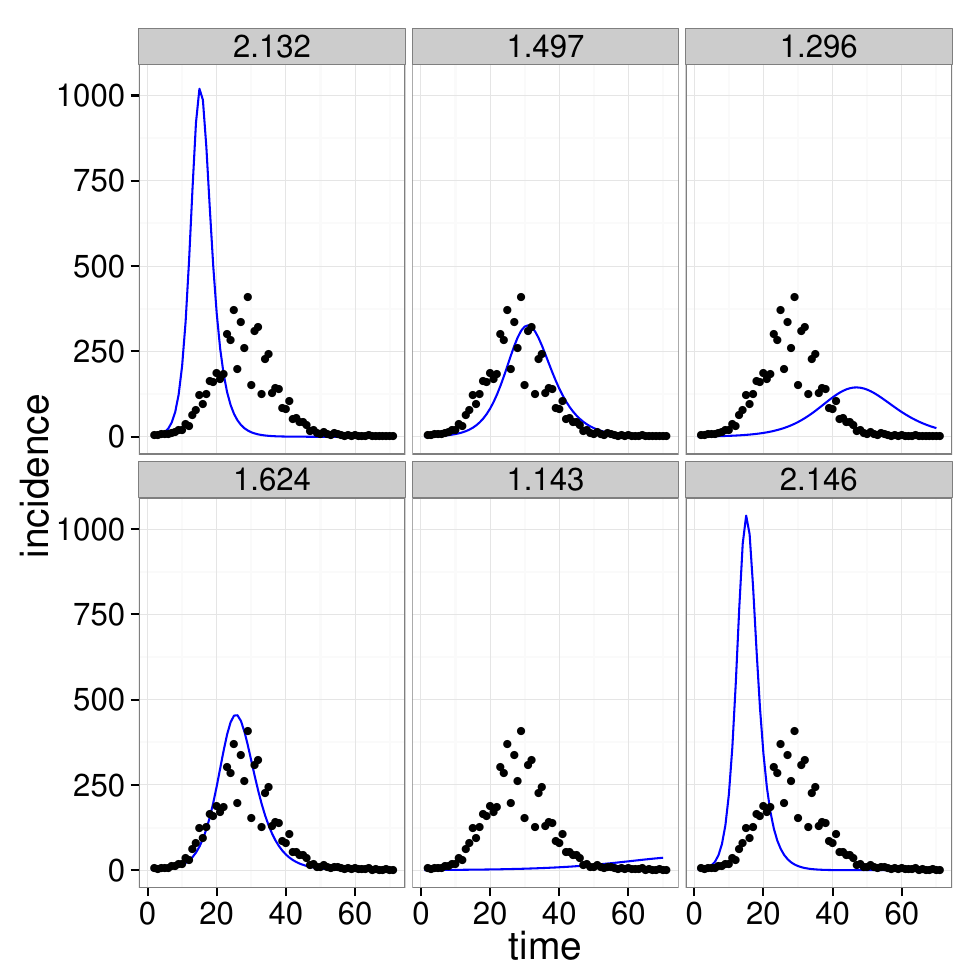
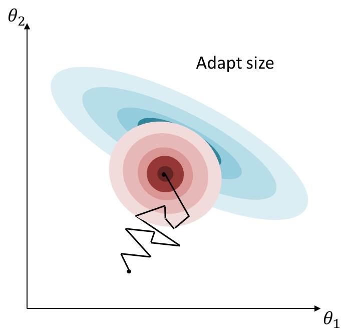
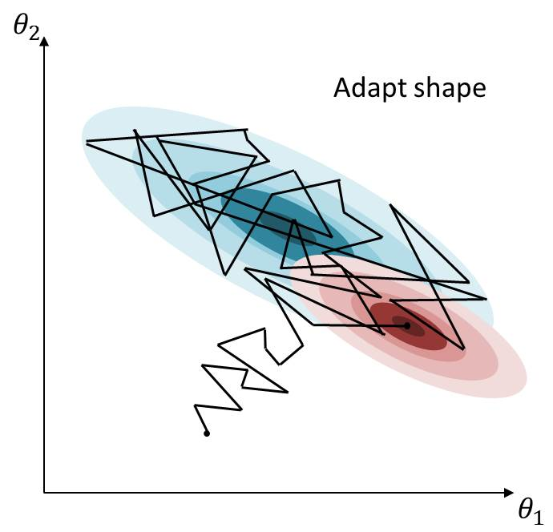

## Recap: Bayesian inference

Last time we saw that the [posterior distribution]{.alert} of $\theta$, given observed
data, is

$$p(\theta \mid \text{data}) \propto p(\text{data} \mid \theta)\, p(\theta)$$

Our aim is to draw samples from this distribution.

# Why sample?

## Sampling to learn about a population

- Imagine you want to know the mean height of people in London.
- You cannot measure everyone, so you take a [sample]{.alert} $S$.

$$m = \frac{1}{N_\text{Lon}} \sum_{i \in \text{Lon}} h_i \;\approx\; \frac{1}{N_S} \sum_{i \in S} h_i$$

::: {.fragment}
We can do exactly the same thing to study a posterior distribution.
:::

## Monte Carlo sampling

Explore a distribution by drawing from it. More samples, better picture:

{.step .fragment .current-visible fragment-index=1}
{.step .fragment .current-visible fragment-index=2}
{.step .fragment .current-visible fragment-index=3}
{.step .fragment .current-visible fragment-index=4}
{.step .fragment .current-visible fragment-index=5}
{.step .fragment fragment-index=6}

## Wasting time in sampling

{.step}

::: {.fragment}
Sampling blindly from the prior spends almost all its effort on parameter values
that fit the data badly. We need something that concentrates where the posterior
is.
:::

# Rejection sampling

## The problem

:::: {.columns}
::: {.column width="50%"}
{.step}
:::
::: {.column width="50%"}
- Consider a distribution $f(\theta)$ which we can evaluate for any $\theta$
- How do we draw samples from it?
:::
::::

## A proposal distribution

:::: {.columns}
::: {.column width="50%"}
{.step}
:::
::: {.column width="50%"}
Rejection sampling uses a [proposal distribution $q(\theta)$]{.alert} which

- is simple to evaluate
- is easy to sample from
- admits some $M > 1$ with $f(\theta) < M q(\theta)$ for all $\theta$
:::
::::

## The algorithm {.smaller}

:::: {.columns}
::: {.column width="50%"}
{.step}
:::
::: {.column width="50%"}
1. Sample $\theta^*$ from $q(\theta)$
2. Draw $u \sim \text{Uniform}[0,\, M q(\theta^*)]$
3. Evaluate $f(\theta^*)$
4. If $f(\theta^*) > u$ accept, else reject
5. Repeat steps 1–4
:::
::::

## Building up a sample {.smaller}

:::: {.columns}
::: {.column width="50%"}
{.step .fragment .current-visible fragment-index=1}
{.step .fragment .current-visible fragment-index=2}
{.step .fragment .current-visible fragment-index=3}
{.step .fragment .current-visible fragment-index=4}
{.step .fragment fragment-index=5}
:::
::: {.column width="50%"}
1. Sample $\theta^*$ from $q(\theta)$
2. Draw $u \sim \text{Uniform}[0,\, M q(\theta^*)]$
3. Evaluate $f(\theta^*)$
4. If $f(\theta^*) > u$ accept, else reject
5. Repeat steps 1–4

Accepted points build up a sample from $f(\theta)$.
:::
::::

## When rejection sampling struggles

:::: {.columns}
::: {.column width="55%"}
- Works best when $q(\theta) \approx f(\theta)$, i.e. $M \gtrapprox 1$
- The acceptance rate is $1/M$
- Requiring $f(\theta) < M q(\theta)$ *everywhere* can push the rejection rate
  very high
- Worse still in high dimensions
:::
::: {.column width="45%"}
{.step}
:::
::::

# What is Markov chain Monte Carlo?

## Markov chain Monte Carlo

- In Markov chain Monte Carlo (MCMC) we do not need one proposal density
  $q(\theta)$ that bounds $f(\theta)$ everywhere.

- Instead we build a [chain]{.alert} of samples, where each proposed $\theta^*$
  depends on the previous one: the proposal density takes the form
  $q(\theta^* \mid \theta)$.

- A commonly used MCMC algorithm is [Metropolis-Hastings]{.alert}.

- Its acceptance rate is carefully derived to ensure [unbiased samples]{.alert}.

## Metropolis-Hastings {.smaller}

:::: {.columns}
::: {.column width="50%"}
{.step .fragment .current-visible fragment-index=1}
{.step .fragment fragment-index=2}
:::
::: {.column width="50%"}
1. Initialise $\theta^{0}$, set $\theta = \theta^{0}$
2. Sample $\theta^* \sim q(\theta^* \mid \theta)$
3. Compute the acceptance probability $r$
4. Draw $u \sim \text{Uniform}[0,1]$
5. Set the new sample to
   $$\theta^{(s+1)} = \begin{cases} \theta^*, & u < r\\ \theta^{(s)}, & u \geqslant r\end{cases}$$
6. Repeat steps 2–5
:::
::::

## The acceptance probability {.smaller}

:::: {.columns}
::: {.column width="50%"}
If $q(\theta^* \mid \theta)$ is symmetric, then

$$r = \min\left(1, \frac{f(\theta^*)}{f(\theta)}\right)$$

::: {.fragment}
- Always move to $\theta^*$ if it is more probable than $\theta$
:::

::: {.fragment}
- *May* move even if $\theta^*$ is less probable
:::

::: {.fragment}
If $q(\theta^* \mid \theta)$ is asymmetric, then

$$r = \min\left(1, \frac{f(\theta^*)\,q(\theta \mid \theta^*)}{f(\theta)\,q(\theta^* \mid \theta)}\right)$$
:::
:::
::: {.column width="50%"}
{.step .fragment .current-visible fragment-index=1}
{.step .fragment .current-visible fragment-index=2}
{.step .fragment .current-visible fragment-index=3}
{.step .fragment fragment-index=4}
:::
::::

# Better proposals

## Tuning by hand does not scale

The proposal covariance has to match the shape of the posterior.

::: {.fragment}
With 2 parameters that is 3 numbers to tune: two variances and a covariance.

With 10 parameters it is 55.
:::

::: {.fragment}
And you generally do not know the posterior scale before you have sampled it.
:::

## Adaptive MCMC

- [Adaptive MCMC]{.alert} alters the proposal distribution while the chain is
  running.

- Start with a large symmetric variance and scan around to find a mode.

- Then alter the shape of the proposal to match the covariance of the accepted
  values.

- Eventually the proposal density should match the shape of the target density.

## Adaptive MCMC: two-stage adaptation

:::: {.columns}
::: {.column width="50%"}
{.step}
:::
::: {.column width="50%"}
{.step}
:::
::::

::: {.footer}
Classical adaptive Metropolis: @haario2001. Robust adaptive Metropolis (RAM), which we
use in the practical: @vihola2012.
:::

# Using gradients

## Random walks waste information

Metropolis-Hastings proposes a direction at random and hopes for the best.

::: {.fragment}
But for a model built from operations we can **differentiate** — including an
ODE model, since the solver propagates derivatives — we can compute the
**gradient** of the log-posterior.

The gradient tells us which way is uphill.
:::

## Hamiltonian Monte Carlo

Instead of a random step, simulate a puck rolling on the negative log-posterior
surface.

- gradients pull it towards high-density regions
- momentum carries it a long way before it stops

::: {.fragment}
Both the **direction** and the **length** of each move now come from the
posterior itself, rather than from a proposal we had to guess.
:::

## NUTS

[NUTS]{.alert}, the No U-Turn Sampler, is HMC with two things automated:

- the **step size**, adapted during warmup
- the **trajectory length**, stopped when the path starts turning back on
  itself — hence the name

::: {.fragment}
The result usually just works, with no proposal tuning at all. It is the default
you should reach for.
:::

::: {.footer}
@hoffman2014; see @betancourt2017 for the intuition.
:::

## Which sampler? {.smaller}

| Sampler | Best for | Limitations |
|---|---|---|
| **MH** | Simple models, discrete parameters, learning MCMC | Needs manual tuning; slow in many dimensions |
| **RAM** | Low-dimensional models where gradients are unavailable | Still a random walk |
| **NUTS** | Continuous parameters, differentiable models | No discrete parameters; needs gradients |

::: {.fragment}
Rule of thumb: start with NUTS. Fall back to RAM or MH when your model has
discrete parameters or a stochastic simulator that breaks differentiation — as
the particle filter will later in the course.
:::

## Over to you

In the practical you will

- implement Metropolis-Hastings yourself for a one-dimensional target
- see what the proposal distribution does to the chain
- experience how hard tuning a proposal by hand is
- hand the same job to Turing.jl, then compare MH, RAM and NUTS

## References {.smaller}

::: {#refs}
:::

#

[Return to the session](../mcmc.qmd)
