## Recap: Bayesian inference

Last time we saw that the [posterior distribution]{.alert} of $\theta$, given observed
data, is

$$p(\theta \mid \text{data}) \propto p(\text{data} \mid \theta)\, p(\theta)$$

Our aim is to draw samples from this distribution.

# Rejection sampling

## The problem

:::: {.columns}
::: {.column width="50%"}
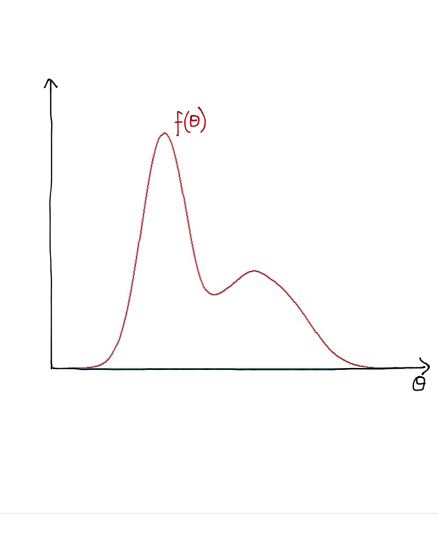{.step}
:::
::: {.column width="50%"}
- Consider a distribution $f(\theta)$ which we can evaluate for any $\theta$
- How do we draw samples from it?
:::
::::

## A proposal distribution

:::: {.columns}
::: {.column width="50%"}
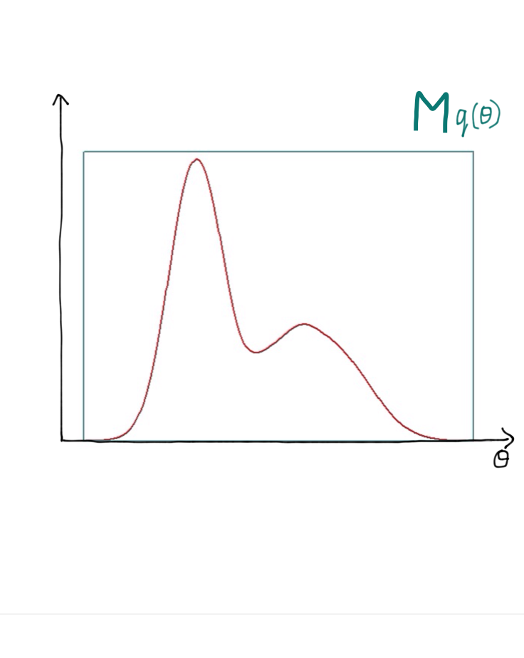{.step}
:::
::: {.column width="50%"}
Rejection sampling uses a [proposal distribution $q(\theta)$]{.alert} which

- is simple to evaluate
- is easy to sample from
- admits some $M > 1$ with $f(\theta) < M q(\theta)$ for all $\theta$
:::
::::

## The algorithm {.smaller}

:::: {.columns}
::: {.column width="50%"}
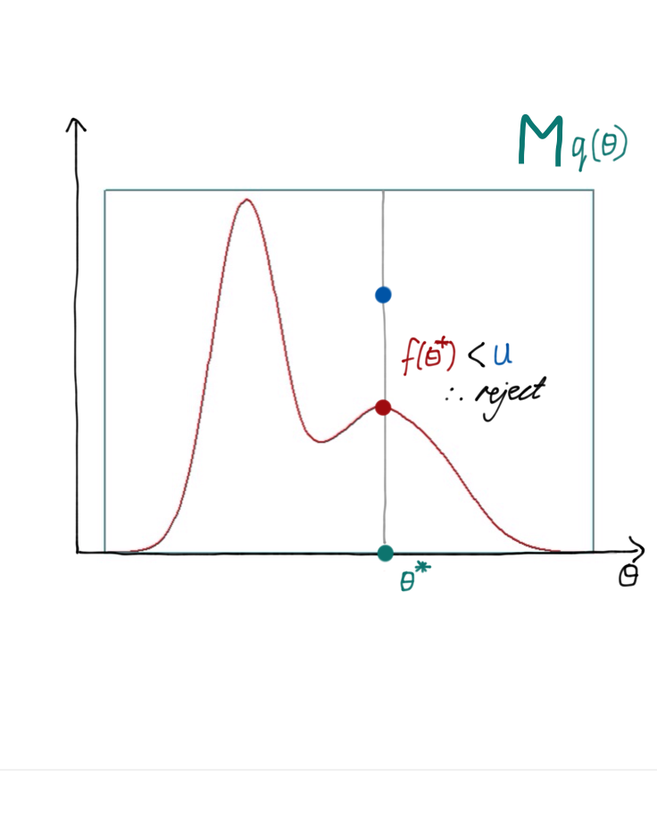{.step}
:::
::: {.column width="50%"}
1. Sample $\theta^*$ from $q(\theta)$
2. Draw $u \sim \text{Uniform}[0,\, M q(\theta^*)]$
3. Evaluate $f(\theta^*)$
4. If $f(\theta^*) > u$ accept, else reject
5. Repeat steps 1–4
:::
::::

## Building up a sample {.smaller}

:::: {.columns}
::: {.column width="50%"}
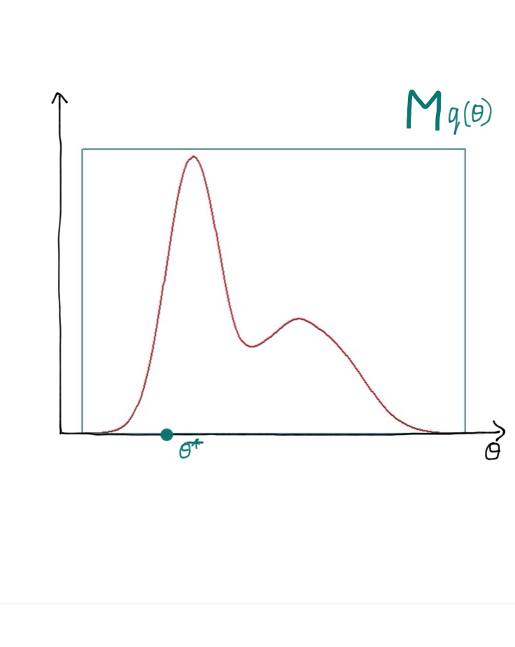{.step .fragment .current-visible fragment-index=1}
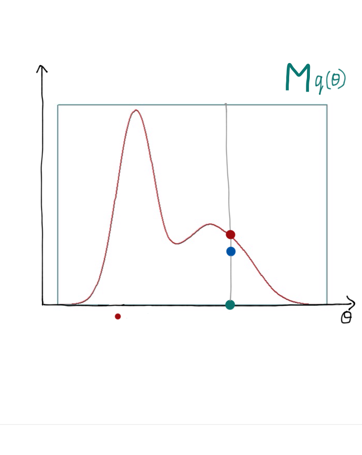{.step .fragment .current-visible fragment-index=2}
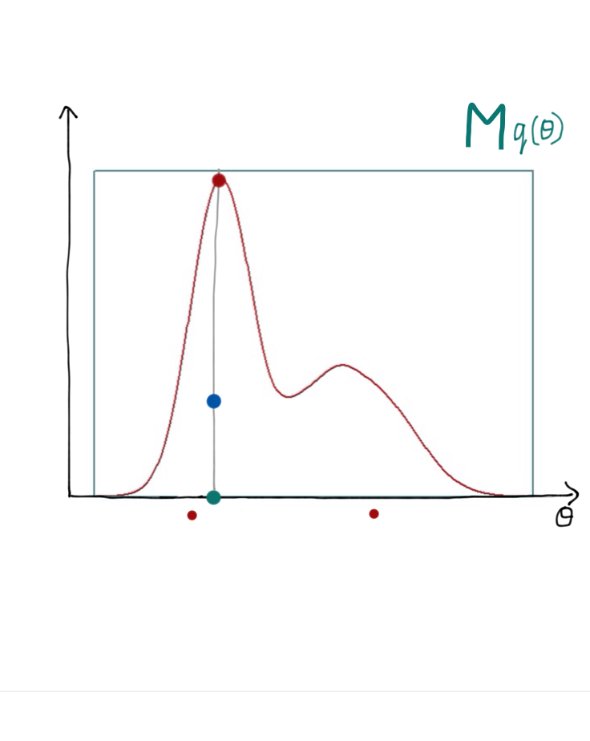{.step .fragment .current-visible fragment-index=3}
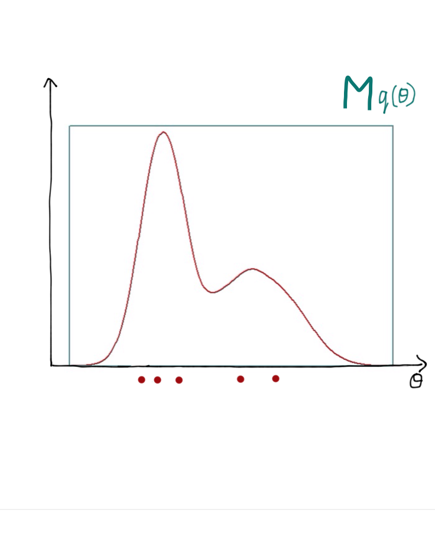{.step .fragment .current-visible fragment-index=4}
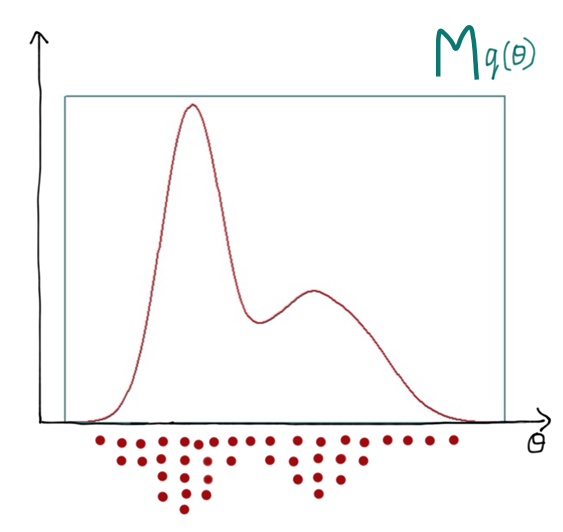{.step .fragment fragment-index=5}
:::
::: {.column width="50%"}
1. Sample $\theta^*$ from $q(\theta)$
2. Draw $u \sim \text{Uniform}[0,\, M q(\theta^*)]$
3. Evaluate $f(\theta^*)$
4. If $f(\theta^*) > u$ accept, else reject
5. Repeat steps 1–4

Accepted points build up a sample from $f(\theta)$.
:::
::::

## When rejection sampling struggles

:::: {.columns}
::: {.column width="55%"}
- Works best when $q(\theta) \approx f(\theta)$, i.e. $M \gtrapprox 1$
- The acceptance rate is $1/M$
- Requiring $f(\theta) < M q(\theta)$ *everywhere* can push the rejection rate
  very high
- Worse still in high dimensions
:::
::: {.column width="45%"}
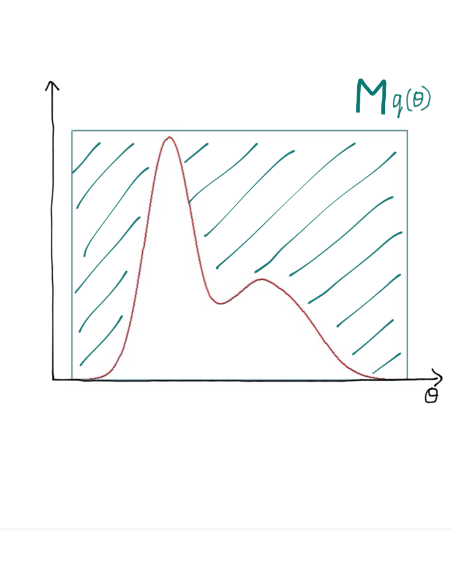{.step}
:::
::::

# What is Markov chain Monte Carlo?

## Markov chain Monte Carlo

- In Markov chain Monte Carlo (MCMC) we do not need one proposal density
  $q(\theta)$ that bounds $f(\theta)$ everywhere.

- Instead we build a [chain]{.alert} of samples, where each proposed $\theta^*$
  depends on the previous one: the proposal density takes the form
  $q(\theta^* \mid \theta)$.

- A commonly used MCMC algorithm is [Metropolis-Hastings]{.alert}.

- Its acceptance rate is carefully derived to ensure [unbiased samples]{.alert}.

## Metropolis-Hastings {.smaller}

:::: {.columns}
::: {.column width="50%"}
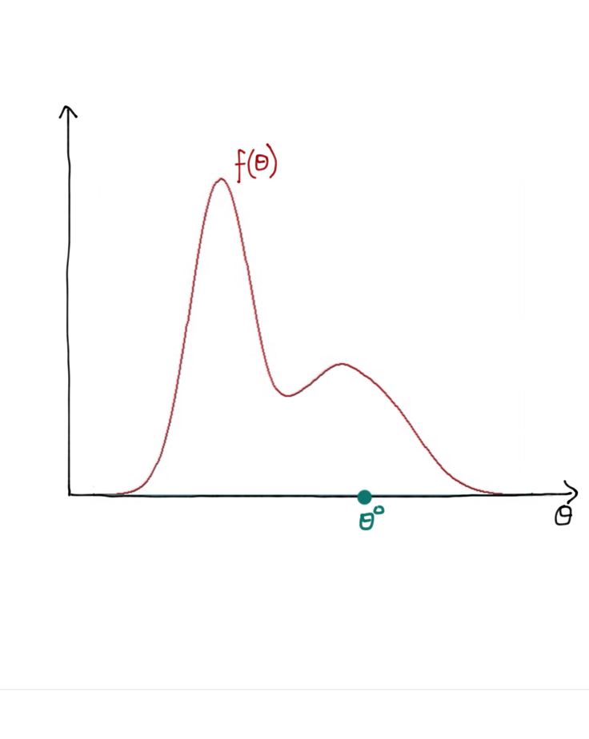{.step .fragment .current-visible fragment-index=1}
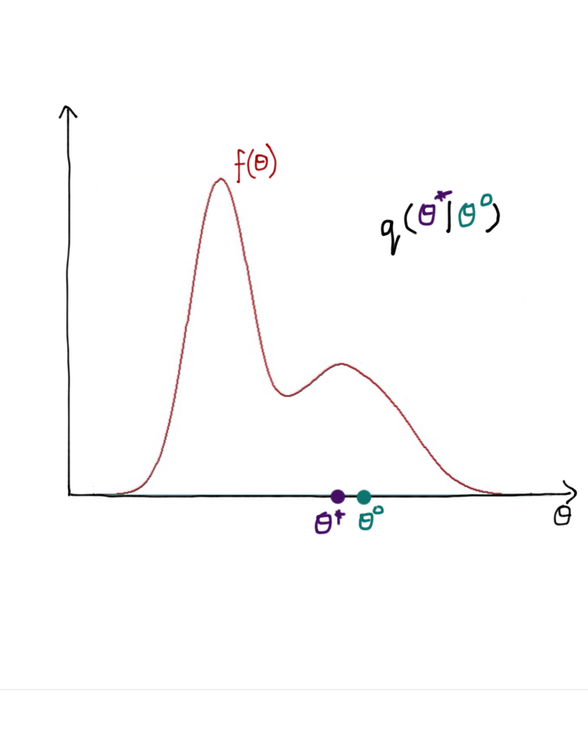{.step .fragment fragment-index=2}
:::
::: {.column width="50%"}
1. Initialise $\theta^{0}$, set $\theta = \theta^{0}$
2. Sample $\theta^* \sim q(\theta^* \mid \theta)$
3. Compute the acceptance probability $r$
4. Draw $u \sim \text{Uniform}[0,1]$
5. Set the new sample to
   $$\theta^{(s+1)} = \begin{cases} \theta^*, & u < r\\ \theta^{(s)}, & u \geqslant r\end{cases}$$
6. Repeat steps 2–5
:::
::::

## The acceptance probability {.smaller}

:::: {.columns}
::: {.column width="50%"}
If $q(\theta^* \mid \theta)$ is symmetric, then

$$r = \min\left(1, \frac{f(\theta^*)}{f(\theta)}\right)$$

::: {.fragment}
- Always move to $\theta^*$ if it is more probable than $\theta$
:::

::: {.fragment}
- *May* move even if $\theta^*$ is less probable
:::

::: {.fragment}
If $q(\theta^* \mid \theta)$ is asymmetric, then

$$r = \min\left(1, \frac{f(\theta^*)\,q(\theta \mid \theta^*)}{f(\theta)\,q(\theta^* \mid \theta)}\right)$$
:::
:::
::: {.column width="50%"}
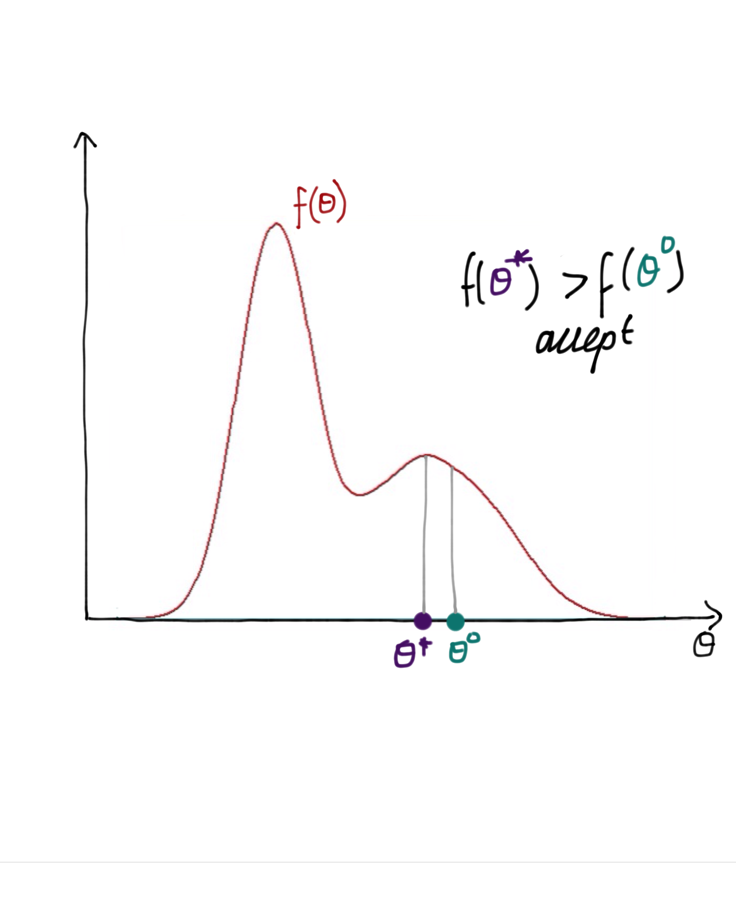{.step .fragment .current-visible fragment-index=1}
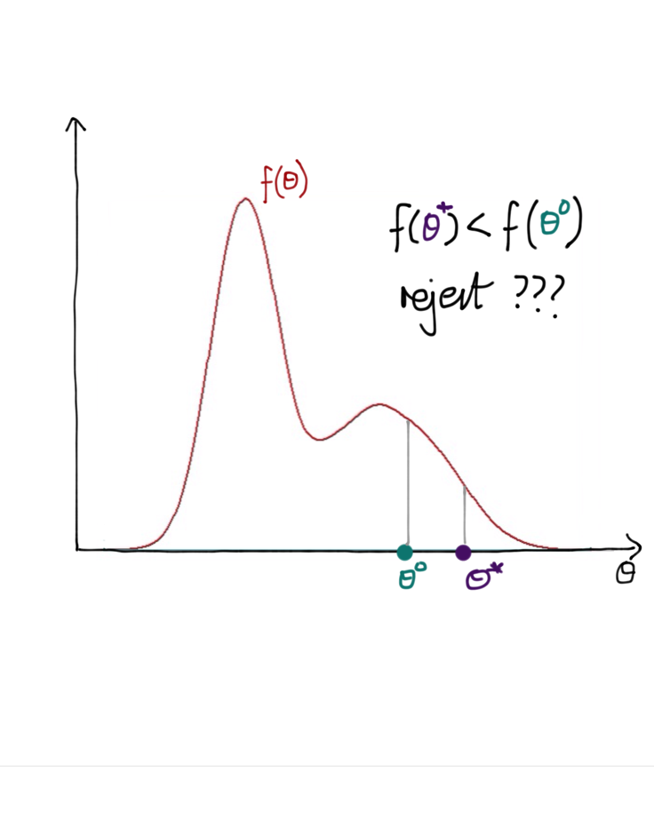{.step .fragment .current-visible fragment-index=2}
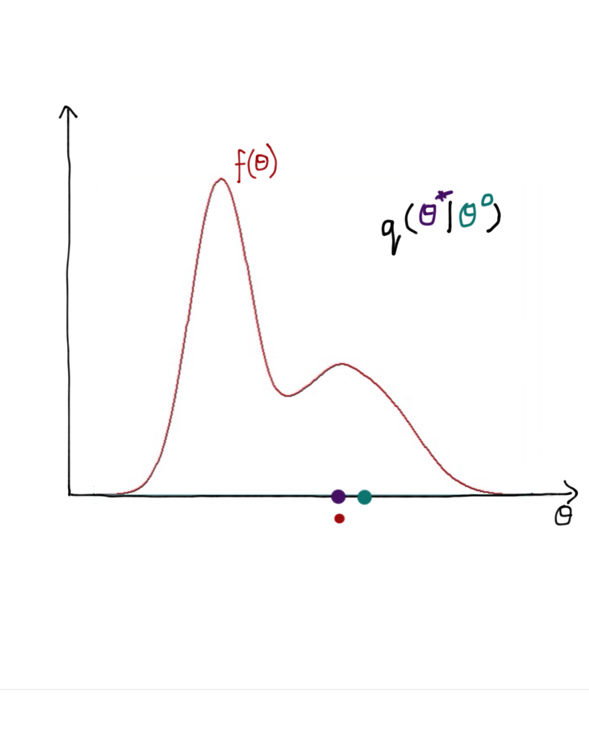{.step .fragment .current-visible fragment-index=3}
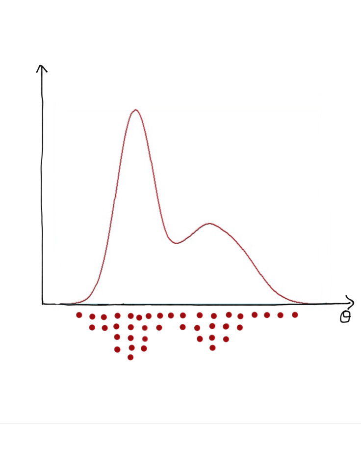{.step .fragment fragment-index=4}
:::
::::

## Over to you

In the practical you will

- implement Metropolis-Hastings yourself for a one-dimensional target
- see what the proposal distribution does to the chain
- then hand the same job to Turing.jl and compare
