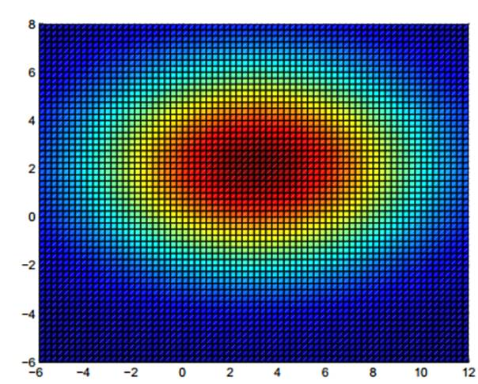
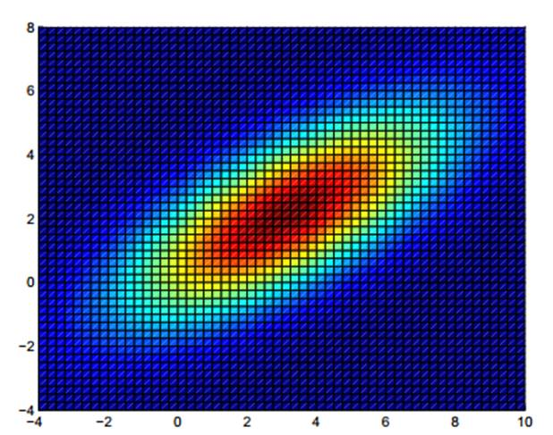
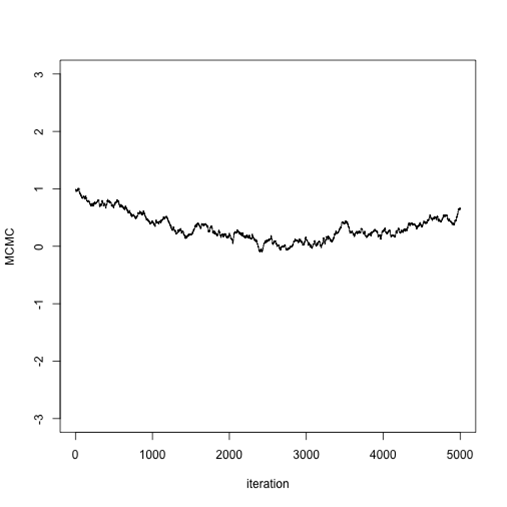
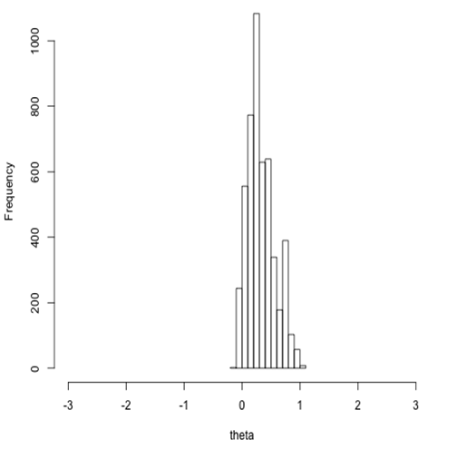
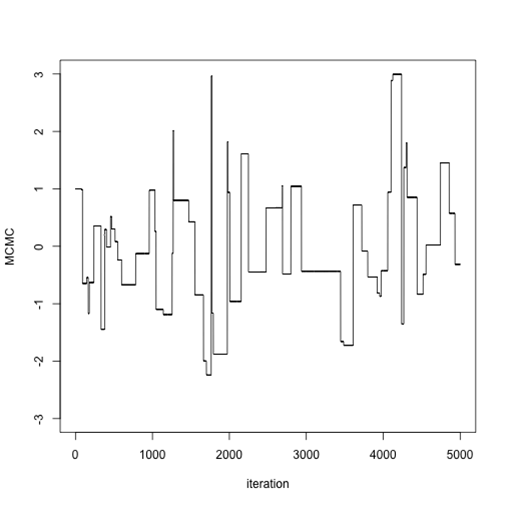
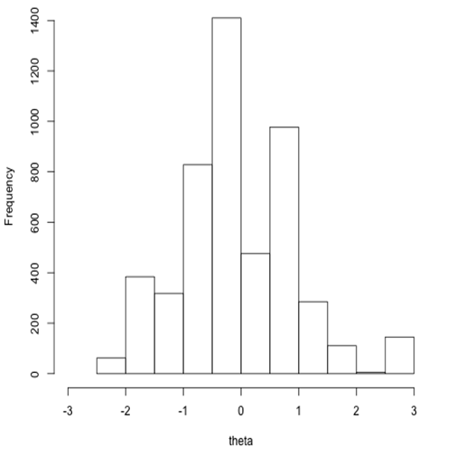
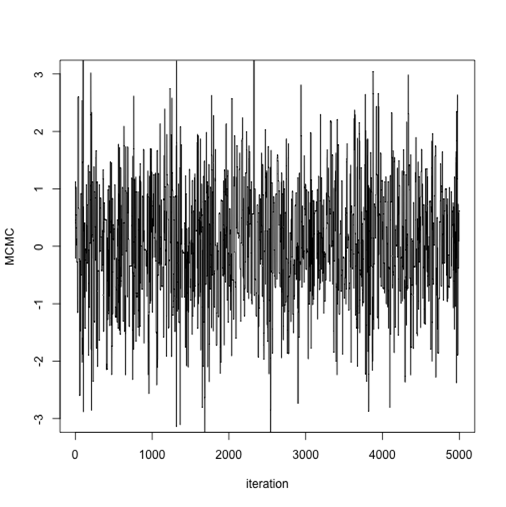
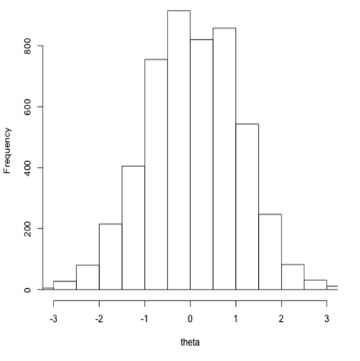
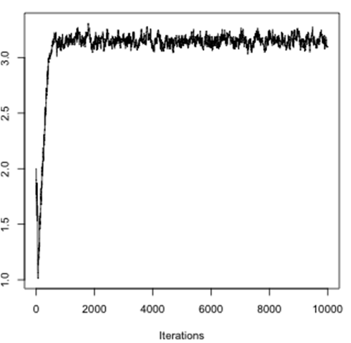

```{julia}
#| echo: false
#| include: false

ENV["GKSwstype"] = "100"
using StatsPlots
using Random
Random.seed!(20260908)

default(
    size = (560, 330), legend = false, guidefontsize = 12, tickfontsize = 10,
    titlefontsize = 14, linewidth = 2, grid = true,
)

## A correlated chain standing in for MCMC output: an AR(1) walk started
## away from the target, so both the drift and the autocorrelation show.
n = 4000
chain = zeros(n)
chain[1] = 6.0
for i in 2:n
    chain[i] = 0.98 * chain[i - 1] + 0.02 * 2.5 + 0.08 * randn()
end
running_mean = cumsum(chain) ./ (1:n)

function acf(x, lags)
    xc = x .- sum(x) / length(x)
    d = sum(abs2, xc)
    [sum(xc[1:(end - k)] .* xc[(1 + k):end]) / d for k in lags]
end
```

# Recap

## Review

In the previous session you used [Metropolis-Hastings]{.alert} with a [Gaussian]{.alert}
proposal distribution to infer a single parameter, $R_0$.

In this session we will

- extend to multivariate inference
- learn about MCMC diagnostics
- think about accuracy and efficiency

## Interlude: the multivariate Gaussian {.smaller}

To infer several parameters at once we can use a multivariate Gaussian.

:::: {.columns}
::: {.column width="50%"}
$\mu = \begin{bmatrix} 3 & 2 \end{bmatrix}$,
$\Sigma = \begin{bmatrix} 25 & 0 \\ 0 & 9 \end{bmatrix}$

{.step}
:::
::: {.column width="50%"}
$\mu = \begin{bmatrix} 3 & 2 \end{bmatrix}$,
$\Sigma = \begin{bmatrix} 10 & 5 \\ 5 & 5 \end{bmatrix}$

{.step}
:::
::::

For accurate and efficient MCMC we tune the variance *and* the covariance of the
proposal distribution.

# Visual diagnostics

## Why we like hairy caterpillars

:::: {.columns}
::: {.column width="55%"}

:::
::: {.column width="45%"}
Key characteristics:

- Straight
- Plump head, plump rear
- Multiple colours
:::
::::

## Choosing a proposal: too small

If the [variance is too small]{.alert}, the chain will be slow to reach the
target distribution.

:::: {.columns}
::: {.column width="50%"}
{.step}
:::
::: {.column width="50%"}
{.step}
:::
::::

## Choosing a proposal: too large

If the [variance is too high]{.alert}, many proposed values will be rejected and
the chain will *stick* in one place for many steps.

:::: {.columns}
::: {.column width="50%"}
{.step}
:::
::: {.column width="50%"}
{.step}
:::
::::

## Choosing a proposal: about right

If the [variance is just right]{.alert}, the chain efficiently explores the full
shape of the target distribution.

:::: {.columns}
::: {.column width="50%"}
{.step}
:::
::: {.column width="50%"}
{.step}
:::
::::

Try several proposal distributions ([pilot runs]{.alert}), aiming for an
acceptance rate between 24% and 40%.

## Two more plots worth making

::::: {.columns}
:::: {.column width="50%"}
**Running mean**

```{julia}
#| echo: false
plot(running_mean, xlabel = "Iteration", ylabel = "Posterior mean so far")
```

It should settle and stay settled.
::::
:::: {.column width="50%"}
**Autocorrelation**

```{julia}
#| echo: false
lags = 0:100
bar(lags, acf(chain, lags), xlabel = "Lag", ylabel = "Correlation")
```

It should decay to zero within a few tens of lags.
::::
:::::

::: {.fragment}
Still drifting, or still correlated at lag 100, and your effective sample size is
a small fraction of the iterations you ran.
:::

## Burn-in

:::: {.columns}
::: {.column width="55%"}
- We can start our MCMC chain anywhere.

- It can take a while to reach and explore the target density $f(\theta)$.

- Throw away the early samples: the [burn-in]{.alert} phase.

- How much to discard?
:::
::: {.column width="45%"}

:::
::::

## MCMC sample size

- In MCMC each sample depends on the one before: [auto-correlation]{.alert}.

- Reduce auto-correlation by [thinning]{.alert}, retaining only every $n$-th
  sample.

- The information content of a set of MCMC samples is given by the
  [effective sample size (ESS)]{.alert}.

## Accuracy and efficiency

How does each of these influence accuracy and efficiency?

- Burn-in
- MCMC iterations after burn-in
- Thinning
- Number of chains, with different initial conditions
- Proposal distribution
- Transforming parameters

# Quantitative diagnostics

## Running several chains

A single chain can look perfectly healthy and still be stuck in the wrong place.

. . .

Run several chains from **different starting points**. If they agree, that is
evidence they have found the same distribution. If they disagree, at least one
of them is wrong.

. . .

Four chains is a reasonable default.

## R̂: the Gelman-Rubin diagnostic

Compare the variance **within** each chain to the variance **between** chains.

$$\hat{R} = \sqrt{\frac{\hat{V}}{W}},
\qquad \hat{V} = \frac{n-1}{n}\,W + \frac{1}{n}\,B$$

$W$ is the average variance within a chain, and $B$ is $n$ times the variance of
the chain means, for chains of length $n$.

::: {.fragment}
- Once the chains agree, each chain mean varies by about $W/n$, so $B \approx W$,
  $\hat{V} \approx W$ and $\hat{R} \to 1$.
- Chains sitting in different places inflate the between-chain variance and push
  $\hat{R}$ up.
:::

::: {.fragment}
Rule of thumb: $\hat{R} < 1.01$. Anything above 1.1 is a red flag.
:::

::: {.cite}
Modern rank-normalised R̂ and ESS: @vehtari2021.
:::

## Effective sample size, and what it costs you {.smaller}

MCMC samples are correlated, so $N$ samples are worth fewer than $N$ independent
draws. [ESS]{.alert} estimates how many independent draws you actually have.

. . .

[MCSE]{.alert} turns that into the uncertainty on your estimate:

$$\text{MCSE} \approx \frac{\text{posterior SD}}{\sqrt{\text{ESS}}}$$

. . .

Report $R_0 = 2.31$ with an MCSE of $0.05$ and the second decimal is sampler
noise: run again with a different seed and it changes. Sample until the MCSE is
small next to the precision you want to claim, whatever the trace plot looks
like.

::: {.fragment}
Bulk ESS describes the centre of the distribution; tail ESS the extremes, which
is what matters for credible interval endpoints.
:::

# Common failure modes

## Divergent transitions

Specific to HMC and NUTS. The sampler simulates a trajectory; a **divergence**
means that simulation became numerically unstable and flew off.

. . .

This usually means the posterior has a region of sharp curvature — a funnel or a
narrow ridge — where the step size that works elsewhere is far too large.

. . .

A handful of divergences may be tolerable. Many means the sampler is
systematically avoiding part of the posterior, so your samples are **biased**,
not merely noisy.

## Multimodality

If the posterior has several separated modes, a chain can settle in one and
never see the others.

. . .

Multiple chains from different starting points are the standard detection: if
they land in different modes, R̂ will be large.

. . .

Fixes are harder than detection. Reparameterisation sometimes helps; otherwise
you need samplers designed to cross between modes.

##  Your Turn {background-color="#447099" transition="fade-in"}

In the practical you will

- generate good and bad chains and compare their trace plots
- compute R̂, ESS and MCSE with `MCMCChains`
- diagnose a deliberately badly specified model and try to fix it


#

[Return to the session](../mcmc_diagnostics.qmd)
