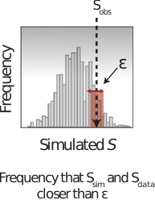

# Observation models

## The choice we have been making silently

Every likelihood in this course so far has assumed

$$y_t \sim \text{Poisson}(\lambda_t)$$

where $\lambda_t$ is what the model predicts at time $t$.

::: {.fragment}
That is a modelling **choice**, not a law. It encodes a specific claim about how
observation works, and it has consequences.
:::

## What Poisson assumes

- The variance **equals** the mean. Expect 100 cases, expect a spread of about
  $\pm 10$.
- Observations at different times are **conditionally independent** given the
  trajectory.
- Every case is reported independently with the same probability.

::: {.fragment}
Real surveillance data rarely obliges. Weekend effects, reporting delays,
outbreak investigations and clustered transmission all break these assumptions.
:::

## Overdispersion

When the data are more variable than Poisson allows, the fix is an observation
model with a free variance:

$$y_t \sim \text{NegativeBinomial}(\lambda_t, \phi)$$

::: {.fragment}
- $\phi \to \infty$ recovers the Poisson
- small $\phi$ allows a much wider spread at the same mean
:::

::: {.fragment}
The cost is one extra parameter. The benefit is that the model stops treating
every unusual week as strong evidence against the trajectory.
:::

## Why it matters for inference

An observation model that is too tight makes the posterior too confident, and
makes outliers dominate the fit.

::: {.fragment}
A single week with 35 cases where the model expects 5 is near-impossible under
Poisson, so the likelihood collapses and the sampler is dragged towards
parameters that accommodate the outlier.

Under a negative binomial the same week is merely unusual.
:::

## Likelihood as a distance

Look at the negative log-likelihood of one observation as a function of how far
it sits from the prediction.

::: {.fragment}
That is a **distance function**: it scores how far the data are from the model,
and different observation models are different distance functions.

- Poisson penalises large relative deviations very sharply
- Negative binomial is more forgiving in the tails
- Gaussian penalises absolute deviations symmetrically
:::

::: {.fragment}
Once you see the likelihood as a distance, an obvious question follows: what if
we chose the distance **directly**?
:::

# Review

## Deterministic models

{.step}

$$p(\theta \mid \text{data}) \propto p(\text{data} \mid \theta)\, p(\theta)$$

Use MCMC to get **samples** from it: $\theta_1, \theta_2, \theta_3, \ldots$

## Stochastic models

{.step}

- What is $p(\text{data} \mid \theta)$?
- We need to **marginalise**:

  $$p(\text{data} \mid \theta) = \int_{X} p(\text{data} \mid X, \theta)\, p(X \mid \theta)$$

## The particle filter {.smaller}

Replaces the integral by a sum over Monte Carlo samples of trajectories.

::: {.fragment .current-visible fragment-index=1}
**propagate**
$$p(X_1 \mid \theta)$$
:::

::: {.fragment .current-visible fragment-index=2}
**resample**
$$p(\text{data}_1 \mid X_1, \theta)\, p(X_1 \mid \theta)$$
:::

::: {.fragment .current-visible fragment-index=3}
**propagate**
$$p(X_2 \mid X_1, \theta)\, p(\text{data}_1 \mid X_1, \theta)\, p(X_1 \mid \theta)$$
:::

::: {.fragment .current-visible fragment-index=4}
**resample**
$$p(\text{data}_2 \mid X_2, \theta)\, p(X_2 \mid X_1, \theta)\, p(\text{data}_1 \mid X_1, \theta)\, p(X_1 \mid \theta)$$
:::

::: {.fragment .current-visible fragment-index=5}
$$\ldots$$
:::

::: {.fragment .current-visible fragment-index=6}
**evaluate**
$$p(\text{data}_N \mid X_N, \theta)\, p(X_N \mid X_{1:N-1}, \theta) \ldots p(\text{data}_1 \mid X_1, \theta)\, p(X_1 \mid \theta)$$
:::

::: {.fragment .current-visible fragment-index=7}
**average**
$$\sum p(\text{data}_N \mid X_N, \theta) \ldots p(\text{data}_1 \mid X_1, \theta)\, p(X \mid \theta)$$
:::

::: {.fragment fragment-index=8}
**Result:**
$$\sum p(\text{data} \mid X)\, p(X \mid \theta)$$
:::

##  {.center}

# Approximate Bayesian Computation

## Motivation

- ABC **approximates** the likelihood using a set of summary statistics $S$.

- A summary statistic is
  - something that is **easy** to calculate and approximates the likelihood
  - e.g. final size, number of peaks, height or timing of peaks

- The idea of **sufficient** summary statistics: to be exact, we would need
  summary statistics that give the *same* result as the likelihood.

## The approximation

$$p(\text{data} \mid \theta) \approx p\big(d(S_\text{data},\, S_{\text{sim}(\theta)}) < \epsilon\big)$$

- $S$: summary statistics
- $d$: distance, e.g. absolute distance
- $\epsilon$: acceptance window

::: {.fragment}
{.step}
:::

## ABC-MCMC {.smaller}

1. Choose a summary statistic $S$, a positive number $\epsilon$, a distance
   function $d(S_1, S_2)$ and an initial $\theta$.
2. Calculate the summary statistic $S_\text{data}$ for the data.
3. Repeat:
   1. sample $\theta^*$ using transition kernel $q(\theta^* \mid \theta)$
   2. simulate a trajectory and observation
   3. calculate the summary statistic $S_{\text{sim}(\theta)}$
   4. calculate the difference $d(S_{\text{sim}(\theta)},\, S_\text{data})$
   5. if $d(S_{\text{sim}(\theta)},\, S_\text{data}) < \epsilon$ accept with
      probability
      $$\min\left(1,\; \frac{p(\theta^*)}{p(\theta)}\frac{q(\theta \mid \theta^*)}{q(\theta^* \mid \theta)}\right)$$
      otherwise reject
4. The time spent at any $\theta$ approximates $p(\theta \mid \text{data})$.

## Is there a correct observation model?

::: {.fragment}
No. There is only a choice, and the choice is part of the model.
:::

::: {.fragment}
- A likelihood is a distance function you have committed to in advance, with the
  benefit that it comes with a probabilistic interpretation.
- An ABC distance is a distance function you have chosen explicitly, with the
  benefit that it works when the likelihood is intractable.
:::

::: {.fragment}
Either way, be explicit about the choice and check whether your conclusions
survive a different one.
:::

## Over to you

In the practical you will

- fit the Tristan da Cunha data with Poisson and negative binomial observation
  models and compare
- see the likelihood plotted explicitly as a distance function
- implement ABC rejection sampling and ABC-SMC from scratch
- compare the posteriors, and test how each approach responds to an outlier

#

[Return to the session](../observation_models.qmd)
