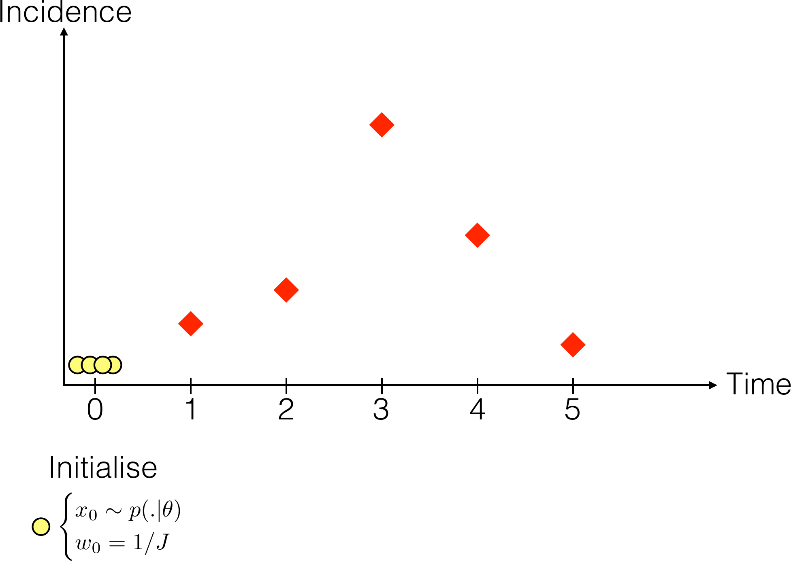
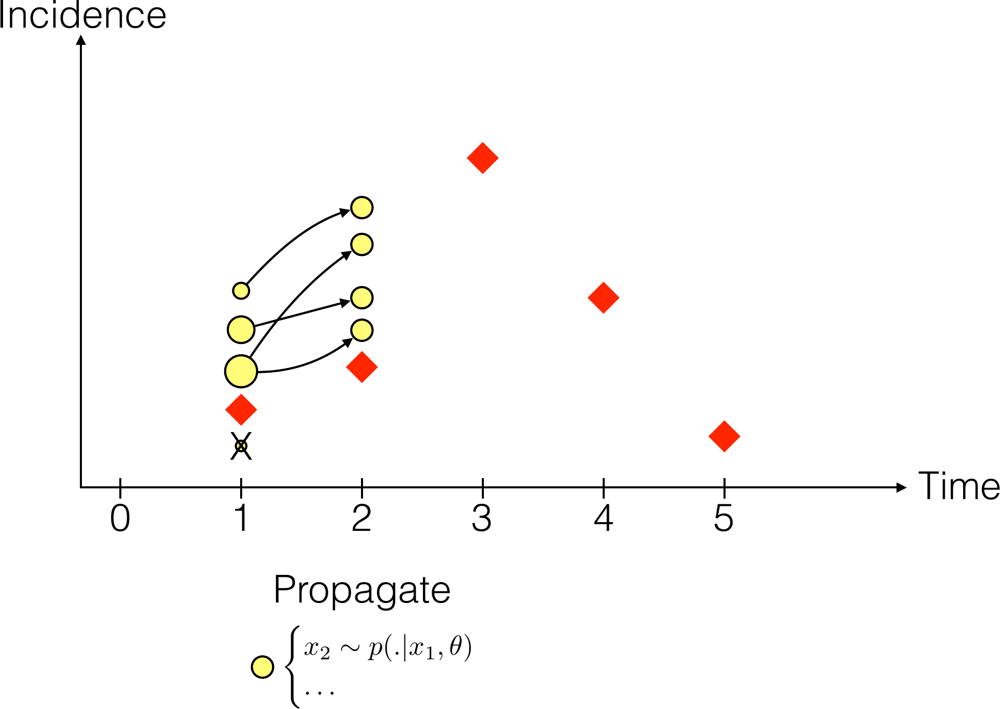
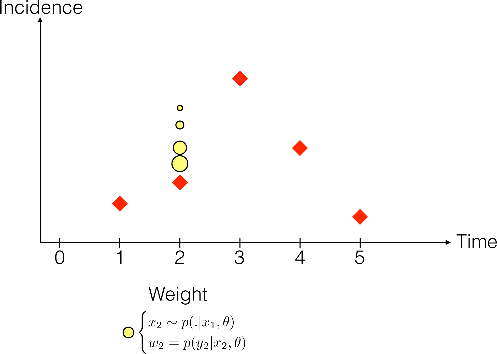
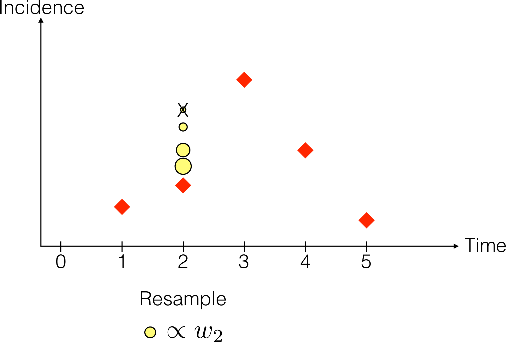

# The likelihood for stochastic models

## Where we are

We know how to get a posterior when the model is **deterministic**:

$$p(\theta \mid y) \propto p(y \mid \theta)\, p(\theta)$$

. . .

One $\theta$ gives one trajectory, so the likelihood is a single calculation:
solve the ODE, evaluate the observation model, done.

. . .

Stochastic models break this.

## The marginal likelihood

The model has a latent state $x$ — the trajectory it actually took — which we do
not observe. To get the likelihood of $\theta$ we must **marginalise** over
every trajectory it could have taken:

$$p(y \mid \theta) = \sum_{x} p(y \mid x, \theta)\, p(x \mid \theta)$$

## The deterministic case is easy

For a deterministic model, $\theta$ determines the trajectory exactly:

$$p(y \mid \theta) = \sum_{x} p(y \mid x, \theta) \times \mathbb{1}_{x = f(\theta)}
= p\big(y \mid x = f(\theta), \theta\big)$$

. . .

The sum collapses to a single term. That is why everything has worked so far.

## The stochastic case is not

$$p(y \mid \theta) = \sum_{x} p(y \mid x, \theta)\, p(x \mid \theta)$$

. . .

Now $x$ is no longer known, and the number of possible trajectories is
astronomical — every combination of every event at every time.

We cannot enumerate them.

## Monte Carlo to the rescue

Approximate the sum by a sample of $J$ **particles**, each one a simulated
trajectory:

$$p(y \mid \theta) \approx \frac{1}{J}\sum_{j=1}^{J} p(y \mid x_j, \theta)$$

. . .

This is **sequential Monte Carlo**, better known as **particle filtering**.

# The particle filter

## The algorithm {.smaller}

::::: {.columns}
:::: {.column width="60%"}
::: {.r-stack}
{.step .fragment .fade-out fragment-index=1}
{.step .fragment .current-visible fragment-index=1}
{.step .fragment .current-visible fragment-index=2}
{.step .fragment fragment-index=3}
:::
::::
:::: {.column width="40%"}
**Initialise** — $J$ particles, each of weight $1/J$

::: {.fragment fragment-index=1}
**Propagate** — simulate each to the next observation
:::

::: {.fragment fragment-index=2}
**Weight** — by $w_j = p(y_t \mid x_j, \theta)$, drawn as size
:::

::: {.fragment fragment-index=3}
**Resample** — in proportion to weight: good ones copied, bad ones die
:::
::::
:::::

::: {.fragment fragment-index=4}
Repeat to the end of the data; the average weight estimates $p(y \mid \theta)$.
:::

::: {.cite}
Red diamonds are the data, yellow circles the particles.
:::

## Why resample?

Without resampling, after a few time steps almost all the weight sits on one or
two particles and the rest contribute nothing.

. . .

This is **particle degeneracy**, and it is the central practical problem.
Resampling concentrates effort where the data say the trajectory actually went.

. . .

The cost is **depletion**: repeatedly copying survivors means the particles
share ancestry, so diversity falls over time.

## How many particles?

- Too few and the likelihood estimate is noisy, which will wreck the sampler
  that uses it.
- Too many and every likelihood evaluation becomes expensive.

. . .

The likelihood estimate is **unbiased** but **stochastic**: run it twice with
the same $\theta$ and you get two different numbers. That has consequences we
deal with in the next session.

## The whole thing, in code {.smaller .scrollable}

```julia
function bootstrap_filter(rng, θ, obs, n_particles; init_state)
    particles = [copy(init_state) for _ in 1:n_particles]
    loglik = 0.0

    for y in obs
        ## propagate: run every particle forward one day
        incidence = map(1:n_particles) do i
            particles[i], daily = gillespie_step(rng, particles[i], θ)
            daily
        end

        ## weight: how plausible is today's observation under each particle?
        log_w = logpdf.(Poisson.(θ[:ρ] .* incidence), y)

        ## accumulate: the mean weight estimates today's likelihood
        loglik += logsumexp(log_w) - log(n_particles)

        ## resample: keep the particles that explained the data
        w = exp.(log_w .- maximum(log_w))
        particles = particles[rand(rng, Categorical(w ./ sum(w)), n_particles)]
    end

    return loglik
end
```

Four steps, one loop. The practical builds it a step at a time.

##  Your Turn {background-color="#447099" transition="fade-in"}

In the practical you will

- see why a deterministic likelihood fails for a stochastic model
- watch particles propagate, get weighted, and be resampled
- read that filter line by line and work out what each step does
- explore how the number of particles affects the likelihood estimate


#

[Return to the session](../particle_filters.qmd)
