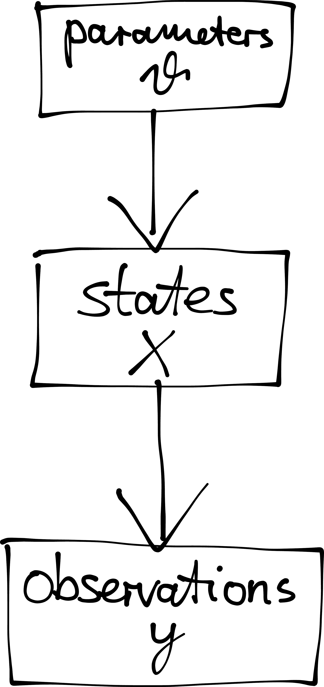
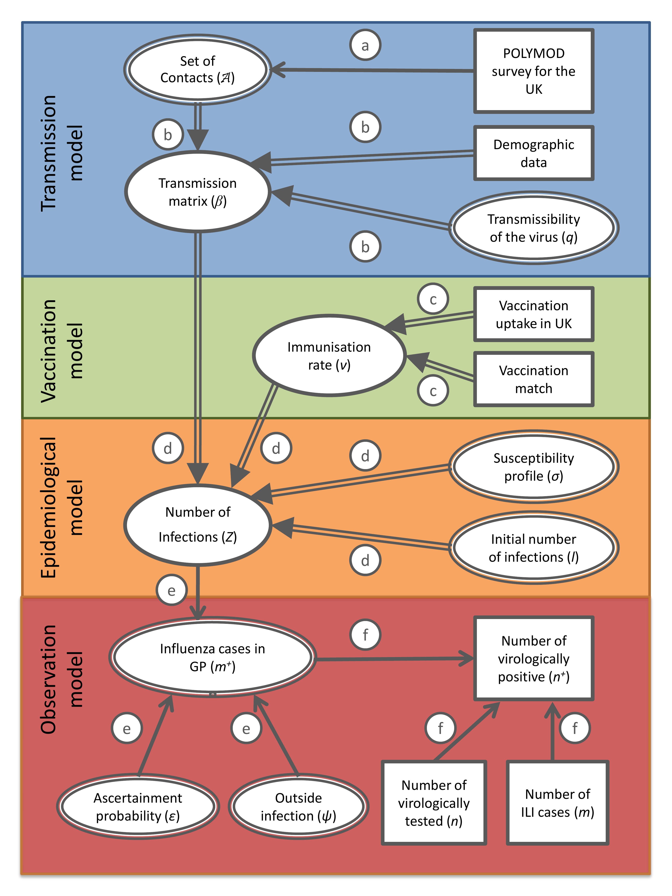

## What we really want to know

We want to find out **two** things:

1. the **parameters** of the process, $\theta$
2. the **state** process, $x$, as opposed to what we observe

We want to do this on the basis of **observations** (data), $y$.

## Hierarchical model

{.step .tall}

This kind of model is sometimes called a **Bayesian hierarchical model**.

## Example: influenza in the UK

{.step .tall}

::: {.footer}
Baguelin et al. (2013)
:::

## Combining the probabilities

:::: {.columns}
::: {.column width="65%"}
1. prior probabilities of the parameters
   $$p(\theta)$$
2. model trajectories
   $$p(x \mid \theta)$$
3. observations
   $$p(y \mid x, \theta)$$
:::
::: {.column width="35%"}
{.step .tall}
:::
::::

::: {.fragment}
Applying the chain rule gives the **joint probability**

$$p(y, x, \theta) = p(y \mid x, \theta)\, p(x \mid \theta)\, p(\theta)$$
:::

## Doing inference {.smaller}

The joint probability

$$p(y, x, \theta) = p(y \mid x, \theta)\, p(x \mid \theta)\, p(\theta)$$

encodes everything about our **model**.

::: {.fragment}
To do model fitting and inference, set $y$ to the data we observe and calculate
the *posterior*

$$p(x, \theta \mid y) = \frac{p(y, x, \theta)}{p(y)}$$
:::

::: {.fragment}
We can rewrite this as

$$p(x, \theta \mid y) = p(\theta \mid y)\, p(x \mid \theta, y)$$

- the first factor is what we need for **parameter fitting**
- the second factor is what we need for **state estimation**
:::

## Parameter estimation

$$p(x, \theta \mid y) = p(\theta \mid y)\, p(x \mid \theta, y)$$

- In a **deterministic** model, every $\theta$ leads to one possible
  $x_{\theta}$. In that case

  $$p(x_{\theta}, \theta \mid y) = p(\theta \mid y)$$

- In general we cannot write down a formula for $p(x_{\theta}, \theta, y)$.
  But we can **sample** from it.

##  {.center}

##  Your Turn {background-color="#447099" transition="fade-in"}

In the practical you will

- meet the Tristan da Cunha influenza outbreak
- build the SEITL model, which adds a latent state to the SIR structure
- simulate it both deterministically and stochastically
- see why the stochastic version needs different inference machinery

#

[Return to the session](../seitl.qmd)
