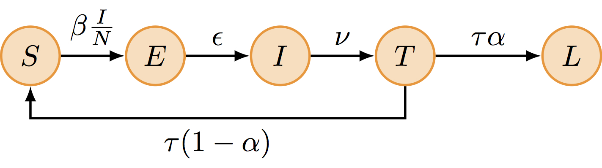
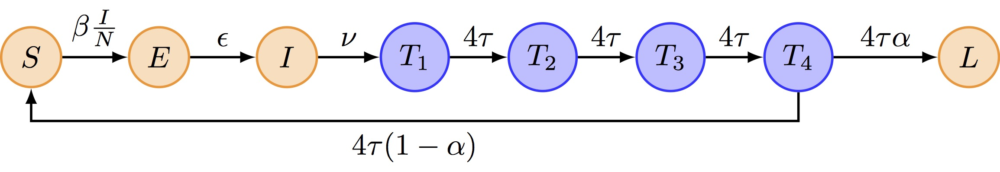

# The state-space view

## What we really want to know

We want to find out **two** things:

1. the **parameters** of the process, $\theta$
2. the **state** process, $x$, as opposed to what we observe

We want to do this on the basis of **observations** (data), $y$.

## Why the state needs its own layer

In a [deterministic]{.alert} model the state is a *function* of the parameters:
one $\theta$, one trajectory, and $x$ is not something to be inferred.

. . .

In a [stochastic]{.alert} model the same $\theta$ gives a different trajectory
every time, so the state has a *distribution*, $p(x \mid \theta)$.

. . .

That extra layer, between the parameters and the data, is what the rest of this
session is about.

## Hierarchical model

{.step .tall}

Parameters, then states, then observations: each layer depends on the one above.
Such a model is called a **Bayesian hierarchical model**, or, when the states
form a time series, a **state-space model**.

## The same three layers, on a real problem {.smaller}

{.step .tall}

Influenza transmission in the UK: parameters at the top, a stochastic epidemic in
the middle, several data streams at the bottom. Larger than ours, same structure.

::: {.cite}
Baguelin et al. (2013)
:::

## Combining the probabilities

:::: {.columns}
::: {.column width="65%"}
1. prior probabilities of the parameters
   $$p(\theta)$$
2. model trajectories
   $$p(x \mid \theta)$$
3. observations
   $$p(y \mid x, \theta)$$
:::
::: {.column width="35%"}
{.step .tall}
:::
::::

## The joint probability

Applying the chain rule to those three pieces gives

$$p(y, x, \theta) = p(y \mid x, \theta)\, p(x \mid \theta)\, p(\theta)$$

# Fitting a state-space model

## Doing inference {.smaller}

The joint probability

$$p(y, x, \theta) = p(y \mid x, \theta)\, p(x \mid \theta)\, p(\theta)$$

encodes everything about our **model**.

. . .

To do model fitting and inference, set $y$ to the data we observe and calculate
the *posterior*

$$p(x, \theta \mid y) = \frac{p(y, x, \theta)}{p(y)}$$

. . .

We can rewrite this as

$$p(x, \theta \mid y) = p(\theta \mid y)\, p(x \mid \theta, y)$$

- the first factor is what we need for **parameter fitting**
- the second factor is what we need for **state estimation**

## Parameter estimation

$$p(x, \theta \mid y) = p(\theta \mid y)\, p(x \mid \theta, y)$$

- In a **deterministic** model, every $\theta$ leads to one possible
  $x_{\theta}$. In that case

  $$p(x_{\theta}, \theta \mid y) = p(\theta \mid y)$$

- In general we cannot write down a formula for $p(x_{\theta}, \theta, y)$.
  But we can **sample** from it.

##  {.center}

# The model we will fit

## Tristan da Cunha, 1971

{.step}

::: {.cite}
The most remote inhabited island in the world: 284 people, one ship every few
months.
:::

## An outbreak in a closed population {.smaller}

An influenza-like illness arrived with a visiting ship and infected most of the
island over eight weeks.

. . .

Two features make it the standard teaching example:

- **Closed** — nobody arrived or left, so there is no importation to explain
  anything away
- **Two waves** — the epidemic subsided and then came back, in a population with
  no new susceptibles

. . .

That second wave is the whole problem. A simple SIR model cannot produce it.

## SEITL

{.step}

. . .

**T** is temporary immunity, and only a fraction $\alpha$ goes on to **L**,
long-term immunity. The rest return to susceptible — and can drive a second wave.

## Two independent choices {.smaller}

. . .

**Model structure** — how many compartments, and what flows between them.

. . .

**Deterministic or stochastic** — whether transitions are continuous flows or
discrete random events.

. . .

These are separate decisions. You can simulate SEITL either way, and the
practical does both so you can see the difference.

## Why stochastic, here

With 284 people, chance is not a rounding error.

. . .

- Individual runs peak days apart
- Some fade out entirely; the deterministic model never does
- The deterministic trajectory is **not** the average of the stochastic ones

. . .

Demographic noise scales roughly as $1/\sqrt{N}$. On an island of 284 it is a
first-order effect, and it is why the rest of the course needs heavier machinery.

## Simulating it: Gillespie {.smaller}

The deterministic version solves an ODE. The stochastic version simulates events
one at a time.

. . .

1. Given the current state, compute the rate of every possible transition
2. Draw the time to the next event from an exponential distribution
3. Pick which event happens, with probability proportional to its rate
4. Update the state, and repeat

. . .

Exact, and slow. Every infection and recovery is an individual event.

## SEIT4L: why four compartments {.smaller}

A single **T** compartment means the waiting time in it is [exponential]{.alert},
so the most likely thing is to leave immediately.

. . .

That is a strange claim about immunity.

. . .

Chaining four compartments, each at four times the rate, gives an **Erlang**
waiting time: same mean, but a peak away from zero. Most people stay immune for
roughly the average duration.

. . .

{.mini}

##  Your Turn {background-color="#447099" transition="fade-in"}

In the practical you will

- meet the Tristan da Cunha influenza outbreak
- build the SEITL model, which adds a latent state to the SIR structure
- simulate it both deterministically and stochastically
- see why the stochastic version needs different inference machinery

#

[Return to the session](../seitl.qmd)
